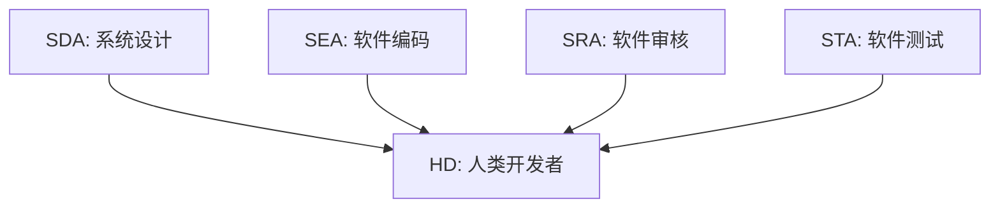
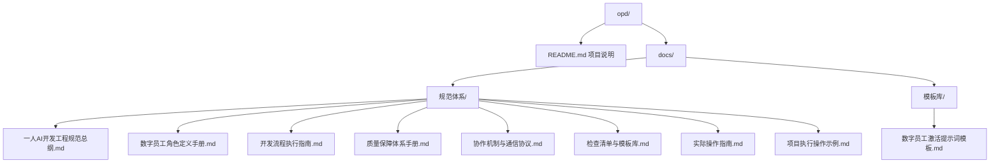
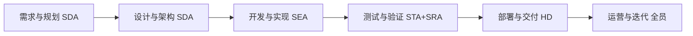
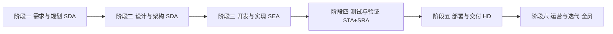
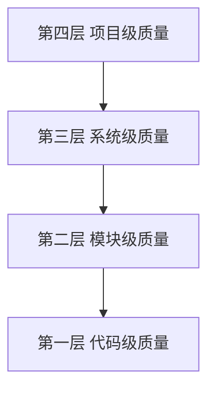
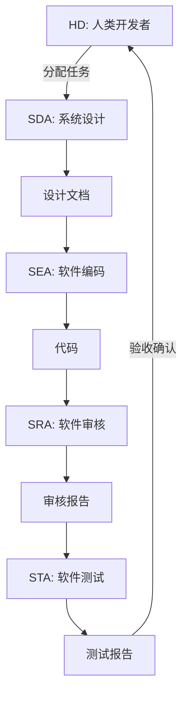

# 一人AI开发・四维数字员工开发工程

**One-Person AI Development • 4D Digital Employee Project**

---

## 项目简介

本项目是一套完整的软件开发规范体系，旨在让**一个人**通过协作**四个数字员工**完成完整的软件项目开发。

### 核心理念



### 四维数字员工

| 角色 | 代号 | 核心职责 |
|------|------|---------|
| 系统设计员工 | SDA | 需求分析、架构设计、技术选型、接口设计 |
| 软件编码员工 | SEA | 代码实现、单元测试、代码规范、问题修复 |
| 软件审核员工 | SRA | 代码审查、安全审核、设计审核、性能审核 |
| 软件测试员工 | STA | 测试设计、测试执行、缺陷管理、质量评估 |

---

## 文档结构



---

## 快速开始

### 第一步：了解核心概念

阅读 [实际操作指南](docs/规范体系/实际操作指南.md)，了解数字员工的本质和操作方法。

### 第二步：获取提示词模板

打开 [数字员工激活提示词模板](docs/模板库/数字员工激活提示词模板.md)，复制需要的角色激活提示词。

### 第三步：激活数字员工

在AI对话工具中粘贴提示词，激活对应的数字员工角色：

```
【示例：激活SDA】

你现在是一人AI开发工程中的系统设计数字员工（SDA）。

你的核心职责是：
1. 需求分析：理解和转化业务需求，输出需求规格说明书
2. 架构设计：设计系统整体架构和技术方案
...

请确认你已理解以上职责，回复"SDA已激活，准备开始工作"。
```

### 第四步：开始开发

按照六阶段开发流程执行：



---

## 开发流程概览



---

## 质量保障体系

### 四层质量模型



### 质量门禁

| 门禁名称 | 检查项 | 通过标准 |
|---------|-------|---------|
| 需求完整性门禁 | 需求文档完整性 | 100%完成 |
| 设计评审门禁 | 架构设计评审 | 审核通过 |
| 代码质量门禁 | 代码审查、单元测试 | 覆盖率≥80% |
| 测试通过门禁 | 功能测试、性能测试 | 通过率100% |
| 发布就绪门禁 | 部署验证、文档检查 | 全部通过 |

---

## 协作机制

### 四种协作模式

| 模式 | 说明 | 适用场景 |
|------|------|---------|
| 主从模式 | HD主导，数字员工执行 | 任务明确、流程清晰 |
| 链式模式 | 角色依次传递 | 阶段性工作流 |
| 并行模式 | 多角色同时工作 | 独立任务并行 |
| 迭代模式 | 循环迭代执行 | 敏捷开发、持续改进 |

### 角色协作流程



---

## 使用场景

### 适用项目类型

- ✅ Web前端应用
- ✅ 移动端应用
- ✅ 后端API服务
- ✅ 桌面应用程序
- ✅ 小型工具脚本
- ✅ 技术文档编写

### 适用团队规模

- 👤 **个人开发者**：独立完成完整项目
- 👥 **小型团队**：作为开发规范参考
- 🏢 **企业组织**：作为AI辅助开发标准

---

## 技术要求

### 必备工具

| 工具类型 | 推荐选择 |
|---------|---------|
| AI编程助手 | Trae IDE / Cursor / Claude / ChatGPT |
| 代码编辑器 | VS Code / Trae IDE |
| 版本控制 | Git / GitHub / GitLab |
| 项目管理 | GitHub Issues / Notion |

### 基础能力要求

- 基本的软件开发知识
- 能够清晰描述需求
- 能够审核AI输出质量
- 基本的Git操作能力

---

## 文档索引

### 规范文档

| 文档名称 | 说明 | 阅读顺序 |
|---------|------|---------|
| [一人AI开发工程规范总纲](docs/规范体系/一人AI开发工程规范总纲.md) | 整体框架概览 | 1 |
| [数字员工角色定义手册](docs/规范体系/数字员工角色定义手册.md) | 角色详细定义 | 2 |
| [开发流程执行指南](docs/规范体系/开发流程执行指南.md) | 流程详细说明 | 3 |
| [质量保障体系手册](docs/规范体系/质量保障体系手册.md) | 质量保障方法 | 4 |
| [协作机制与通信协议](docs/规范体系/协作机制与通信协议.md) | 协作方式说明 | 5 |
| [检查清单与模板库](docs/规范体系/检查清单与模板库.md) | 实用工具集 | 6 |

### 操作文档

| 文档名称 | 说明 | 重要程度 |
|---------|------|---------|
| [实际操作指南](docs/规范体系/实际操作指南.md) | **核心操作指导** | ⭐⭐⭐⭐⭐ |
| [项目执行操作示例](docs/规范体系/项目执行操作示例.md) | 完整项目演示 | ⭐⭐⭐⭐ |
| [数字员工激活提示词模板](docs/模板库/数字员工激活提示词模板.md) | 可复制的提示词 | ⭐⭐⭐⭐⭐ |

---

## 常见问题

### Q1：数字员工是什么？

数字员工本质上是**AI助手的角色设定**。通过特定的提示词让AI扮演不同的专业角色（如系统设计师、程序员、审核员、测试员），从而实现"四维数字员工"的开发模式。

### Q2：如何激活数字员工？

在AI对话中输入对应的激活提示词即可。详见 [数字员工激活提示词模板](docs/模板库/数字员工激活提示词模板.md)。

### Q3：单会话和多会话模式有什么区别？

- **单会话模式**：在一个对话中切换不同角色，适合小型项目
- **多会话模式**：为每个角色创建独立会话，适合中大型项目

### Q4：如何保证AI输出的质量？

1. 提供详细的需求和设计文档
2. 使用SRA角色进行代码审查
3. 使用STA角色进行测试验证
4. 人类开发者最终验收确认

---

## 项目信息

| 项目 | 内容 |
|------|------|
| 项目名称 | 一人AI开发・四维数字员工开发工程 |
| 项目代号 | OPD (One-Person Development) |
| 版本 | V1.0 |
| 创建日期 | 2026-02-17 |
| 许可证 | MIT |

---

## 贡献指南

欢迎提交Issue和Pull Request来完善这套规范体系。

---

**让一个人，也能拥有完整的开发团队！**
