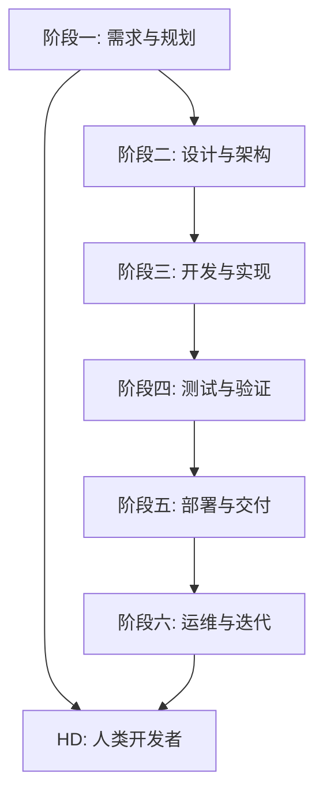
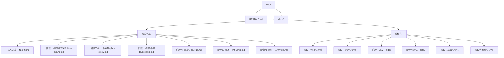
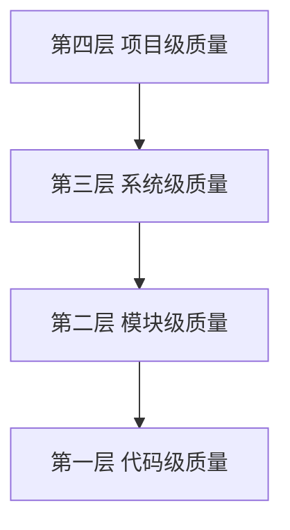
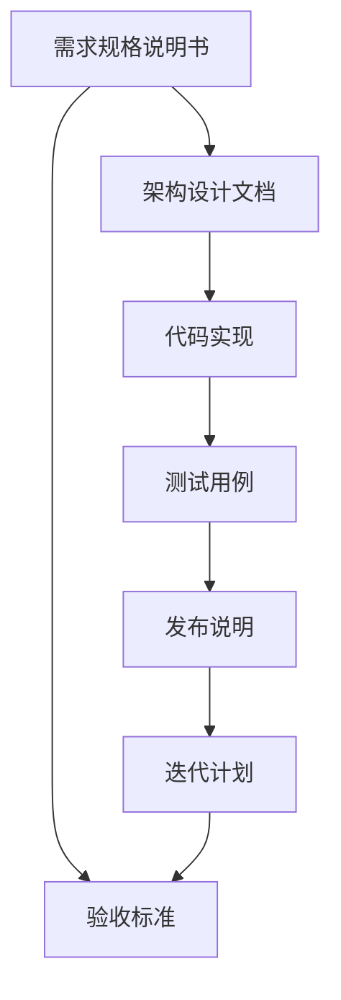

# 一人AI开发工程

**One-Person AI Development Project**

---

## 项目简介

本项目是一套完整的软件开发规范体系，旨在让**一个人**通过**六阶段标准化流程**完成完整的软件项目开发。

### 核心理念

一人AI开发模式下，开发者通过六个标准化阶段完成项目：

```mermaid
graph TB
    P1[阶段一: 需求与规划]
    P2[阶段二: 设计与架构]
    P3[阶段三: 开发与实现]
    P4[阶段四: 测试与验证]
    P5[阶段五: 部署与交付]
    P6[阶段六: 运维与迭代]
    HD[HD: 人类开发者]
    
    P1 --> P2 --> P3 --> P4 --> P5 --> P6
    P1 --> HD
    P6 --> HD
```

### 六阶段流程

| 阶段 | 名称 | 占比 | 核心任务 |
|------|------|------|----------|
| 阶段一 | 需求与规划 | 10-15% | 需求分析、项目计划、验收标准 |
| 阶段二 | 设计与架构 | 15-20% | 架构设计、技术选型、接口设计 |
| 阶段三 | 开发与实现 | 40-50% | 代码开发、单元测试、代码审查 |
| 阶段四 | 测试与验证 | 15-20% | 测试设计、测试执行、缺陷管理 |
| 阶段五 | 部署与交付 | 5-10% | 部署配置、发布说明、用户手册 |
| 阶段六 | 运维与迭代 | 持续 | 系统监控、问题分析、迭代优化 |

---

## 文档结构

```mermaid
graph TB
    Root[opd/]
    README[README.md]
    Docs[docs/]
    Specs[规范体系/]
    Templates[模板库/]
    
    Spec1[一人AI开发工程规范.md]
    Skill1[阶段一-需求与规划/office-hours.md]
    Skill2[阶段二-设计与架构/plan-review.md]
    Skill3[阶段三-开发与实现/develop.md]
    Skill4[阶段四-测试与验证/qa.md]
    Skill5[阶段五-部署与交付/ship.md]
    Skill6[阶段六-运维与迭代/retro.md]
    
    Temp1[阶段一需求与规划/]
    Temp2[阶段二设计与架构/]
    Temp3[阶段三开发与实现/]
    Temp4[阶段四测试与验证/]
    Temp5[阶段五部署与交付/]
    Temp6[阶段六运维与迭代/]
    
    Root --> README
    Root --> Docs
    Docs --> Specs
    Docs --> Templates
    Specs --> Spec1
    Specs --> Skill1
    Specs --> Skill2
    Specs --> Skill3
    Specs --> Skill4
    Specs --> Skill5
    Specs --> Skill6
    Templates --> Temp1
    Templates --> Temp2
    Templates --> Temp3
    Templates --> Temp4
    Templates --> Temp5
    Templates --> Temp6
```

**目录说明**：

| 目录 | 内容 |
|------|------|
| `规范体系/` | 工程规范主文档 + 六阶段技能文件 |
| `模板库/` | 各阶段交付物模板（25+个文档模板） |

---

## 快速开始

### 第一步：了解核心概念

阅读 [一人AI开发工程规范](docs/规范体系/一人AI开发工程规范.md)，了解六阶段流程和操作方法。

### 第二步：准备开发环境

确保你已经安装了必要的工具：
- AI编程助手（Trae IDE / Cursor / Claude / ChatGPT）
- 代码编辑器（VS Code / Trae IDE）
- 版本控制工具（Git）

### 第三步：开始开发

按照六阶段开发流程执行：

```mermaid
graph LR
    S1[需求与规划]
    S2[设计与架构]
    S3[开发与实现]
    S4[测试与验证]
    S5[部署与交付]
    S6[运维与迭代]
    
    S1 --> S2 --> S3 --> S4 --> S5 --> S6
```

**链式调用机制**：每个阶段的产出文档自动成为下一阶段的输入，形成闭环。

---

## 开发流程概览

```mermaid
graph LR
    P1[阶段一 需求与规划]
    P2[阶段二 设计与架构]
    P3[阶段三 开发与实现]
    P4[阶段四 测试与验证]
    P5[阶段五 部署与交付]
    P6[阶段六 运维与迭代]
    
    P1 --> P2 --> P3 --> P4 --> P5 --> P6
```

**核心方法论**：

| 阶段 | 核心方法论 |
|------|------------|
| 阶段一 | **六问题强迫思考**：需求分析前必须回答6个关键问题 |
| 阶段四 | **真实浏览器QA**：使用 Playwright 进行端到端测试 |
| 全流程 | **OWASP + STRIDE安全审计**：双重安全检查机制 |

---

## 质量保障体系

### 四层质量模型

```mermaid
graph TB
    L4[第四层 项目级质量]
    L3[第三层 系统级质量]
    L2[第二层 模块级质量]
    L1[第一层 代码级质量]
    
    L4 --> L3 --> L2 --> L1
```

### 质量门禁

| 门禁名称 | 检查项 | 通过标准 |
|---------|-------|---------|
| 需求完整性门禁 | 需求文档完整性 | 100%完成 |
| 设计评审门禁 | 架构设计评审 | 审核通过 |
| 代码质量门禁 | 代码审查、单元测试 | 覆盖率≥80% |
| 测试通过门禁 | 功能测试、性能测试 | 通过率100% |
| 发布就绪门禁 | 部署验证、文档检查 | 全部通过 |

---

## 链式调用机制

### 文档流转

六阶段开发流程采用**链式调用**设计：每个阶段的产出文档自动成为下一阶段的输入，形成闭环。

```mermaid
graph TB
    D1[需求规格说明书]
    D2[架构设计文档]
    D3[代码实现]
    D4[测试用例]
    D5[发布说明]
    D6[迭代计划]
    VC[验收标准]
    
    D1 --> D2 --> D3 --> D4 --> D5 --> D6
    D1 --> VC
    D6 --> VC
```

### 执行模式

| 模式 | 说明 | 适用场景 |
|------|------|---------|
| 顺序执行 | 按照六阶段顺序依次执行 | 小型项目 |
| 迭代执行 | 分模块迭代执行 | 大型项目 |
| 回溯修正 | 发现偏差时回溯上游文档修正 | 问题修复 |

---

## 使用场景

### 适用项目类型

- ✅ Web前端应用
- ✅ 移动端应用
- ✅ 后端API服务
- ✅ 桌面应用程序
- ✅ 小型工具脚本
- ✅ 技术文档编写

### 适用团队规模

- 👤 **个人开发者**：独立完成完整项目
- 👥 **小型团队**：作为开发规范参考
- 🏢 **企业组织**：作为AI辅助开发标准

---

## 技术要求

### 必备工具

| 工具类型 | 推荐选择 |
|---------|---------|
| AI编程助手 | Trae IDE / Cursor / Claude / ChatGPT |
| 代码编辑器 | VS Code / Trae IDE |
| 版本控制 | Git / GitHub / GitLab |
| 项目管理 | GitHub Issues / Notion |

### 基础能力要求

- 基本的软件开发知识
- 能够清晰描述需求
- 能够审核AI输出质量
- 基本的Git操作能力

---

## 文档索引

### 规范文档

| 文档名称 | 说明 | 阅读顺序 |
|---------|------|---------|
| [一人AI开发工程规范](docs/规范体系/一人AI开发工程规范.md) | 整体框架概览 | 1 |

### 技能文档

每个技能文件包含：执行流程、输出模板、质量门禁、下游链接

| 阶段 | 技能文件 | 核心方法论 |
|------|----------|------------|
| 阶段一 | [office-hours.md](docs/规范体系/阶段一-需求与规划/office-hours.md) | 六问题强迫思考 |
| 阶段二 | [plan-review.md](docs/规范体系/阶段二-设计与架构/plan-review.md) | STRIDE威胁模型分析 |
| 阶段三 | [develop.md](docs/规范体系/阶段三-开发与实现/develop.md) | OWASP安全检查 |
| 阶段四 | [qa.md](docs/规范体系/阶段四-测试与验证/qa.md) | 真实浏览器QA |
| 阶段五 | [ship.md](docs/规范体系/阶段五-部署与交付/ship.md) | 发布管理 |
| 阶段六 | [retro.md](docs/规范体系/阶段六-运维与迭代/retro.md) | 闭环回顾 |

### 模板文档

| 阶段 | 模板类型 | 重要程度 |
|------|---------|---------|
| **阶段一：需求与规划** | [需求规格说明书](docs/模板库/阶段一需求与规划/需求规格说明书.md) | ⭐⭐⭐⭐⭐ |
| **阶段一：需求与规划** | [前端UI设计说明书](docs/模板库/阶段一需求与规划/前端UI设计说明书.md) | ⭐⭐⭐⭐⭐ |
| **阶段一：需求与规划** | [验收标准](docs/模板库/阶段一需求与规划/验收标准.md) | ⭐⭐⭐⭐ |
| **阶段一：需求与规划** | [项目计划](docs/模板库/阶段一需求与规划/项目计划.md) | ⭐⭐⭐⭐ |
| **阶段一：需求与规划** | [风险清单](docs/模板库/阶段一需求与规划/风险清单.md) | ⭐⭐⭐ |
| **阶段二：设计与架构** | [架构设计文档](docs/模板库/阶段二设计与架构/架构设计文档.md) | ⭐⭐⭐⭐⭐ |
| **阶段二：设计与架构** | [前端技术设计说明书](docs/模板库/阶段二设计与架构/前端技术设计说明书.md) | ⭐⭐⭐⭐ |
| **阶段二：设计与架构** | [后端技术设计说明书](docs/模板库/阶段二设计与架构/后端技术设计说明书.md) | ⭐⭐⭐⭐ |
| **阶段二：设计与架构** | [接口设计说明书](docs/模板库/阶段二设计与架构/接口设计说明书.md) | ⭐⭐⭐⭐ |
| **阶段二：设计与架构** | [数据库设计](docs/模板库/阶段二设计与架构/数据库设计.sql) | ⭐⭐⭐⭐ |
| **阶段三：开发与实现** | [技术实现文档](docs/模板库/阶段三开发与实现/技术实现文档.md) | ⭐⭐⭐ |
| **阶段三：开发与实现** | [代码审查报告](docs/模板库/阶段三开发与实现/代码审查报告.md) | ⭐⭐⭐⭐ |
| **阶段四：测试与验证** | [测试计划](docs/模板库/阶段四测试与验证/测试计划.md) | ⭐⭐⭐⭐ |
| **阶段四：测试与验证** | [测试用例](docs/模板库/阶段四测试与验证/测试用例.md) | ⭐⭐⭐⭐⭐ |
| **阶段四：测试与验证** | [缺陷报告](docs/模板库/阶段四测试与验证/缺陷报告.md) | ⭐⭐⭐⭐ |
| **阶段四：测试与验证** | [测试报告](docs/模板库/阶段四测试与验证/测试报告.md) | ⭐⭐⭐⭐⭐ |
| **阶段五：部署与交付** | [部署文档](docs/模板库/阶段五部署与交付/部署文档.md) | ⭐⭐⭐⭐ |
| **阶段五：部署与交付** | [发布说明](docs/模板库/阶段五部署与交付/发布说明.md) | ⭐⭐⭐⭐ |
| **阶段五：部署与交付** | [用户手册](docs/模板库/阶段五部署与交付/用户手册.md) | ⭐⭐⭐ |
| **阶段六：运维与迭代** | [运维报告](docs/模板库/阶段六运维与迭代/运维报告.md) | ⭐⭐⭐ |
| **阶段六：运维与迭代** | [问题分析报告](docs/模板库/阶段六运维与迭代/问题分析报告.md) | ⭐⭐⭐ |
| **阶段六：运维与迭代** | [迭代计划](docs/模板库/阶段六运维与迭代/迭代计划.md) | ⭐⭐⭐ |
| **阶段六：运维与迭代** | [优化建议](docs/模板库/阶段六运维与迭代/优化建议.md) | ⭐⭐⭐ |

---

## 常见问题

### Q1：一人AI开发模式是什么？

一人AI开发模式是一种标准化的软件开发流程，让一个人通过六个阶段（需求与规划、设计与架构、开发与实现、测试与验证、部署与交付、运维与迭代）完成完整的软件项目开发。

### Q2：链式调用机制有什么好处？

链式调用机制确保每个阶段的产出文档自动成为下一阶段的输入，形成闭环，避免信息丢失和需求偏离。

### Q3：什么是六问题强迫思考？

需求分析阶段采用"六问题强迫思考"方法论，在编写需求文档前必须回答六个关键问题，挖掘真实需求，避免伪需求。

### Q4：如何保证开发质量？

1. 提供详细的需求和设计文档
2. 执行 OWASP + STRIDE 双重安全审计
3. 使用真实浏览器进行端到端测试
4. 通过五个质量门禁进行阶段验收

---

## 项目信息

| 项目 | 内容 |
|------|------|
| 项目名称 | 一人AI开发工程 |
| 项目代号 | OPD (One-Person Development) |
| 版本 | V1.0 |
| 创建日期 | 2026-02-27 |
| 许可证 | MIT |

---

## 贡献指南

欢迎提交 Issue 和 Pull Request 来完善这套规范体系。

---

**让一个人，也能完成完整的软件开发！**
