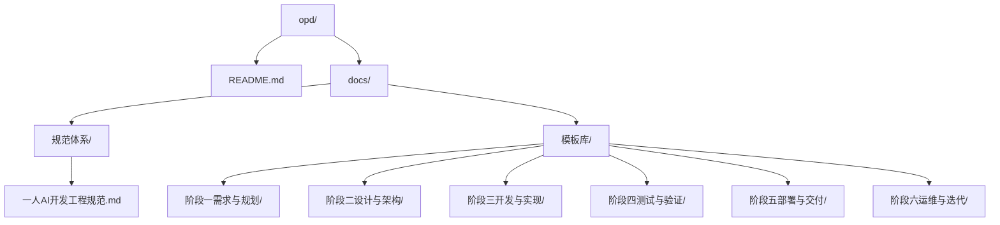
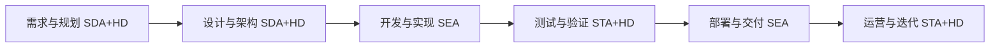
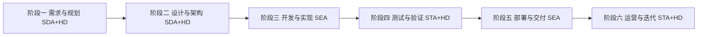

# 一人AI开发・四维数字员工开发工程

**One-Person AI Development • 4D Digital Employee Project**

---

## 项目简介

本项目是一套完整的软件开发规范体系，旨在让**一个人**通过协作**四个数字员工**完成完整的软件项目开发。

### 核心理念


### 四维数字员工

| 角色 | 代号 | 核心职责 |
|------|------|---------|
| 系统设计员工 | SDA | 需求分析、架构设计、技术选型、接口设计 |
| 软件编码员工 | SEA | 代码实现、单元测试、代码规范、问题修复 |
| 软件审核员工 | SRA | 代码审查、安全审核、设计审核、性能审核 |
| 软件测试员工 | STA | 测试设计、测试执行、缺陷管理、质量评估 |

---

## 文档结构



---

## 快速开始

### 第一步：了解核心概念

阅读 [一人AI开发工程规范](docs/规范体系/一人AI开发工程规范.md)，了解数字员工的本质和操作方法。

### 第二步：准备开发环境

确保你已经安装了必要的工具：
- AI编程助手（Trae IDE / Cursor / Claude / ChatGPT）
- 代码编辑器（VS Code / Trae IDE）
- 版本控制工具（Git）

### 第三步：激活数字员工

在AI对话工具中粘贴提示词，激活对应的数字员工角色：

```
【示例：激活SDA】

你现在是一人AI开发工程中的系统设计数字员工（SDA）。

你的核心职责是：
1. 需求分析：理解和转化业务需求，输出需求规格说明书
2. 架构设计：设计系统整体架构和技术方案
...

请确认你已理解以上职责，回复"SDA已激活，准备开始工作"。
```

### 第四步：开始开发

按照六阶段开发流程执行：



---

## 开发流程概览



---

## 质量保障体系

### 四层质量模型


### 质量门禁

| 门禁名称 | 检查项 | 通过标准 |
|---------|-------|---------|
| 需求完整性门禁 | 需求文档完整性 | 100%完成 |
| 设计评审门禁 | 架构设计评审 | 审核通过 |
| 代码质量门禁 | 代码审查、单元测试 | 覆盖率≥80% |
| 测试通过门禁 | 功能测试、性能测试 | 通过率100% |
| 发布就绪门禁 | 部署验证、文档检查 | 全部通过 |

---

## 协作机制

### 四种协作模式

| 模式 | 说明 | 适用场景 |
|------|------|---------|
| 主从模式 | HD主导，数字员工执行 | 任务明确、流程清晰 |
| 链式模式 | 角色依次传递 | 阶段性工作流 |
| 并行模式 | 多角色同时工作 | 独立任务并行 |
| 迭代模式 | 循环迭代执行 | 敏捷开发、持续改进 |

### 角色协作流程


---

## 使用场景

### 适用项目类型

- ✅ Web前端应用
- ✅ 移动端应用
- ✅ 后端API服务
- ✅ 桌面应用程序
- ✅ 小型工具脚本
- ✅ 技术文档编写

### 适用团队规模

- 👤 **个人开发者**：独立完成完整项目
- 👥 **小型团队**：作为开发规范参考
- 🏢 **企业组织**：作为AI辅助开发标准

---

## 技术要求

### 必备工具

| 工具类型 | 推荐选择 |
|---------|---------|
| AI编程助手 | Trae IDE / Cursor / Claude / ChatGPT |
| 代码编辑器 | VS Code / Trae IDE |
| 版本控制 | Git / GitHub / GitLab |
| 项目管理 | GitHub Issues / Notion |

### 基础能力要求

- 基本的软件开发知识
- 能够清晰描述需求
- 能够审核AI输出质量
- 基本的Git操作能力

---

## 文档索引

### 规范文档

| 文档名称 | 说明 | 阅读顺序 |
|---------|------|---------|
| [一人AI开发工程规范](docs/规范体系/一人AI开发工程规范.md) | 整体框架概览 | 1 |

### 模板文档

| 阶段 | 模板类型 | 重要程度 |
|------|---------|---------|
| **阶段一：需求与规划** | [需求规格说明书](docs/模板库/阶段一需求与规划/需求规格说明书.md) | ⭐⭐⭐⭐⭐ |
| **阶段一：需求与规划** | [前端UI设计说明书](docs/模板库/阶段一需求与规划/前端UI设计说明书.md) | ⭐⭐⭐⭐⭐ |
| **阶段一：需求与规划** | [验收标准](docs/模板库/阶段一需求与规划/验收标准.md) | ⭐⭐⭐⭐ |
| **阶段一：需求与规划** | [项目计划](docs/模板库/阶段一需求与规划/项目计划.md) | ⭐⭐⭐⭐ |
| **阶段一：需求与规划** | [风险清单](docs/模板库/阶段一需求与规划/风险清单.md) | ⭐⭐⭐ |
| **阶段二：设计与架构** | [架构设计文档](docs/模板库/阶段二设计与架构/架构设计文档.md) | ⭐⭐⭐⭐⭐ |
| **阶段二：设计与架构** | [前端技术设计说明书](docs/模板库/阶段二设计与架构/前端技术设计说明书.md) | ⭐⭐⭐⭐ |
| **阶段二：设计与架构** | [后端技术设计说明书](docs/模板库/阶段二设计与架构/后端技术设计说明书.md) | ⭐⭐⭐⭐ |
| **阶段二：设计与架构** | [接口设计说明书](docs/模板库/阶段二设计与架构/接口设计说明书.md) | ⭐⭐⭐⭐ |
| **阶段二：设计与架构** | [数据库设计](docs/模板库/阶段二设计与架构/数据库设计.sql) | ⭐⭐⭐⭐ |
| **阶段三：开发与实现** | [技术实现文档](docs/模板库/阶段三开发与实现/技术实现文档.md) | ⭐⭐⭐ |
| **阶段三：开发与实现** | [代码审查报告](docs/模板库/阶段三开发与实现/代码审查报告.md) | ⭐⭐⭐⭐ |
| **阶段四：测试与验证** | [测试计划](docs/模板库/阶段四测试与验证/测试计划.md) | ⭐⭐⭐⭐ |
| **阶段四：测试与验证** | [测试用例](docs/模板库/阶段四测试与验证/测试用例.md) | ⭐⭐⭐⭐⭐ |
| **阶段四：测试与验证** | [缺陷报告](docs/模板库/阶段四测试与验证/缺陷报告.md) | ⭐⭐⭐⭐ |
| **阶段四：测试与验证** | [测试报告](docs/模板库/阶段四测试与验证/测试报告.md) | ⭐⭐⭐⭐⭐ |
| **阶段五：部署与交付** | [部署文档](docs/模板库/阶段五部署与交付/部署文档.md) | ⭐⭐⭐⭐ |
| **阶段五：部署与交付** | [发布说明](docs/模板库/阶段五部署与交付/发布说明.md) | ⭐⭐⭐⭐ |
| **阶段五：部署与交付** | [用户手册](docs/模板库/阶段五部署与交付/用户手册.md) | ⭐⭐⭐ |
| **阶段六：运维与迭代** | [运维报告](docs/模板库/阶段六运维与迭代/运维报告.md) | ⭐⭐⭐ |
| **阶段六：运维与迭代** | [问题分析报告](docs/模板库/阶段六运维与迭代/问题分析报告.md) | ⭐⭐⭐ |
| **阶段六：运维与迭代** | [迭代计划](docs/模板库/阶段六运维与迭代/迭代计划.md) | ⭐⭐⭐ |

---

## 常见问题

### Q1：数字员工是什么？

数字员工本质上是**AI助手的角色设定**。通过特定的提示词让AI扮演不同的专业角色（如系统设计师、程序员、审核员、测试员），从而实现"四维数字员工"的开发模式。

### Q2：如何激活数字员工？

在AI对话中输入对应的激活提示词即可。激活提示词可以参考[一人AI开发工程规范](docs/规范体系/一人AI开发工程规范.md)中的操作指南部分。

### Q3：单会话和多会话模式有什么区别？

- **单会话模式**：在一个对话中切换不同角色，适合小型项目
- **多会话模式**：为每个角色创建独立会话，适合中大型项目

### Q4：如何保证AI输出的质量？

1. 提供详细的需求和设计文档
2. 使用SRA角色进行代码审查
3. 使用STA角色进行测试验证
4. 人类开发者最终验收确认

---

## 项目信息

| 项目 | 内容 |
|------|------|
| 项目名称 | 一人AI开发・四维数字员工开发工程 |
| 项目代号 | OPD (One-Person Development) |
| 版本 | V1.0 |
| 创建日期 | 2026-02-27 |
| 许可证 | MIT |

---

## 贡献指南

欢迎提交Issue和Pull Request来完善这套规范体系。

---

**让一个人，也能拥有完整的开发团队！**
