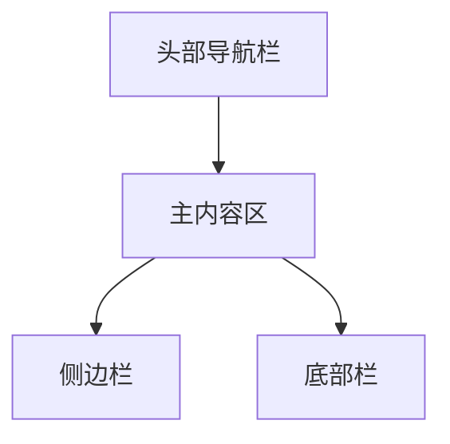
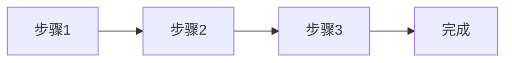
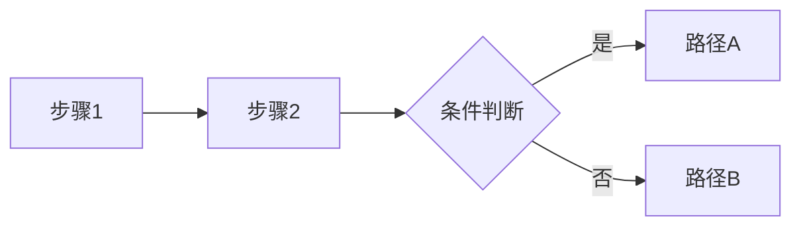

# 前端UI设计说明书

**项目名称**：[项目名称]  
**版本号**：V1.0  
**创建日期**：[YYYY-MM-DD]  
**创建人**：[创建人姓名]

---

## 一、设计原则

### 1.1 设计理念

[描述整体设计理念，如简洁、现代、专业等]

### 1.2 设计风格

- **视觉风格**：[如简约现代/商务专业/活泼活力]
- **交互风格**：[如直观易用/高效快捷/趣味互动]

### 1.3 色彩方案

#### 1.3.1 主色调

```mermaid
graph LR
    Primary[主色调<br/>#[颜色代码]]
    PrimaryLight[浅色<br/>#[颜色代码]]
    PrimaryDark[深色<br/>#[颜色代码]]
    
    Primary --> PrimaryLight
    Primary --> PrimaryDark
```

**使用场景**：
- [使用场景1]
- [使用场景2]

#### 1.3.2 辅助色

| 颜色 | 色值 | 用途 |
|------|------|------|
| [颜色名] | #[色值] | [用途] |
| [颜色名] | #[色值] | [用途] |

#### 1.3.3 中性色

| 颜色 | 色值 | 用途 |
|------|------|------|
| 白色 | #FFFFFF | 背景、卡片 |
| 浅灰 | #F3F4F6 | 次要背景 |
| 中灰 | #9CA3AF | 次要文字 |
| 深灰 | #374151 | 主要文字 |

---

## 二、页面布局

### 2.1 整体布局



### 2.2 页面结构

#### 2.2.1 首页/仪表盘

**布局说明**：
- [布局描述]

**页面元素**：
- [元素1]
- [元素2]

### 2.3 一级功能1

#### 2.3.1 二级功能1-1

##### 2.3.1.1 三级功能1-1-1

**布局说明**：
- [布局描述]

**页面元素**：
- [元素1]
- [元素2]

##### 2.3.1.2 三级功能1-1-2

**布局说明**：
- [布局描述]

**页面元素**：
- [元素1]
- [元素2]

#### 2.3.2 二级功能1-2

##### 2.3.2.1 三级功能1-2-1

**布局说明**：
- [布局描述]

**页面元素**：
- [元素1]
- [元素2]

### 2.4 一级功能2

#### 2.4.1 二级功能2-1

##### 2.4.1.1 三级功能2-1-1

**布局说明**：
- [布局描述]

**页面元素**：
- [元素1]
- [元素2]

#### 2.4.2 二级功能2-2

##### 2.4.2.1 三级功能2-2-1

**布局说明**：
- [布局描述]

**页面元素**：
- [元素1]
- [元素2]

### 2.5 一级功能3

#### 2.5.1 二级功能3-1

##### 2.5.1.1 三级功能3-1-1

**布局说明**：
- [布局描述]

**页面元素**：
- [元素1]
- [元素2]

### 2.6 响应式设计

| 断点 | 设备类型 | 布局调整 |
|------|---------|---------|
| ≥1200px | 桌面端 | [调整说明] |
| 768-1199px | 平板端 | [调整说明] |
| &lt;768px | 移动端 | [调整说明] |

---

## 三、组件设计

### 3.1 基础组件

#### 3.1.1 按钮

**类型**：
- 主要按钮（Primary）
- 次要按钮（Secondary）
- 危险按钮（Danger）
- 链接按钮（Link）

**尺寸**：
- 大（Large）
- 中（Medium）
- 小（Small）

#### 3.1.2 表单组件

- 输入框（Input）
- 下拉选择（Select）
- 复选框（Checkbox）
- 单选框（Radio）
- 日期选择器（Date Picker）

#### 3.1.3 反馈组件

- 提示（Toast）
- 弹窗（Modal）
- 加载（Loading）
- 空状态（Empty）

### 3.2 业务组件

#### 3.2.1 [业务组件名称1]

**功能说明**：
[功能描述]

**交互设计**：
- [交互1]
- [交互2]

#### 3.2.2 [业务组件名称2]

**功能说明**：
[功能描述]

**交互设计**：
- [交互1]
- [交互2]

### 3.3 布局组件

- 容器（Container）
- 栅格（Grid）
- 卡片（Card）
- 标签页（Tabs）

---

## 四、交互设计

### 4.1 交互流程

#### 4.1.1 [主要流程1]



**详细说明**：
- [步骤1说明]
- [步骤2说明]
- [步骤3说明]

#### 4.1.2 [主要流程2]



**详细说明**：
- [步骤说明]

### 4.2 动画效果

| 动画类型 | 用途 | 时长 |
|---------|------|------|
| 淡入淡出 | 页面切换 | 300ms |
| 滑入滑出 | 侧边栏 | 200ms |
| 缩放 | 按钮点击 | 150ms |

### 4.3 反馈机制

- **操作成功**：显示成功提示
- **操作失败**：显示错误信息
- **加载状态**：显示加载动画
- **确认操作**：二次确认弹窗

---

## 五、设计资源

### 5.1 设计稿链接

- Figma/Sketch：[设计稿链接]
- 原型演示：[原型链接]

### 5.2 图标库

- 图标来源：[图标库名称]
- 使用规范：[使用说明]

### 5.3 字体资源

- 中文字体：[字体名称]
- 英文字体：[字体名称]
- 字体大小规范：
  - 标题：[大小]
  - 正文：[大小]
  - 辅助文字：[大小]

---

**文档结束**