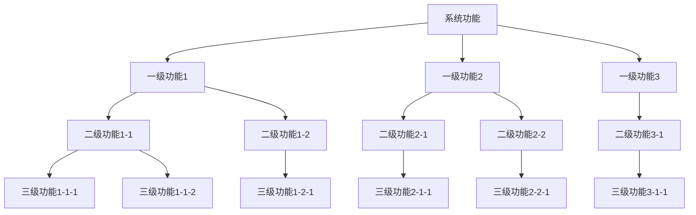

# 需求规格说明书

**项目名称**：[项目名称]  
**版本号**：V1.0  
**创建日期**：[YYYY-MM-DD]  
**创建人**：[创建人姓名]

---

## 一、项目概述

### 1.1 项目背景

[描述项目的背景信息，为什么需要这个项目]

### 1.2 项目目标

- [目标1]
- [目标2]
- [目标3]

### 1.3 项目范围

#### 1.3.1 包含范围

- [功能范围1]
- [功能范围2]
- [功能范围3]

#### 1.3.2 不包含范围

- [不包含的功能1]
- [不包含的功能2]

---

## 二、功能需求

### 2.1 功能结构

### 2.2 功能清单

| 功能层级 | 功能项 | 功能编号 | 功能名称 | 优先级 | 说明 |
|---------|--------|---------|---------|--------|------|
| 一级功能 | [一级功能1] | - | - | - | - |
| 二级功能 | └─ [二级功能1-1] | - | - | - | - |
| 三级功能 | └─ [三级功能1-1-1] | F-001 | [功能名称] | [高/中/低] | [功能说明] |
| 三级功能 | └─ [三级功能1-1-2] | F-002 | [功能名称] | [高/中/低] | [功能说明] |
| 二级功能 | └─ [二级功能1-2] | - | - | - | - |
| 三级功能 | └─ [三级功能1-2-1] | F-003 | [功能名称] | [高/中/低] | [功能说明] |
| 一级功能 | [一级功能2] | - | - | - | - |
| 二级功能 | └─ [二级功能2-1] | - | - | - | - |
| 三级功能 | └─ [三级功能2-1-1] | F-004 | [功能名称] | [高/中/低] | [功能说明] |
| 二级功能 | └─ [二级功能2-2] | - | - | - | - |
| 三级功能 | └─ [三级功能2-2-1] | F-005 | [功能名称] | [高/中/低] | [功能说明] |
| 一级功能 | [一级功能3] | - | - | - | - |
| 二级功能 | └─ [二级功能3-1] | - | - | - | - |
| 三级功能 | └─ [三级功能3-1-1] | F-006 | [功能名称] | [高/中/低] | [功能说明] |

### 2.3 功能描述

#### 2.3.1 [一级功能1] - [二级功能1-1] - [三级功能1-1-1]

**功能编号**：F-001  
**功能路径**：[一级功能1] → [二级功能1-1] → [三级功能1-1-1]  
**优先级**：[高/中/低]

**功能描述**：
[详细描述功能]

**输入**：
- [输入1]
- [输入2]

**输出**：
- [输出1]
- [输出2]

**业务规则**：
- [规则1]
- [规则2]

#### 2.3.2 [一级功能1] - [二级功能1-1] - [三级功能1-1-2]

**功能编号**：F-002  
**功能路径**：[一级功能1] → [二级功能1-1] → [三级功能1-1-2]  
**优先级**：[高/中/低]

**功能描述**：
[详细描述功能]

**输入**：
- [输入1]
- [输入2]

**输出**：
- [输出1]
- [输出2]

**业务规则**：
- [规则1]
- [规则2]

---

## 三、非功能需求

### 3.1 性能需求

- 响应时间：[响应时间要求]
- 并发用户数：[并发用户数]
- 吞吐量：[吞吐量要求]

### 3.2 安全需求

- 认证方式：[认证方式]
- 授权机制：[授权机制]
- 数据加密：[加密要求]

### 3.3 可用性需求

- 系统可用性：[可用性百分比]
- 界面风格：[界面风格描述]
- 响应式支持：[是否支持响应式]

### 3.4 兼容性需求

- 浏览器支持：[支持的浏览器列表]
- 操作系统支持：[支持的操作系统]
- 设备支持：[支持的设备]

---

## 四、约束条件

### 4.1 技术约束

- [技术约束1]
- [技术约束2]

### 4.2 时间约束

- [时间约束1]
- [时间约束2]

### 4.3 资源约束

- [资源约束1]
- [资源约束2]

---

## 五、验收标准

### 5.1 功能验收标准

- [功能验收标准1]
- [功能验收标准2]

### 5.2 性能验收标准

- [性能验收标准1]
- [性能验收标准2]

### 5.3 质量验收标准

- [质量验收标准1]
- [质量验收标准2]

---

## 六、附录

### 6.1 术语表

| 术语 | 说明 |
|------|------|
| [术语1] | [说明] |
| [术语2] | [说明] |

### 6.2 参考文档

- [参考文档1]
- [参考文档2]

---

**文档结束**