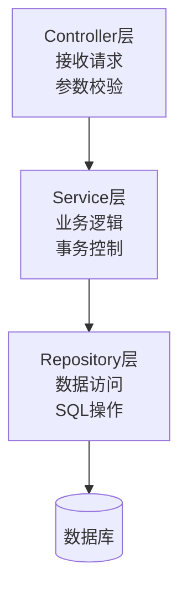

# 后端技术设计说明书

**项目名称**：[项目名称]  
**版本号**：V1.0  
**创建日期**：[YYYY-MM-DD]  
**创建人**：[创建人姓名]

---

## 一、技术选型

### 1.1 后端框架选择

- **框架名称**：[框架名称，如Spring Boot/Django/Express/NestJS]
- **版本**：[版本号]
- **选型理由**：
  - [理由1]
  - [理由2]
  - [理由3]

### 1.2 数据库选择

- **数据库类型**：[关系型/NoSQL]
- **数据库名称**：[数据库名称，如MySQL/PostgreSQL/MongoDB/Redis]
- **版本**：[版本号]
- **选型理由**：
  - [理由1]
  - [理由2]

### 1.3 缓存方案选择

- **缓存方案**：[方案名称，如Redis/Memcached]
- **版本**：[版本号]
- **选型理由**：
  - [理由1]
  - [理由2]

### 1.4 消息队列选择

- **消息队列**：[队列名称，如RabbitMQ/Kafka/RocketMQ]
- **版本**：[版本号]
- **选型理由**：
  - [理由1]
  - [理由2]

---

## 二、项目架构

### 2.1 目录结构设计

```
src/
├── main/
│   ├── java/              # 源代码
│   │   ├── controller/      # 控制器层
│   │   ├── service/        # 服务层
│   │   ├── repository/     # 数据访问层
│   │   ├── entity/         # 实体类
│   │   ├── dto/            # 数据传输对象
│   │   ├── config/         # 配置类
│   │   ├── util/           # 工具类
│   │   ├── exception/      # 异常处理
│   │   └── Application.java  # 启动类
│   └── resources/       # 资源文件
│       ├── application.yml  # 配置文件
│       ├── mapper/         # MyBatis映射文件
│       └── static/         # 静态资源
└── test/                 # 测试代码
    └── java/
```

### 2.2 模块划分

| 模块名称 | 模块路径 | 模块说明 |
|---------|---------|---------|
| [模块1] | controller/[模块1]/ | [模块说明] |
| [模块2] | controller/[模块2]/ | [模块说明] |
| [模块3] | controller/[模块3]/ | [模块说明] |

### 2.3 服务设计

#### 2.3.1 分层架构



#### 2.3.2 服务规范

- **Controller命名**：[命名规范]
- **Service命名**：[命名规范]
- **Repository命名**：[命名规范]
- **Entity命名**：[命名规范]

---

## 三、技术方案

### 3.1 数据库设计

#### 3.1.1 数据库连接配置

```yaml
spring:
  datasource:
    url: jdbc:mysql://localhost:3306/[数据库名]
    username: [用户名]
    password: [密码]
    driver-class-name: com.mysql.cj.jdbc.Driver
```

#### 3.1.2 连接池配置

- **连接池**：[HikariCP/Druid]
- **最大连接数**：[数量]
- **最小空闲连接**：[数量]
- **连接超时**：[时间]

### 3.2 缓存设计

#### 3.2.1 缓存策略

| 缓存类型 | 缓存键 | 过期时间 | 用途 |
|---------|--------|-----------|------|
| 用户信息 | user:[userId] | [时间] | 用户信息缓存 |
| 配置信息 | config:[key] | [时间] | 配置缓存 |
| 热点数据 | hot:[key] | [时间] | 热点数据缓存 |

#### 3.2.2 缓存更新策略

- **Cache Aside**：先更新数据库，再删除缓存
- **Write Through**：同时更新缓存和数据库
- **Write Behind**：异步更新数据库

### 3.3 接口设计

#### 3.3.1 RESTful API规范

| HTTP方法 | 用途 | 示例 |
|---------|------|------|
| GET | 查询资源 | GET /api/users |
| POST | 创建资源 | POST /api/users |
| PUT | 更新资源 | PUT /api/users/{id} |
| DELETE | 删除资源 | DELETE /api/users/{id} |

#### 3.3.2 统一响应格式

```json
{
  "code": 200,
  "message": "success",
  "data": {},
  "timestamp": 1234567890
}
```

#### 3.3.3 错误码定义

| 错误码 | 错误信息 | HTTP状态码 |
|---------|----------|------------|
| 400 | 请求参数错误 | 400 |
| 401 | 未授权 | 401 |
| 403 | 无权限 | 403 |
| 404 | 资源不存在 | 404 |
| 500 | 服务器内部错误 | 500 |

### 3.4 安全方案

#### 3.4.1 认证方案

- **认证方式**：[JWT/OAuth2/Session]
- **Token过期时间**：[时间]
- **刷新Token**：[是/否]

#### 3.4.2 授权方案

- **权限控制**：[RBAC/ABAC]
- **接口权限**：[注解/拦截器]
- **数据权限**：[实现方式]

#### 3.4.3 数据加密

- **密码加密**：[BCrypt/MD5]
- **传输加密**：[HTTPS]
- **敏感数据**：[加密方式]

---

## 四、开发规范

### 4.1 编码规范

| 规范项 | 规范内容 |
|--------|---------|
| 缩进 | [空格数]空格 |
| 命名规范 | [命名规范] |
| 代码格式化 | [工具名称] |

### 4.2 命名规范

| 类型 | 命名规范 | 示例 |
|------|---------|------|
| Controller | [命名规范] | UserController |
| Service | [命名规范] | UserService |
| ServiceImpl | [命名规范] | UserServiceImpl |
| Repository | [命名规范] | UserRepository |
| Entity | [命名规范] | User |
| DTO | [命名规范] | UserDTO |
| VO | [命名规范] | UserVO |

### 4.3 注释规范

- **类注释**：[注释规范]
- **方法注释**：[注释规范]
- **参数注释**：[注释规范]

---

## 五、第三方依赖

### 5.1 依赖列表

| 依赖名称 | 版本 | 用途 |
|---------|------|------|
| [依赖1] | [版本] | [用途] |
| [依赖2] | [版本] | [用途] |
| [依赖3] | [版本] | [用途] |

### 5.2 版本说明

- **核心依赖**：[锁定版本/使用最新]
- **开发依赖**：[锁定版本/使用最新]

---

**文档结束**