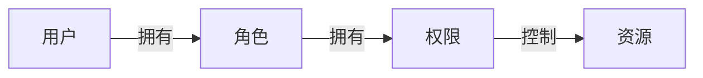

# 安全方案文档

**项目名称**：[项目名称]  
**版本号**：V1.0  
**创建日期**：[YYYY-MM-DD]  
**创建人**：[创建人姓名]

---

## 一、安全策略

### 1.1 安全目标

- **保密性**：确保数据不被未授权访问
- **完整性**：确保数据不被未授权修改
- **可用性**：确保系统和数据可被授权用户访问
- **可追溯性**：确保所有操作可被追溯

### 1.2 安全原则

- 最小权限原则
- 纵深防御原则
- 安全设计原则
- 持续监控原则

---

## 二、认证授权

### 2.1 认证方式

#### 2.1.1 认证方案

- **认证类型**：[JWT/OAuth2.0/Session]
- **Token算法**：[HS256/RS256]
- **Token有效期**：[时间，如2小时]
- **刷新Token**：[是/否，有效期如7天]

#### 2.1.2 JWT配置示例

```yaml
jwt:
  secret: [密钥]
  expiration: 7200
  refresh-expiration: 604800
  header: Authorization
  prefix: Bearer
```

### 2.2 授权机制

#### 2.2.1 权限模型

- **权限模型**：[RBAC/ABAC]
- **权限粒度**：[菜单/按钮/数据]

#### 2.2.2 RBAC模型



### 2.3 会话管理

- **会话超时**：[超时时间]
- **并发控制**：[是否允许多点登录]
- **会话注销**：[手动/自动]

---

## 三、数据保护

### 3.1 数据加密

#### 3.1.1 传输加密

- **协议**：HTTPS/TLS 1.3
- **证书**：[证书来源]
- **强制HTTPS**：[是/否]

#### 3.1.2 存储加密

| 数据类型 | 加密方式 | 加密算法 |
|---------|---------|---------|
| 密码 | 单向加密 | BCrypt/Argon2 |
| 敏感信息 | 对称加密 | AES-256 |
| 个人信息 | 脱敏处理 | - |

#### 3.1.3 密码加密示例

```java
// BCrypt加密
String password = "userPassword";
String hashedPassword = BCrypt.hashpw(password, BCrypt.gensalt());

// 验证密码
boolean isMatch = BCrypt.checkpw(password, hashedPassword);
```

### 3.2 敏感数据处理

#### 3.2.1 数据脱敏

| 数据类型 | 脱敏方式 | 示例 |
|---------|---------|------|
| 手机号 | 中间4位脱敏 | 138****1234 |
| 身份证号 | 中间10位脱敏 | 110***********1234 |
| 邮箱 | 中间脱敏 | te**@example.com |
| 银行卡号 | 中间脱敏 | 6222 **** **** 1234 |

#### 3.2.2 数据脱敏实现

```java
public class DataMaskUtils {
    // 手机号脱敏
    public static String maskPhone(String phone) {
        if (phone == null || phone.length() != 11) {
            return phone;
        }
        return phone.substring(0, 3) + "****" + phone.substring(7);
    }
}
```

### 3.3 数据备份

- **备份频率**：[频率，如每天]
- **备份保留**：[保留时间，如30天]
- **备份加密**：[是/否]
- **异地备份**：[是/否]

---

## 四、输入验证

### 4.1 输入校验规则

| 输入类型 | 校验规则 |
|---------|---------|
| 用户名 | 长度4-20，字母数字下划线 |
| 密码 | 长度8-20，包含大小写字母数字特殊字符 |
| 邮箱 | 标准邮箱格式 |
| 手机号 | 11位数字，以1开头 |
| URL | 标准URL格式 |

### 4.2 常见攻击防护

#### 4.2.1 SQL注入防护

- **使用预编译语句**：PreparedStatement
- **ORM框架**：MyBatis/Hibernate
- **禁止字符串拼接**：参数化查询

#### 4.2.2 XSS防护

- **输入过滤**：移除危险标签
- **输出转义**：HTML实体转义
- **CSP策略**：内容安全策略

#### 4.2.3 CSRF防护

- **Token验证**：CSRF Token
- **SameSite Cookie**：设置SameSite属性
- **Referer验证**：验证请求来源

#### 4.2.4 文件上传防护

- **文件类型校验**：白名单验证
- **文件大小限制**：最大文件大小
- **文件名处理**：随机文件名
- **存储路径隔离**：独立目录

---

## 五、接口安全

### 5.1 接口限流

| 限流类型 | 限流规则 |
|---------|---------|
| 用户级别 | [次数]/分钟 |
| IP级别 | [次数]/分钟 |
| 接口级别 | [次数]/秒 |

### 5.2 接口签名

- **签名算法**：[MD5/SHA256/HMAC]
- **签名参数**：[参数列表]
- **时间戳验证**：[有效期，如5分钟]
- **防重放攻击**：[Nonce/序列号]

### 5.3 接口审计

- **日志记录**：记录所有接口请求
- **敏感数据过滤**：不记录密码等敏感信息
- **日志保留**：[保留时间]

---

## 六、系统安全

### 6.1 服务器安全

- **操作系统加固**：最小化安装、关闭不必要服务
- **防火墙配置**：只开放必要端口
- **SSH安全**：禁用root登录、密钥认证
- **定期更新**：系统和软件及时更新

### 6.2 应用安全

- **依赖扫描**：定期扫描第三方依赖漏洞
- **安全头设置**：
  - X-Content-Type-Options: nosniff
  - X-Frame-Options: DENY
  - X-XSS-Protection: 1; mode=block
  - Content-Security-Policy: [策略]

### 6.3 日志安全

- **日志级别**：生产环境INFO及以上
- **敏感信息**：不记录密码、Token等
- **日志访问**：限制日志文件访问权限

---

## 七、安全监控

### 7.1 安全事件

| 事件类型 | 响应等级 | 处理流程 |
|---------|---------|---------|
| 暴力破解 | 高 | 立即封禁IP，通知管理员 |
| SQL注入 | 高 | 立即阻断，记录日志，通知管理员 |
| XSS攻击 | 中 | 记录日志，分析攻击 |
| 异常访问 | 中 | 记录日志，关注后续行为 |

### 7.2 告警机制

- **告警方式**：[邮件/短信/钉钉/企业微信]
- **告警阈值**：[配置阈值]
- **告警接收人**：[接收人列表]

---

## 八、应急响应

### 8.1 应急流程

1. 发现安全事件
2. 立即启动应急响应
3. 隔离受影响系统
4. 调查和分析
5. 修复漏洞
6. 恢复系统
7. 总结和改进

### 8.2 联系人

| 角色 | 姓名 | 联系方式 |
|------|------|---------|
| 安全负责人 | [姓名] | [联系方式] |
| 技术负责人 | [姓名] | [联系方式] |

---

**文档结束**