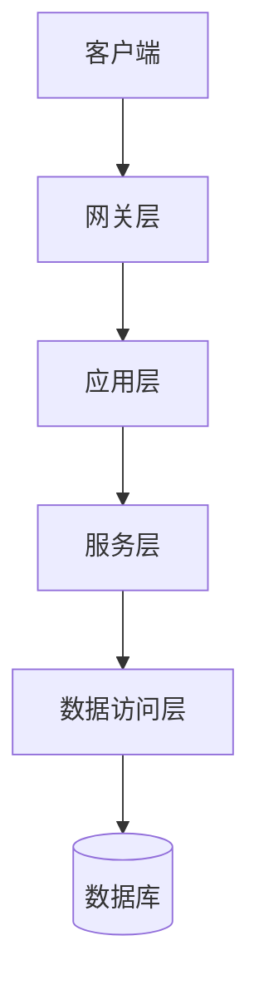
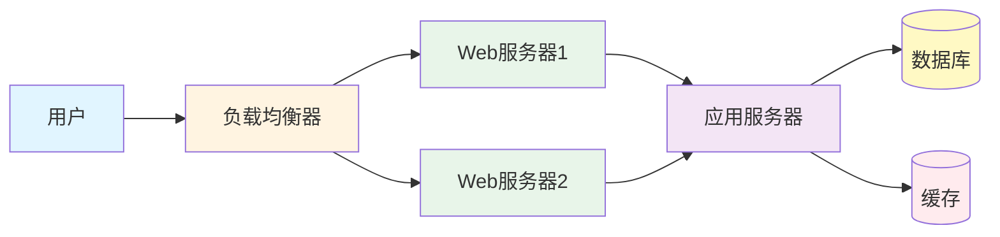

# 架构设计文档

**项目名称**：[项目名称]  
**版本号**：V1.0  
**创建日期**：[YYYY-MM-DD]  
**创建人**：[创建人姓名]

---

## 一、架构概述

### 1.1 架构风格

- **架构类型**：[单体应用/微服务/前后端分离]
- **设计模式**：[MVC/MVVM/分层架构]
- **架构特点**：[特点描述]

### 1.2 架构目标

- **可扩展性**：[扩展性目标]
- **可维护性**：[可维护性目标]
- **性能**：[性能目标]
- **安全性**：[安全性目标]

### 1.3 架构原则

- [原则1]
- [原则2]
- [原则3]
- [原则4]

---

## 二、系统架构

### 2.1 整体架构图

### 2.2 模块划分

| 模块名称 | 模块职责 | 负责人 |
|---------|---------|--------|
| [模块1] | [职责描述] | [负责人] |
| [模块2] | [职责描述] | [负责人] |
| [模块3] | [职责描述] | [负责人] |

### 2.3 模块职责

#### 2.3.1 [模块名称1]

**主要职责**：
- [职责1]
- [职责2]
- [职责3]

**核心接口**：
- [接口1]
- [接口2]

#### 2.3.2 [模块名称2]

**主要职责**：
- [职责1]
- [职责2]

**核心接口**：
- [接口1]

---

## 三、技术选型

### 3.1 技术栈选择

| 层级 | 技术选型 | 选型理由 |
|------|---------|---------|
| 前端 | [前端框架] | [选型理由] |
| 后端 | [后端框架] | [选型理由] |
| 数据库 | [数据库] | [选型理由] |
| 缓存 | [缓存方案] | [选型理由] |
| 消息队列 | [消息队列] | [选型理由] |

### 3.2 框架选择

#### 3.2.1 前端框架

- **框架名称**：[框架名称]
- **版本**：[版本号]
- **核心特性**：
  - [特性1]
  - [特性2]

#### 3.2.2 后端框架

- **框架名称**：[框架名称]
- **版本**：[版本号]
- **核心特性**：
  - [特性1]
  - [特性2]

### 3.3 中间件选择

| 中间件 | 用途 | 版本 |
|--------|------|------|
| [中间件1] | [用途] | [版本] |
| [中间件2] | [用途] | [版本] |
| [中间件3] | [用途] | [版本] |

---

## 四、部署架构

### 4.1 部署方案

### 4.2 环境规划

| 环境 | 用途 | 服务器配置 | 数据库配置 |
|------|------|-----------|-----------|
| 开发环境 | 开发调试 | [配置] | [配置] |
| 测试环境 | 功能测试 | [配置] | [配置] |
| 预发布环境 | 集成测试 | [配置] | [配置] |
| 生产环境 | 正式运行 | [配置] | [配置] |

### 4.3 资源配置

| 资源类型 | 开发环境 | 测试环境 | 生产环境 |
|---------|---------|---------|---------|
| CPU | [配置] | [配置] | [配置] |
| 内存 | [配置] | [配置] | [配置] |
| 存储 | [配置] | [配置] | [配置] |
| 网络带宽 | [配置] | [配置] | [配置] |

---

## 五、技术风险

### 5.1 风险识别

| 风险项 | 风险描述 | 影响程度 | 发生概率 | 风险等级 |
|--------|---------|---------|---------|---------|
| [风险1] | [风险描述] | [高/中/低] | [高/中/低] | [红/黄/绿] |
| [风险2] | [风险描述] | [高/中/低] | [高/中/低] | [红/黄/绿] |
| [风险3] | [风险描述] | [高/中/低] | [高/中/低] | [红/黄/绿] |

### 5.2 应对措施

| 风险项 | 应对措施 | 责任人 | 状态 |
|--------|---------|--------|------|
| [风险1] | [应对措施] | [责任人] | □未开始 □进行中 □已完成 |
| [风险2] | [应对措施] | [责任人] | □未开始 □进行中 □已完成 |
| [风险3] | [应对措施] | [责任人] | □未开始 □进行中 □已完成 |

---

**文档结束**