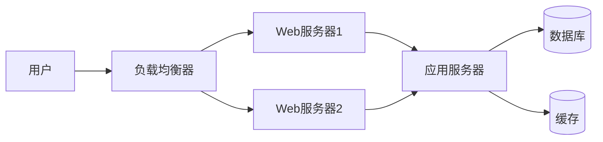

# 部署文档

**项目名称**：[项目名称]  
**版本号**：V1.0  
**创建日期**：[YYYY-MM-DD]  
**创建人**：[创建人姓名]

---

## 一、部署概述

### 1.1 部署架构



### 1.2 环境要求

#### 1.2.1 服务器要求

| 环境 | CPU | 内存 | 硬盘 | 操作系统 |
|------|-----|------|------|---------|
| 开发环境 | 2核 | 4GB | 50GB | [系统] |
| 测试环境 | 4核 | 8GB | 100GB | [系统] |
| 生产环境 | 8核 | 16GB | 500GB | [系统] |

#### 1.2.2 软件要求

| 软件 | 版本 | 说明 |
|------|------|------|
| Nginx | [版本] | Web服务器 |
| Node.js | [版本] | 前端运行环境 |
| JDK | [版本] | 后端运行环境 |
| MySQL | [版本] | 数据库 |
| Redis | [版本] | 缓存 |

---

## 二、部署步骤

### 2.1 环境准备

#### 2.1.1 操作系统配置

```bash
# 更新系统
yum update -y

# 安装基础工具
yum install -y wget curl vim git

# 配置防火墙
firewall-cmd --zone=public --add-port=80/tcp --permanent
firewall-cmd --zone=public --add-port=443/tcp --permanent
firewall-cmd --reload
```

#### 2.1.2 软件安装

```bash
# 安装Nginx
yum install -y nginx

# 安装Node.js
curl -fsSL https://rpm.nodesource.com/setup_[版本].x | bash -
yum install -y nodejs

# 安装JDK
yum install -y java-[版本]-openjdk
```

### 2.2 前端部署

#### 2.2.1 构建

```bash
# 克隆代码
git clone [仓库地址]
cd [项目目录]

# 安装依赖
npm install

# 构建
npm run build
```

#### 2.2.2 部署

```bash
# 上传dist目录到服务器
scp -r dist/* user@server:/var/www/[项目名]

# 配置Nginx
vim /etc/nginx/conf.d/[项目名].conf
```

**Nginx配置示例**：

```nginx
server {
    listen 80;
    server_name [域名];
    root /var/www/[项目名];
    index index.html;

    location / {
        try_files $uri $uri/ /index.html;
    }

    location /api {
        proxy_pass http://localhost:8080;
        proxy_set_header Host $host;
        proxy_set_header X-Real-IP $remote_addr;
    }
}
```

```bash
# 重启Nginx
nginx -t
systemctl restart nginx
```

### 2.3 后端部署

#### 2.3.1 构建

```bash
# 克隆代码
git clone [仓库地址]
cd [项目目录]

# Maven构建
mvn clean package -DskipTests
```

#### 2.3.2 部署

```bash
# 上传jar包
scp target/[项目名].jar user@server:/opt/[项目名]/

# 创建启动脚本
vim /opt/[项目名]/start.sh
```

**启动脚本示例**：

```bash
#!/bin/bash
APP_NAME=[项目名]
APP_JAR=/opt/[项目名]/$APP_NAME.jar
LOG_FILE=/opt/[项目名]/logs/app.log

nohup java -jar $APP_JAR > $LOG_FILE 2>&1 &
echo $! > /opt/[项目名]/app.pid
```

```bash
# 添加执行权限
chmod +x /opt/[项目名]/start.sh

# 启动应用
/opt/[项目名]/start.sh

# 配置systemd服务
vim /etc/systemd/system/[项目名].service
```

**systemd配置示例**：

```ini
[Unit]
Description=[项目名] Service
After=network.target

[Service]
Type=forking
User=root
WorkingDirectory=/opt/[项目名]
ExecStart=/opt/[项目名]/start.sh
PIDFile=/opt/[项目名]/app.pid
Restart=always

[Install]
WantedBy=multi-user.target
```

```bash
# 启动服务
systemctl daemon-reload
systemctl start [项目名]
systemctl enable [项目名]
```

### 2.4 数据库部署

#### 2.4.1 数据库初始化

```bash
# 创建数据库
mysql -u root -p
CREATE DATABASE [数据库名] DEFAULT CHARACTER SET utf8mb4 COLLATE utf8mb4_unicode_ci;

# 创建用户
CREATE USER '[用户名]'@'%' IDENTIFIED BY '[密码]';
GRANT ALL PRIVILEGES ON [数据库名].* TO '[用户名]'@'%';
FLUSH PRIVILEGES;

# 导入数据
mysql -u [用户名] -p [数据库名] < database.sql
```

#### 2.4.2 数据库配置

```yaml
spring:
  datasource:
    url: jdbc:mysql://localhost:3306/[数据库名]
    username: [用户名]
    password: [密码]
```

---

## 三、配置说明

### 3.1 环境变量

| 变量名 | 说明 | 示例 |
|--------|------|------|
| NODE_ENV | 运行环境 | production |
| API_BASE_URL | API地址 | https://api.example.com |
| DB_HOST | 数据库主机 | localhost |
| DB_PORT | 数据库端口 | 3306 |
| DB_NAME | 数据库名 | [数据库名] |
| DB_USER | 数据库用户 | [用户名] |
| DB_PASS | 数据库密码 | [密码] |
| REDIS_HOST | Redis主机 | localhost |
| REDIS_PORT | Redis端口 | 6379 |

### 3.2 应用配置

#### 3.2.1 前端配置

```javascript
// config.js
export default {
  apiBaseUrl: process.env.API_BASE_URL || '/api',
  timeout: 10000,
  tokenKey: 'access_token'
}
```

#### 3.2.2 后端配置

```yaml
# application.yml
server:
  port: 8080

spring:
  datasource:
    url: ${DB_URL}
    username: ${DB_USER}
    password: ${DB_PASS}
```

---

## 四、回滚方案

### 4.1 回滚步骤

1. 停止当前版本服务
2. 备份当前版本
3. 恢复上一版本
4. 启动上一版本服务
5. 验证回滚结果

### 4.2 数据备份

```bash
# 备份数据库
mysqldump -u [用户名] -p [数据库名] > backup_$(date +%Y%m%d).sql

# 备份应用
cp -r /opt/[项目名] /opt/[项目名]_backup_$(date +%Y%m%d)
```

### 4.3 回滚命令

```bash
# 停止服务
systemctl stop [项目名]

# 恢复备份
cp -r /opt/[项目名]_backup_[日期] /opt/[项目名]

# 启动服务
systemctl start [项目名]
```

---

## 五、常见问题

### 5.1 端口被占用

```bash
# 查看端口占用
netstat -tlnp | grep [端口号]

# 杀死进程
kill -9 [PID]
```

### 5.2 权限问题

```bash
# 修改文件权限
chown -R [用户]:[组] /opt/[项目名]
chmod -R 755 /opt/[项目名]
```

### 5.3 日志查看

```bash
# 查看应用日志
tail -f /opt/[项目名]/logs/app.log

# 查看Nginx日志
tail -f /var/log/nginx/access.log
tail -f /var/log/nginx/error.log
```

---

**文档结束**