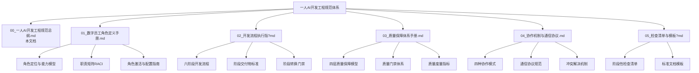
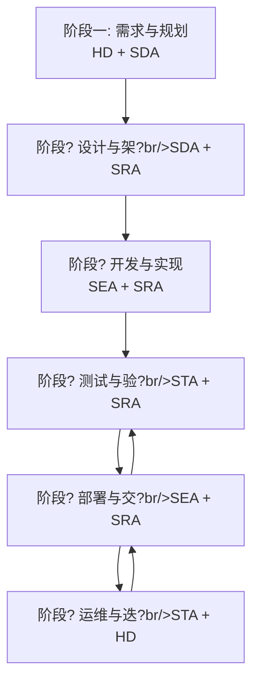

# 一?AI 开发・四维数字员工开发工程规范总纲

**文档版本**：V1.0  
**发布日期**?026-02-17  
**文档性质**：规范性文? 
**适用范围**：所有采用一人AI开发模式的软件项目

---

## 一、概?

### 1.1 规范背景

随着人工智能技术的快速发展，AI 辅助软件开发已成为提升开发效率的重要手段。「一?AI 开发・四维数字员工开发工程」是一种创新的软件开发模式，通过 1 名人类开发者配?4 个专业化数字员工，实现完整的软件项目开发能力?

### 1.2 规范目的

本规范旨在：
- 明确人类开发者与数字员工的职责边?
- 建立标准化的开发流程和质量保障体系
- 提供可操作的协作机制和通信协议
- 确保软件开发的效率和质量可?

### 1.3 适用对象

- 采用一人AI开发模式的个人开发?
- 小型软件开发团?
- 需要快速交付的软件项目

---

## 二、核心概?

### 2.1 四维数字员工

四维数字员工是指四个具有专业化能力的 AI 智能体，分别承担不同的开发职责：

| 数字员工 | 英文代号 | 核心定位 | 主要职责 |
|---------|---------|---------|---------|
| 系统设计员工 | SDA (System Design Agent) | 架构规划?| 需求分析、架构设计、技术选型 |
| 软件编码员工 | SEA (Software Engineering Agent) | 代码实现?| 功能开发、代码编写、单元测?|
| 软件审核员工 | SRA (Software Review Agent) | 质量守门?| 代码审查、安全审核、规范检?|
| 软件测试员工 | STA (Software Testing Agent) | 质量验证?| 测试设计、测试执行、缺陷管?|

### 2.2 人类开发者角?

人类开发者（HD - Human Developer）在开发工程中承担以下核心职责?

- **需求主?*：定义业务需求、确定项目范?
- **决策中心**：关键技术决策、优先级排序
- **最终审?*：里程碑验收、发布审?
- **风险管控**：风险识别、问题升级处?

### 2.3 协作原则

1. **职责清晰原则**：每个角色有明确的职责边界，不越界、不推诿
2. **质量优先原则**：质量门禁不可妥协，问题必须解决
3. **效率平衡原则**：在保证质量的前提下追求开发效?
4. **持续改进原则**：定期复盘，持续优化流程和能?

---

## 三、规范体系架?

### 3.1 文档体系



### 3.2 规范层级

| 层级 | 规范类型 | 强制程度 | 示例 |
|-----|---------|---------|------|
| L1 | 强制性规?| 必须遵守 | 质量门禁、安全规?|
| L2 | 推荐性规?| 应当遵守 | 编码规范、文档格?|
| L3 | 指导性规?| 建议参?| 最佳实践、优化建?|

---

## 四、开发流程概?

### 4.1 六阶段开发模?



### 4.2 阶段时长建议

| 阶段 | 占总周期比?| 主要角色 | 关键交付?|
|-----|-------------|---------|-----------|
| 需求与规划 | 10-15% | HD + SDA | 需求规格说明书 |
| 设计与架?| 15-20% | SDA + SRA | 架构设计文档 |
| 开发与实现 | 40-50% | SEA + SRA | 可运行代?|
| 测试与验?| 15-20% | STA + SRA | 测试报告 |
| 部署与交?| 5-10% | SEA + SRA | 部署?|
| 运维与迭?| 持续 | STA + HD | 运维报告 |

---

## 五、质量保障概?

### 5.1 四层质量模型


### 5.2 核心质量指标

| 指标类别 | 指标名称 | 目标?|
|---------|---------|-------|
| 代码质量 | 单元测试覆盖?| ?80% |
| 代码质量 | 代码审查覆盖?| 100% |
| 测试质量 | 测试通过?| ?95% |
| 缺陷管理 | 严重缺陷修复?| 100% |
| 缺陷管理 | 缺陷密度 | ?0.5 ?千行 |

---

## 六、协作机制概?

### 6.1 四种协作模式

| 模式 | 适用场景 | 特点 |
|-----|---------|------|
| 主从协作 | 独立任务执行 | 单向指令，结果汇?|
| 链式协作 | 流水线工?| 顺序传递，阶段推进 |
| 并行协作 | 独立任务并行 | 同时执行，结果汇?|
| 迭代协作 | 需反复优化 | 循环改进，逐步完善 |

### 6.2 决策层级


---

## 七、实施指?

### 7.1 项目启动流程

```
1. 项目评估
   ├── 确定项目规模（小?中型/大型?
   ├── 评估技术复杂度
   └── 制定时间计划

2. 角色配置
   ├── 根据项目规模配置数字员工
   ├── 确定协作模式
   └── 建立通信机制

3. 环境准备
   ├── 开发环境搭?
   ├── 工具链配?
   └── 代码仓库初始?

4. 规范导入
   ├── 确认适用的规范条?
   ├── 定制项目特定规范
   └── 团队（数字员工）培训
```

### 7.2 项目规模适配

| 项目规模 | 特征 | 数字员工配置建议 |
|---------|------|-----------------|
| 小型 | 1-2周，功能点≤20 | 精简模式，关键节点审?|
| 中型 | 2-8周，功能?0-100 | 标准模式，持续审?|
| 大型 | 8周以上，功能?100 | 强化模式，多层审?|

### 7.3 持续改进

每个项目完成后应进行复盘，内容包括：
- 流程执行情况评估
- 质量指标达成分析
- 协作效率评估
- 改进建议收集
- 最佳实践沉淀

---

## 八、规范管?

### 8.1 版本管理

| 版本 | 日期 | 修订内容 | 修订?|
|-----|------|---------|-------|
| V1.0 | 2026-02-17 | 初始版本 | HD |

### 8.2 规范维护

- **定期评审**：每季度评审一次规范适用?
- **问题反馈**：建立规范问题反馈渠?
- **版本更新**：根据实践反馈持续优化规?

### 8.3 规范解释

本规范的最终解释权归人类开发者（HD）所有。在规范执行过程中遇到歧义或冲突时，?HD 进行最终裁决?

---

## 附录

### 附录A：术语表

| 术语 | 全称 | 定义 |
|-----|------|------|
| HD | Human Developer | 人类开发?|
| SDA | System Design Agent | 系统设计数字员工 |
| SEA | Software Engineering Agent | 软件编码数字员工 |
| SRA | Software Review Agent | 软件审核数字员工 |
| STA | Software Testing Agent | 软件测试数字员工 |
| RACI | Responsible, Accountable, Consulted, Informed | 职责分配矩阵 |

### 附录B：参考文?

- 《数字员工角色定义手册?
- 《开发流程执行指南?
- 《质量保障体系手册?
- 《协作机制与通信协议?
- 《检查清单与模板库?

---

**文档结束**
