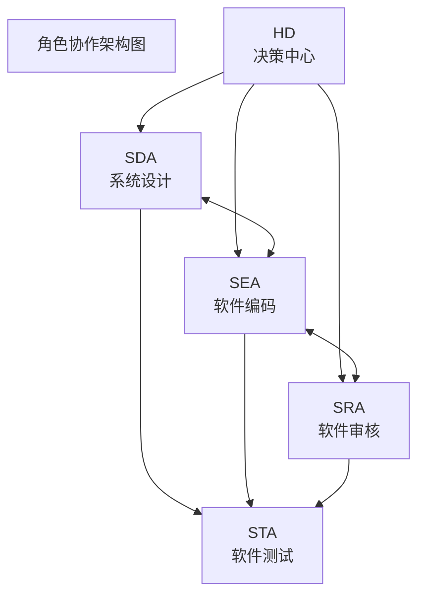
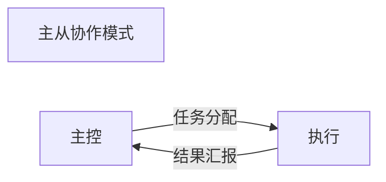

# 协作机制与通信协议

**文档版本**：V1.0  
**发布日期**：2026-02-17  
**文档性质**：规范性文档  
**所属体系**：一人AI开发工程规范体系

---

## 一、总则

### 1.1 文档目的

本手册详细定义一人AI开发工程中各角色间的协作机制和通信协议，确保信息传递准确、协作高效、决策及时，为项目开发提供顺畅的协作保障。

### 1.2 协作原则

```
┌─────────────────────────────────────────────────────────────┐
│                    协作基本原则                               │
├─────────────────────────────────────────────────────────────┤
│                                                             │
│  1. 职责清晰：每个角色明确自己的职责边界                       │
│                                                             │
│  2. 信息透明：关键信息及时共享，不隐瞒不延迟                   │
│                                                             │
│  3. 沟通高效：选择合适的协作模式，减少不必要的沟通              │
│                                                             │
│  4. 决策及时：问题及时升级，决策快速响应                       │
│                                                             │
│  5. 协作有序：遵循协作流程，不越权不推诿                       │
│                                                             │
└─────────────────────────────────────────────────────────────┘
```

### 1.3 协作架构



协作关系说明：
HD ←→ SDA：需求沟通、设计审批、问题升级
HD ←→ SEA：任务分配、进度汇报、问题升级
HD ←→ SRA：审核决策、问题升级、发布审批
HD ←→ STA：验收决策、质量评估、问题升级
SDA ←→ SEA：设计传递、实现反馈、技术讨论
SDA ←→ SRA：设计审核、方案优化、技术评审
SEA ←→ SRA：代码审查、问题修改、规范讨论
SEA ←→ STA：功能交付、缺陷修复、测试协作
SRA ←→ STA：测试建议、安全测试、质量评估
```

---

## 二、协作模式

### 2.1 主从协作模式

#### 2.1.1 模式定义



特点：单向指令传递，结果反馈

#### 2.1.2 适用场景

| 场景 | 主控角色 | 执行角色 | 说明 |
|------|---------|---------|------|
| 需求分析任务 | HD | SDA | HD提出需求，SDA分析后汇报 |
| 架构设计任务 | HD | SDA | HD确认需求，SDA设计后汇报 |
| 功能开发任务 | HD | SEA | HD分配任务，SEA开发后汇报 |
| 代码审查任务 | HD | SRA | HD要求审查，SRA审查后汇报 |
| 测试执行任务 | HD | STA | HD要求测试，STA测试后汇报 |

#### 2.1.3 执行流程

```
主从协作执行流程:

主控方                              执行方
   │                                  │
   │──── 1. 任务分配消息 ────────────▶│
   │                                  │
   │     任务信息:                     │
   │     - 任务编号                    │
   │     - 任务描述                    │
   │     - 输入要求                    │
   │     - 输出要求                    │
   │     - 截止时间                    │
   │                                  │
   │◀─── 2. 任务确认 ─────────────────│
   │                                  │
   │     确认信息:                     │
   │     - 接受/拒绝                   │
   │     - 预估时间                    │
   │     - 需要的支持                  │
   │                                  │
   │                                  │
   │◀─── 3. 任务完成通知 ─────────────│
   │                                  │
   │     完成信息:                     │
   │     - 任务结果                    │
   │     - 交付物                      │
   │     - 遇到的问题                  │
   │                                  │
   │──── 4. 结果确认 ────────────────▶│
   │                                  │
   │     确认信息:                     │
   │     - 接受/退回                   │
   │     - 反馈意见                    │
   │                                  │
```

### 2.2 链式协作模式

#### 2.2.1 模式定义

```
┌─────────────────────────────────────────────────────────────┐
│                    链式协作模式                               │
├─────────────────────────────────────────────────────────────┤
│                                                             │
│  ┌───────┐     ┌───────┐     ┌───────┐     ┌───────┐       │
│  │ 角色1 │ ──▶ │ 角色2 │ ──▶ │ 角色3 │ ──▶ │ 角色4 │       │
│  └───────┘     └───────┘     └───────┘     └───────┘       │
│                                                             │
│  特点：顺序传递，流水线作业                                   │
│                                                             │
└─────────────────────────────────────────────────────────────┘
```

#### 2.2.2 适用场景

| 场景 | 协作链 | 说明 |
|------|-------|------|
| 功能开发完整流程 | HD→SDA→SEA→SRA→STA→HD | 需求→设计→开发→审查→测试→验收 |
| 设计审核流程 | SDA→SRA→SDA | 设计→审核→修改完善 |
| 代码审查流程 | SEA→SRA→SEA | 提交→审查→修改 |
| 缺陷处理流程 | STA→SEA→STA | 报告→修复→验证 |

#### 2.2.3 执行流程

```
链式协作执行流程（功能开发示例）:

HD          SDA         SEA         SRA         STA         HD
│            │           │           │           │           │
│──需求─────▶│           │           │           │           │
│            │           │           │           │           │
│            │──设计────▶│           │           │           │
│            │           │           │           │           │
│            │           │──代码────▶│           │           │
│            │           │           │           │           │
│            │           │           │──审核通过─▶│           │
│            │           │           │           │           │
│            │           │           │           │──测试通过─▶│
│            │           │           │           │           │
│◀───验收确认───────────────────────────────────────────────│
│            │           │           │           │           │

传递内容:
每个环节传递:
- 任务编号
- 输入交付物
- 处理要求
- 质量标准
```

### 2.3 并行协作模式

#### 2.3.1 模式定义

```
┌─────────────────────────────────────────────────────────────┐
│                    并行协作模式                               │
├─────────────────────────────────────────────────────────────┤
│                                                             │
│                        ┌───────┐                            │
│              ┌────────│ 角色1 │────────┐                   │
│              │        └───────┘        │                   │
│              │                         │                   │
│              ▼                         ▼                   │
│        ┌───────────┐           ┌───────────┐              │
│        │  任务A    │           │  任务B    │              │
│        └─────┬─────┘           └─────┬─────┘              │
│              │                       │                   │
│              └───────────┬───────────┘                   │
│                          │                               │
│                          ▼                               │
│                    ┌───────────┐                         │
│                    │  结果汇聚  │                         │
│                    └───────────┘                         │
│                                                             │
│  特点：任务并行执行，结果汇聚                                 │
│                                                             │
└─────────────────────────────────────────────────────────────┘
```

#### 2.3.2 适用场景

| 场景 | 并行角色 | 任务内容 | 汇聚方式 |
|------|---------|---------|---------|
| 设计阶段多任务 | SDA | 接口设计 + 数据库设计 | 合并为完整设计 |
| 多模块开发 | SEA | 模块A开发 + 模块B开发 | 集成为完整系统 |
| 多类型测试 | STA | 功能测试 + 性能测试 | 合并为测试报告 |
| 安全与性能审核 | SRA | 安全审核 + 性能审核 | 合并为审核报告 |

#### 2.3.3 执行流程

```
并行协作执行流程:

协调方                              执行方A           执行方B
   │                                  │                 │
   │──── 1. 任务分配 ────────────────▶│                 │
   │    (任务A)                       │                 │
   │                                  │                 │
   │──── 1. 任务分配 ──────────────────────────────────▶│
   │    (任务B)                       │                 │
   │                                  │                 │
   │                                  │── 执行任务A ───▶│
   │                                  │                 │── 执行任务B ──▶
   │                                  │                 │
   │◀─── 2. 任务A完成 ────────────────│                 │
   │                                  │                 │
   │◀─── 2. 任务B完成 ─────────────────────────────────│
   │                                  │                 │
   │──── 3. 结果汇聚 ──────────────────────────────────▶│
   │                                  │                 │
   │◀─── 4. 汇聚完成 ──────────────────────────────────│
   │                                  │                 │

并行协作要求:
- 任务间无依赖关系
- 明确各自的输出标准
- 设定统一的完成时间
- 结果汇聚需要协调方处理
```

### 2.4 迭代协作模式

#### 2.4.1 模式定义

```
┌─────────────────────────────────────────────────────────────┐
│                    迭代协作模式                               │
├─────────────────────────────────────────────────────────────┤
│                                                             │
│         ┌─────────────────────────────────────┐            │
│         │              迭代循环                │            │
│         │                                     │            │
│         ▼                                     │            │
│    ┌───────┐     ┌───────┐     ┌───────┐    │            │
│    │ 执行  │ ──▶ │ 审核  │ ──▶ │ 反馈  │ ───┘            │
│    └───────┘     └───────┘     └───────┘                  │
│                                                             │
│  特点：循环迭代，逐步完善                                     │
│                                                             │
└─────────────────────────────────────────────────────────────┘
```

#### 2.4.2 适用场景

| 场景 | 执行角色 | 审核角色 | 迭代内容 |
|------|---------|---------|---------|
| 设计优化 | SDA | SRA | 设计→审核→修改→再审核 |
| 代码审查 | SEA | SRA | 代码→审查→修改→再审查 |
| 缺陷修复 | SEA | STA | 修复→验证→再修复→再验证 |
| 文档完善 | SDA/SEA | SRA/HD | 文档→审核→完善→再审核 |

#### 2.4.3 迭代规则

```yaml
迭代协作规则:
  迭代次数限制:
    最大迭代次数: 3次
    超过限制: 升级HD决策
    
  单次迭代时长:
    建议: ≤ 2小时
    超时: 需说明原因
    
  迭代终止条件:
    - 审核通过
    - 达到最大迭代次数
    - HD介入决策
    
  迭代记录:
    - 每次迭代的问题
    - 修改内容
    - 审核结果
```

#### 2.4.4 执行流程

```
迭代协作执行流程:

执行方                              审核方
   │                                  │
   │──── 1. 提交审核 ────────────────▶│
   │                                  │
   │◀─── 2. 审核反馈 ─────────────────│
   │     (问题清单)                    │
   │                                  │
   │──── 3. 修改完善 ────────────────▶│
   │                                  │
   │◀─── 4. 审核反馈 ─────────────────│
   │     (通过/继续修改)               │
   │                                  │
   │    ┌─────────────────────────────┤
   │    │                             │
   │    ▼                             │
   │  通过？                          │
   │    │                             │
   │    ├── 是 ──▶ 迭代结束           │
   │    │                             │
   │    └── 否 ──▶ 继续迭代           │
   │           (检查迭代次数)          │
   │                                  │
   │    迭代次数 > 3？                 │
   │           │                      │
   │           ├── 是 ──▶ 升级HD决策  │
   │           │                      │
   │           └── 否 ──▶ 继续修改    │
```

---

## 三、通信协议

### 3.1 任务传递协议（TTP）

#### 3.1.1 协议定义

任务传递协议（Task Transfer Protocol，TTP）用于角色间任务分配和传递。

#### 3.1.2 消息格式

```yaml
任务传递消息格式:
  header:
    message_id: "[唯一标识符]"
    timestamp: "[时间戳 YYYY-MM-DD HH:mm:ss]"
    sender: "[发送者角色 HD/SDA/SEA/SRA/STA]"
    receiver: "[接收者角色 HD/SDA/SEA/SRA/STA]"
    priority: "[优先级 P0/P1/P2/P3]"
    
  task:
    task_id: "[任务编号]"
    task_type: "[任务类型]"
    task_name: "[任务名称]"
    phase: "[所属阶段]"
    description: "[任务描述]"
    
  input:
    artifacts:
      - name: "[交付物名称]"
        location: "[交付物位置]"
        description: "[说明]"
    references:
      - name: "[参考文档名称]"
        location: "[文档位置]"
    constraints:
      - "[约束条件1]"
      - "[约束条件2]"
    
  output:
    expected:
      - name: "[期望输出名称]"
        format: "[输出格式]"
        standard: "[输出标准]"
    deadline: "[截止时间 YYYY-MM-DD HH:mm:ss]"
    
  quality_gate:
    criteria:
      - "[质量标准1]"
      - "[质量标准2]"
    reviewer: "[审核角色]"
```

#### 3.1.3 消息示例

```yaml
任务传递消息示例:
  header:
    message_id: "TASK-20260217-001"
    timestamp: "2026-02-17 09:00:00"
    sender: "HD"
    receiver: "SDA"
    priority: "P1"
    
  task:
    task_id: "TASK-001"
    task_type: "DESIGN"
    task_name: "用户登录模块设计"
    phase: "设计阶段"
    description: "设计用户登录模块的架构方案，包括账号密码登录和手机验证码登录两种方式"
    
  input:
    artifacts:
      - name: "需求规格说明书"
        location: "docs/需求规格说明书.md"
        description: "包含登录功能的详细需求"
    references:
      - name: "系统架构文档"
        location: "docs/架构设计文档.md"
    constraints:
      - "需要兼容现有用户体系"
      - "响应时间要求<500ms"
    
  output:
    expected:
      - name: "登录模块设计文档"
        format: "Markdown"
        standard: "符合设计文档模板"
      - name: "接口定义文档"
        format: "OpenAPI 3.0"
        standard: "接口定义完整规范"
    deadline: "2026-02-18 18:00:00"
    
  quality_gate:
    criteria:
      - "设计文档完整"
      - "接口定义清晰"
      - "安全方案可行"
    reviewer: "SRA"
```

### 3.2 审核反馈协议（RFP）

#### 3.2.1 协议定义

审核反馈协议（Review Feedback Protocol，RFP）用于审核结果的反馈传递。

#### 3.2.2 消息格式

```yaml
审核反馈消息格式:
  header:
    message_id: "[唯一标识符]"
    timestamp: "[时间戳]"
    task_id: "[关联任务ID]"
    reviewer: "[审核者角色]"
    reviewee: "[被审核者角色]"
    
  review_info:
    review_type: "[审核类型 CODE_REVIEW/DESIGN_REVIEW/SECURITY_REVIEW]"
    review_scope: "[审核范围]"
    review_duration: "[审核耗时]"
    
  result:
    status: "[PASS/PASS_WITH_COMMENTS/NEEDS_REVISION/FAIL]"
    summary: "[审核总结]"
    
  issues:
    - id: "[问题编号]"
      severity: "[CRITICAL/MAJOR/MINOR/SUGGESTION]"
      category: "[问题类别]"
      location: "[问题位置]"
      description: "[问题描述]"
      suggestion: "[改进建议]"
      status: "[OPEN/FIXED/WONT_FIX]"
      
  metrics:
    quality_score: "[质量评分 0-100]"
    compliance_rate: "[规范符合率 %]"
    
  next_action:
    action: "[下一步行动]"
    responsible: "[责任角色]"
    deadline: "[完成期限]"
```

#### 3.2.3 消息示例

```yaml
审核反馈消息示例:
  header:
    message_id: "REVIEW-20260217-001"
    timestamp: "2026-02-17 14:00:00"
    task_id: "TASK-002"
    reviewer: "SRA"
    reviewee: "SEA"
    
  review_info:
    review_type: "CODE_REVIEW"
    review_scope: "用户登录模块代码"
    review_duration: "30分钟"
    
  result:
    status: "NEEDS_REVISION"
    summary: "代码整体质量良好，但存在安全问题和性能优化空间"
    
  issues:
    - id: "ISSUE-001"
      severity: "CRITICAL"
      category: "安全性"
      location: "src/auth/login.js:45"
      description: "密码明文传输，存在安全风险"
      suggestion: "使用HTTPS传输，前端进行密码加密"
      status: "OPEN"
      
    - id: "ISSUE-002"
      severity: "MAJOR"
      category: "性能"
      location: "src/auth/login.js:78"
      description: "数据库查询未使用索引"
      suggestion: "为username字段添加索引"
      status: "OPEN"
      
    - id: "ISSUE-003"
      severity: "MINOR"
      category: "代码规范"
      location: "src/auth/login.js:12"
      description: "函数命名不符合规范"
      suggestion: "将checkUser改为validateUser"
      status: "OPEN"
      
  metrics:
    quality_score: "75"
    compliance_rate: "85%"
    
  next_action:
    action: "修改代码后重新提交审核"
    responsible: "SEA"
    deadline: "2026-02-17 18:00:00"
```

### 3.3 状态同步协议（SSP）

#### 3.3.1 协议定义

状态同步协议（Status Sync Protocol，SSP）用于项目状态和角色状态的同步。

#### 3.3.2 消息格式

```yaml
状态同步消息格式:
  header:
    sync_id: "[同步ID]"
    sync_type: "[PERIODIC/EVENT_DRIVEN/ON_DEMAND]"
    sync_time: "[同步时间]"
    
  project_status:
    project_id: "[项目ID]"
    project_name: "[项目名称]"
    phase: "[当前阶段]"
    progress: "[完成百分比 %]"
    health: "[项目健康度 GREEN/YELLOW/RED]"
    last_update: "[最后更新时间]"
    
  agent_status:
    - role: "[角色名称]"
      status: "[IDLE/WORKING/BLOCKED/WAITING]"
      current_task: "[当前任务]"
      workload: "[工作负载 %]"
      last_activity: "[最后活动时间]"
      
  tasks_status:
    total: "[总任务数]"
    completed: "[已完成数]"
    in_progress: "[进行中数]"
    blocked: "[阻塞数]"
    pending: "[待开始数]"
    
  risks:
    - id: "[风险ID]"
      level: "[风险等级 HIGH/MEDIUM/LOW]"
      description: "[风险描述]"
      mitigation: "[缓解措施]"
      owner: "[责任人]"
      
  metrics:
    velocity: "[开发速度]"
    defect_rate: "[缺陷率]"
    quality_trend: "[质量趋势 IMPROVING/STABLE/DECLINING]"
```

#### 3.3.3 消息示例

```yaml
状态同步消息示例:
  header:
    sync_id: "SYNC-20260217-001"
    sync_type: "PERIODIC"
    sync_time: "2026-02-17 18:00:00"
    
  project_status:
    project_id: "PROJ-001"
    project_name: "电商平台开发"
    phase: "开发阶段"
    progress: "45%"
    health: "GREEN"
    last_update: "2026-02-17 17:30:00"
    
  agent_status:
    - role: "SDA"
      status: "IDLE"
      current_task: "无"
      workload: "0%"
      last_activity: "2026-02-17 10:00:00"
      
    - role: "SEA"
      status: "WORKING"
      current_task: "用户登录模块开发"
      workload: "80%"
      last_activity: "2026-02-17 17:45:00"
      
    - role: "SRA"
      status: "WAITING"
      current_task: "等待代码提交审核"
      workload: "20%"
      last_activity: "2026-02-17 16:00:00"
      
    - role: "STA"
      status: "IDLE"
      current_task: "无"
      workload: "0%"
      last_activity: "2026-02-17 09:00:00"
      
  tasks_status:
    total: "20"
    completed: "8"
    in_progress: "3"
    blocked: "0"
    pending: "9"
    
  risks:
    - id: "RISK-001"
      level: "MEDIUM"
      description: "第三方支付接口对接可能延期"
      mitigation: "提前联系第三方确认接口文档"
      owner: "HD"
      
  metrics:
    velocity: "2.5 功能点/天"
    defect_rate: "0.3 个/千行"
    quality_trend: "STABLE"
```

### 3.4 问题升级协议（ECP）

#### 3.4.1 协议定义

问题升级协议（Escalation Protocol，ECP）用于问题升级和紧急情况处理。

#### 3.4.2 消息格式

```yaml
问题升级消息格式:
  header:
    escalation_id: "[升级ID]"
    timestamp: "[时间戳]"
    escalate_from: "[升级发起者]"
    escalate_to: "[升级目标]"
    
  issue:
    type: "[问题类型 TECHNICAL/DESIGN/RESOURCE/SCHEDULE/QUALITY]"
    severity: "[严重程度 CRITICAL/HIGH/MEDIUM/LOW]"
    title: "[问题标题]"
    description: "[问题描述]"
    impact: "[影响范围]"
    urgency: "[紧急程度]"
    
  context:
    related_task: "[关联任务]"
    related_phase: "[关联阶段]"
    affected_components: "[受影响组件]"
    
  attempted:
    - action: "[已尝试的解决方案]"
      result: "[结果]"
      timestamp: "[时间]"
      
  request:
    - type: "[请求类型 DECISION/RESOURCE/SUPPORT/INFORMATION]"
      description: "[请求描述]"
      expected_response: "[期望响应]"
      
  attachments:
    - type: "[附件类型]"
      location: "[附件位置]"
```

#### 3.4.3 消息示例

```yaml
问题升级消息示例:
  header:
    escalation_id: "ESC-20260217-001"
    timestamp: "2026-02-17 15:00:00"
    escalate_from: "SDA"
    escalate_to: "HD"
    
  issue:
    type: "DESIGN"
    severity: "HIGH"
    title: "技术方案选型分歧"
    description: "在数据库选型上，SDA建议使用PostgreSQL，但SRA认为MySQL更合适，双方意见不一致"
    impact: "影响设计阶段进度，可能延迟后续开发"
    urgency: "需要在今天内做出决策"
    
  context:
    related_task: "TASK-001"
    related_phase: "设计阶段"
    affected_components: "数据存储层"
    
  attempted:
    - action: "SDA和SRA进行了技术讨论"
      result: "双方各持己见，未能达成一致"
      timestamp: "2026-02-17 14:00:00"
      
  request:
    - type: "DECISION"
      description: "请HD决策数据库选型方案"
      expected_response: "明确选择PostgreSQL还是MySQL，并说明理由"
      
  attachments:
    - type: "技术对比文档"
      location: "docs/数据库选型对比.md"
```

---

## 四、协作规则

### 4.1 任务分配规则

| 规则编号 | 规则名称 | 规则内容 | 违反处理 |
|---------|---------|---------|---------|
| R-TASK-001 | 角色匹配原则 | 任务必须分配给具有相应职责的数字员工 | 拒绝任务，说明原因 |
| R-TASK-002 | 单一职责原则 | 同一时刻一个数字员工只能执行一个主要任务 | 排队等待或并行协调 |
| R-TASK-003 | 优先级原则 | 高优先级任务可以中断低优先级任务 | 保存当前状态，切换任务 |
| R-TASK-004 | 超时升级原则 | 任务执行超过预估时间150%需升级HD | 自动发送升级消息 |
| R-TASK-005 | 依赖前置原则 | 有依赖关系的任务必须按顺序执行 | 阻塞等待依赖完成 |
| R-TASK-006 | 能力匹配原则 | 任务要求不能超出执行者能力范围 | 拒绝任务，说明原因 |

### 4.2 审核决策规则

| 规则编号 | 规则名称 | 规则内容 | 违反处理 |
|---------|---------|---------|---------|
| R-REV-001 | 审核独立性原则 | 审核者不能是任务执行者 | 重新分配审核者 |
| R-REV-002 | 问题分级原则 | CRITICAL问题必须修复后才能继续 | 阻断后续工作 |
| R-REV-003 | 迭代上限原则 | 同一任务迭代修改不超过3次 | 升级HD决策 |
| R-REV-004 | 争议升级原则 | 审核分歧由HD最终裁决 | 发送升级消息 |
| R-REV-005 | 追溯原则 | 所有审核意见必须可追溯 | 记录审核历史 |
| R-REV-006 | 时效原则 | 审核应在规定时间内完成 | 超时自动提醒 |

### 4.3 沟通协作规则

| 规则编号 | 规则名称 | 规则内容 |
|---------|---------|---------|
| R-COMM-001 | 及时响应原则 | 收到消息后应在合理时间内响应 |
| R-COMM-002 | 信息完整原则 | 发送消息应包含所有必要信息 |
| R-COMM-003 | 格式规范原则 | 消息格式应符合协议规范 |
| R-COMM-004 | 状态同步原则 | 重要状态变更应及时同步 |
| R-COMM-005 | 问题升级原则 | 超出能力范围的问题应及时升级 |
| R-COMM-006 | 记录留存原则 | 重要沟通应记录留存 |

---

## 五、冲突解决机制

### 5.1 冲突类型

```
┌─────────────────────────────────────────────────────────────┐
│                    冲突类型分类                               │
└─────────────────────────────────────────────────────────────┘

┌─────────────────┐  ┌─────────────────┐  ┌─────────────────┐
│  技术方案冲突   │  │  优先级冲突     │  │  资源冲突       │
│                 │  │                 │  │                 │
│ • 架构方案分歧  │  │ • 任务优先级分歧│  │ • 时间资源不足  │
│ • 技术选型分歧  │  │ • 功能优先级分歧│  │ • 能力资源不足  │
│ • 实现方案分歧  │  │ • 缺陷修复优先级│  │ • 信息资源不足  │
└─────────────────┘  └─────────────────┘  └─────────────────┘

┌─────────────────┐  ┌─────────────────┐
│  质量标准冲突   │  │  进度冲突       │
│                 │  │                 │
│ • 代码质量标准  │  │ • 任务延期      │
│ • 测试通过标准  │  │ • 里程碑延期    │
│ • 发布质量标准  │  │ • 依赖阻塞      │
└─────────────────┘  └─────────────────┘
```

### 5.2 冲突解决流程

```
┌─────────────────────────────────────────────────────────────┐
│                    冲突解决流程                               │
└─────────────────────────────────────────────────────────────┘

    ┌─────────────┐
    │ 冲突识别    │
    └──────┬──────┘
           │
           ▼
    ┌─────────────┐
    │ 冲突分类    │
    └──────┬──────┘
           │
           ├──────────────────┬──────────────────┐
           │                  │                  │
           ▼                  ▼                  ▼
    ┌─────────────┐    ┌─────────────┐    ┌─────────────┐
    │技术方案冲突 │    │ 优先级冲突  │    │ 其他冲突   │
    └──────┬──────┘    └──────┬──────┘    └──────┬──────┘
           │                  │                  │
           ▼                  ▼                  ▼
    ┌─────────────┐    ┌─────────────┐    ┌─────────────┐
    │SRA技术评估  │    │SDA影响分析  │    │各方说明需求 │
    └──────┬──────┘    └──────┬──────┘    └──────┬──────┘
           │                  │                  │
           └──────────────────┼──────────────────┘
                              │
                              ▼
                       ┌─────────────┐
                       │  HD决策     │
                       └──────┬──────┘
                              │
                              ▼
                       ┌─────────────┐
                       │ 执行决策    │
                       └─────────────┘
```

### 5.3 决策原则

```yaml
冲突决策原则:
  业务价值优先:
    说明: 优先考虑业务价值和用户价值
    示例: 核心功能优先于辅助功能
    
  质量不可妥协:
    说明: 质量标准不可降低
    示例: 安全问题必须修复
    
  风险最小化:
    说明: 选择风险最小的方案
    示例: 选择成熟稳定的技术
    
  效率平衡:
    说明: 在保证质量的前提下追求效率
    示例: 合理安排任务优先级
    
  HD最终裁决:
    说明: 所有冲突最终由HD裁决
    示例: HD拥有最终决策权
```

---

## 六、协作场景示例

### 6.1 功能开发完整协作流程

```
┌─────────────────────────────────────────────────────────────┐
│              功能开发完整协作流程示例                         │
│                  （用户登录功能开发）                         │
└─────────────────────────────────────────────────────────────┘

阶段一：需求与规划
─────────────────────────────────────────────────────────────
HD: "我需要开发用户登录功能，支持账号密码和手机验证码两种方式"

SDA: 接收任务，开始需求分析
     → 输出：需求规格说明书
     → 输出：用户故事列表
     → 输出：验收标准

HD: 审核需求文档
     → 确认需求范围
     → 批准进入设计阶段

阶段二：设计与架构
─────────────────────────────────────────────────────────────
SDA: 开始架构设计
     → 输出：架构设计文档
     → 输出：接口定义文档
     → 输出：数据库设计文档

SRA: 设计审核
     → 审核架构合理性
     → 审核安全性
     → 输出：设计审核报告
     → 结果：通过

HD: 审批设计方案
     → 批准进入开发阶段

阶段三：开发与实现
─────────────────────────────────────────────────────────────
SEA: 开始代码实现
     → 实现登录接口
     → 编写单元测试
     → 代码自检

SEA: 提交代码审查
     → 发送TTP消息给SRA

SRA: 代码审查
     → 审查代码质量
     → 审查安全性
     → 输出：代码审查报告
     → 结果：需要修改（2个问题）

SEA: 修改代码
     → 修复问题
     → 重新提交

SRA: 重新审查
     → 结果：通过

阶段四：测试与验证
─────────────────────────────────────────────────────────────
STA: 测试准备
     → 设计测试用例
     → 搭建测试环境

STA: 执行测试
     → 功能测试
     → 发现1个缺陷

STA: 发送缺陷报告给SEA
     → 使用RFP协议

SEA: 修复缺陷
     → 提交修复

STA: 回归测试
     → 验证修复
     → 结果：通过

STA: 输出测试报告
     → 质量评估

HD: 验收测试
     → 执行验收
     → 结果：通过

阶段五：部署与交付
─────────────────────────────────────────────────────────────
SEA: 部署准备
     → 构建部署包
     → 准备部署脚本

SRA: 部署审核
     → 审核部署方案
     → 结果：通过

SEA: 执行部署
     → 部署到生产环境

STA: 冒烟测试
     → 验证核心功能
     → 结果：通过

HD: 发布审批
     → 批准发布

SEA: 发布完成
     → 编写发布说明
     → 通知相关方
```

### 6.2 问题升级处理示例

```
┌─────────────────────────────────────────────────────────────┐
│                问题升级处理示例                               │
│              （技术方案分歧）                                 │
└─────────────────────────────────────────────────────────────┘

背景：
SDA建议使用PostgreSQL，SRA认为MySQL更合适

处理过程：
─────────────────────────────────────────────────────────────
1. 冲突识别
   SDA: "我建议使用PostgreSQL，因为..."
   SRA: "我认为MySQL更合适，因为..."
   → 双方意见不一致，识别为技术方案冲突

2. 冲突分类
   → 类型：技术方案冲突
   → 严重程度：HIGH
   → 影响：可能延迟设计阶段进度

3. 技术评估
   SRA: 进行技术对比评估
   → 输出：技术对比文档
   → 列出两种方案的优缺点

4. 升级决策
   SDA: 发送ECP消息给HD
   → 包含问题描述
   → 包含技术对比文档
   → 请求决策

5. HD决策
   HD: 审核技术对比文档
   → 考虑项目实际情况
   → 考虑团队能力
   → 考虑长期维护成本
   → 决策：选择MySQL
   → 说明理由

6. 执行决策
   SDA: 根据决策调整设计
   → 使用MySQL进行设计
   → 更新设计文档

7. 记录归档
   → 记录决策过程
   → 记录决策理由
   → 归档相关文档
```

---

## 七、附录

### 7.1 协作模式选择指南

| 场景特征 | 推荐协作模式 | 说明 |
|---------|-------------|------|
| 独立任务，无依赖 | 主从协作 | 简单高效 |
| 流水线工作，有顺序依赖 | 链式协作 | 顺序传递 |
| 多任务并行，无依赖 | 并行协作 | 提高效率 |
| 需要反复优化 | 迭代协作 | 逐步完善 |

### 7.2 通信协议选择指南

| 通信目的 | 推荐协议 | 说明 |
|---------|---------|------|
| 任务分配和传递 | TTP | 包含完整任务信息 |
| 审核结果反馈 | RFP | 包含问题和改进建议 |
| 状态同步 | SSP | 定期或事件驱动 |
| 问题升级 | ECP | 紧急情况处理 |

### 7.3 协作效率优化建议

```yaml
协作效率优化建议:
  减少不必要的沟通:
    - 明确任务要求，减少反复确认
    - 提供完整信息，减少补充说明
    - 使用标准格式，减少理解偏差
    
  优化协作流程:
    - 选择合适的协作模式
    - 减少不必要的审核环节
    - 合并相关的任务
    
  提高响应速度:
    - 设置合理的响应时限
    - 建立快速响应机制
    - 减少等待时间
    
  利用自动化工具:
    - 自动化状态同步
    - 自动化质量检查
    - 自动化报告生成
```

---

**文档结束**
