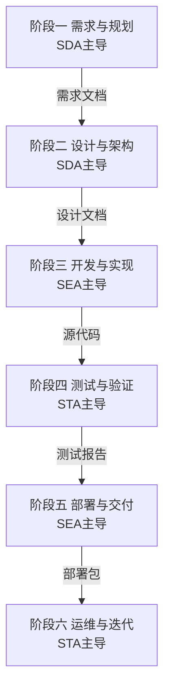

# 各阶段输出成果清单

**文档版本**：V1.0  
**发布日期**：2026-02-26  
**文档性质**：规范性文档  
**所属体系**：一人AI开发工程规范体系

---

## 一、设计背景

**问题现状**：个人开发者资源有限，AI辅助开发缺乏系统性规范，开发过程随意性强，质量难以保障。

**解决方案**：通过角色专业化分工，建立标准化流程体系，明确输出成果规范，构建质量保障机制。

**核心价值**：一人即可完成完整项目开发，效率提升3-5倍，获得团队级开发能力。

---

## 二、文档目的

本文档明确列出"一人AI开发·四维数字员工开发工程"各阶段的输出成果，为项目开发提供清晰的交付物清单和文件命名规范。

---

## 三、阶段输出成果总览



---

## 四、阶段一：需求与规划

### 3.1 主导角色

**SDA（系统设计员工）** + HD（人类开发者）

### 3.2 输出成果清单

| 序号 | 交付物名称 | 文件名 | 负责角色 | 审核角色 | 必需性 |
|------|-----------|--------|---------|---------|--------|
| 1 | 需求规格说明书 | 需求规格说明书.md | SDA | HD | 必需 |
| 2 | 前端UI设计说明书 | 前端UI设计说明书.md | SDA | HD | 必需 |
| 3 | 用户故事列表 | 用户故事列表.md | SDA | HD | 必需 |
| 4 | 验收标准 | 验收标准.md | SDA | HD | 必需 |
| 5 | 项目计划 | 项目计划.md | SDA | HD | 必需 |
| 6 | 风险清单 | 风险清单.md | SDA | HD | 必需 |

### 3.3 文档内容要求

#### 3.3.1 需求规格说明书.md

**文档结构**：
```markdown
# 需求规格说明书

## 1. 项目概述
   - 项目背景
   - 项目目标
   - 项目范围

## 2. 功能需求
   - 功能列表
   - 功能描述
   - 用户故事

## 3. 非功能需求
   - 性能需求
   - 安全需求
   - 可用性需求
   - 兼容性需求

## 4. 约束条件
   - 技术约束
   - 时间约束
   - 资源约束

## 5. 验收标准
   - 功能验收标准
   - 性能验收标准
   - 质量验收标准

## 6. 附录
   - 术语表
   - 参考文档
```

#### 3.3.2 前端UI设计说明书.md

**文档结构**：
```markdown
# 前端UI设计说明书

## 1. 设计原则
   - 设计理念
   - 设计风格
   - 色彩方案

## 2. 页面布局
   - 整体布局
   - 页面结构
   - 响应式设计

## 3. 组件设计
   - 基础组件
   - 业务组件
   - 布局组件

## 4. 交互设计
   - 交互流程
   - 动画效果
   - 反馈机制

## 5. 设计资源
   - 设计稿链接
   - 图标库
   - 字体资源
```

---

## 五、阶段二：设计与架构

### 4.1 主导角色

**SDA（系统设计员工）** + SRA（软件审核员工）

### 4.2 输出成果清单

| 序号 | 交付物名称 | 文件名 | 负责角色 | 审核角色 | 必需性 |
|------|-----------|--------|---------|---------|--------|
| 1 | 架构设计文档 | 架构设计文档.md | SDA | SRA/HD | 必需 |
| 2 | 前端技术设计说明书 | 前端技术设计说明书.md | SDA | SRA | 必需 |
| 3 | 后端技术设计说明书 | 后端技术设计说明书.md | SDA | SRA | 必需 |
| 4 | 接口设计说明书 | 接口设计说明书.md | SDA | SRA | 必需 |
| 5 | 数据库设计文档 | 数据库设计.sql | SDA | SRA | 必需 |
| 6 | 安全方案文档 | 安全方案文档.md | SDA | SRA | 推荐 |
| 7 | 设计审核报告 | 设计审核报告.md | SRA | HD | 必需 |

### 4.3 文档内容要求

#### 4.3.1 架构设计文档.md

**文档结构**：
```markdown
# 架构设计文档

## 1. 架构概述
   - 架构风格
   - 架构目标
   - 架构原则

## 2. 系统架构
   - 整体架构图
   - 模块划分
   - 模块职责

## 3. 技术选型
   - 技术栈选择
   - 框架选择
   - 中间件选择

## 4. 部署架构
   - 部署方案
   - 环境规划
   - 资源配置

## 5. 技术风险
   - 风险识别
   - 应对措施
```

#### 4.3.2 前端技术设计说明书.md

**文档结构**：
```markdown
# 前端技术设计说明书

## 1. 技术选型
   - 前端框架选择
   - UI组件库选择
   - 状态管理方案
   - 构建工具选择

## 2. 项目架构
   - 目录结构设计
   - 模块划分
   - 组件设计

## 3. 技术方案
   - 路由设计
   - 状态管理设计
   - API调用方案
   - 权限控制方案

## 4. 开发规范
   - 编码规范
   - 命名规范
   - 注释规范

## 5. 第三方依赖
   - 依赖列表
   - 版本说明
```

#### 4.3.3 后端技术设计说明书.md

**文档结构**：
```markdown
# 后端技术设计说明书

## 1. 技术选型
   - 后端框架选择
   - 数据库选择
   - 缓存方案选择
   - 消息队列选择

## 2. 项目架构
   - 目录结构设计
   - 模块划分
   - 服务设计

## 3. 技术方案
   - 数据库设计
   - 缓存设计
   - 接口设计
   - 安全方案

## 4. 开发规范
   - 编码规范
   - 命名规范
   - 注释规范

## 5. 第三方依赖
   - 依赖列表
   - 版本说明
```

#### 4.3.4 接口设计说明书.md

**文档结构**：
```markdown
# 接口设计说明书

## 1. 接口概述
   - 接口规范
   - 认证方式
   - 版本管理

## 2. 接口列表
   ### 2.1 用户模块
   - 用户登录
   - 用户注册
   - 用户信息查询
   
   ### 2.2 业务模块
   - 业务接口1
   - 业务接口2

## 3. 公共接口
   - 文件上传
   - 文件下载
   - 数据导出

## 4. 错误码定义
   - 错误码列表
   - 错误处理规范

## 5. 接口示例
   - 请求示例
   - 响应示例
```

#### 4.3.5 数据库设计.sql

**文档结构**：
```sql
-- 数据库设计文档

-- 1. 数据库创建
CREATE DATABASE IF NOT EXISTS database_name 
DEFAULT CHARACTER SET utf8mb4 
DEFAULT COLLATE utf8mb4_unicode_ci;

-- 2. 用户表
CREATE TABLE users (
    id BIGINT PRIMARY KEY AUTO_INCREMENT COMMENT '用户ID',
    username VARCHAR(50) NOT NULL COMMENT '用户名',
    email VARCHAR(100) NOT NULL COMMENT '邮箱',
    password VARCHAR(255) NOT NULL COMMENT '密码',
    created_at TIMESTAMP DEFAULT CURRENT_TIMESTAMP COMMENT '创建时间',
    updated_at TIMESTAMP DEFAULT CURRENT_TIMESTAMP ON UPDATE CURRENT_TIMESTAMP COMMENT '更新时间',
    INDEX idx_username (username),
    INDEX idx_email (email)
) ENGINE=InnoDB DEFAULT CHARSET=utf8mb4 COMMENT='用户表';

-- 3. 业务表
CREATE TABLE business_table (
    id BIGINT PRIMARY KEY AUTO_INCREMENT COMMENT '主键ID',
    name VARCHAR(100) NOT NULL COMMENT '名称',
    description TEXT COMMENT '描述',
    created_at TIMESTAMP DEFAULT CURRENT_TIMESTAMP COMMENT '创建时间',
    updated_at TIMESTAMP DEFAULT CURRENT_TIMESTAMP ON UPDATE CURRENT_TIMESTAMP COMMENT '更新时间'
) ENGINE=InnoDB DEFAULT CHARSET=utf8mb4 COMMENT='业务表';

-- 4. 索引设计
-- 5. 视图设计
-- 6. 存储过程设计
```

---

## 六、阶段三：开发与实现

### 5.1 主导角色

**SEA（软件编码员工）** + SRA（软件审核员工）

### 5.2 输出成果清单

| 序号 | 交付物名称 | 文件名/目录 | 负责角色 | 审核角色 | 必需性 |
|------|-----------|------------|---------|---------|--------|
| 1 | 源代码 | src/ | SEA | SRA | 必需 |
| 2 | 单元测试代码 | tests/ | SEA | STA | 必需 |
| 3 | 技术实现文档 | 技术实现文档.md | SEA | SRA | 推荐 |
| 4 | 代码审查报告 | 代码审查报告.md | SRA | HD | 必需 |

### 5.3 文档内容要求

#### 5.3.1 技术实现文档.md

**文档结构**：
```markdown
# 技术实现文档

## 1. 实现概述
   - 实现范围
   - 技术要点
   - 难点说明

## 2. 核心模块实现
   - 模块A实现说明
   - 模块B实现说明

## 3. 配置说明
   - 环境配置
   - 应用配置
   - 第三方服务配置

## 4. 部署说明
   - 构建步骤
   - 部署步骤
   - 环境变量说明

## 5. 注意事项
   - 已知问题
   - 性能优化建议
```

---

## 七、阶段四：测试与验证

### 6.1 主导角色

**STA（软件测试员工）** + SRA（软件审核员工）

### 6.2 输出成果清单

| 序号 | 交付物名称 | 文件名 | 负责角色 | 审核角色 | 必需性 |
|------|-----------|--------|---------|---------|--------|
| 1 | 测试计划 | 测试计划.md | STA | HD | 必需 |
| 2 | 测试用例 | 测试用例.md | STA | HD | 必需 |
| 3 | 缺陷报告 | 缺陷报告.md | STA | SEA | 必需 |
| 4 | 测试报告 | 测试报告.md | STA | HD | 必需 |
| 5 | 质量评估报告 | 质量评估报告.md | STA | HD | 必需 |

### 6.3 文档内容要求

#### 6.3.1 测试报告.md

**文档结构**：
```markdown
# 测试报告

## 1. 测试概述
   - 测试范围
   - 测试环境
   - 测试时间

## 2. 测试执行情况
   - 测试用例统计
   - 测试执行率
   - 测试通过率

## 3. 缺陷统计
   - 缺陷数量统计
   - 缺陷严重程度分布
   - 缺陷修复率

## 4. 质量评估
   - 功能完整性
   - 性能指标
   - 安全性评估

## 5. 发布建议
   - 发布风险评估
   - 发布建议
```

---

## 八、阶段五：部署与交付

### 7.1 主导角色

**SEA（软件编码员工）** + SRA（软件审核员工）

### 7.2 输出成果清单

| 序号 | 交付物名称 | 文件名/目录 | 负责角色 | 审核角色 | 必需性 |
|------|-----------|------------|---------|---------|--------|
| 1 | 部署包 | deploy/ | SEA | SRA | 必需 |
| 2 | 部署文档 | 部署文档.md | SEA | SRA | 必需 |
| 3 | 发布说明 | 发布说明.md | SEA | HD | 必需 |
| 4 | 用户手册 | 用户手册.md | SEA | HD | 推荐 |
| 5 | 运维手册 | 运维手册.md | SEA | HD | 推荐 |

### 7.3 文档内容要求

#### 7.3.1 部署文档.md

**文档结构**：
```markdown
# 部署文档

## 1. 部署概述
   - 部署架构
   - 环境要求
   - 依赖说明

## 2. 部署步骤
   - 环境准备
   - 应用部署
   - 配置修改
   - 服务启动

## 3. 配置说明
   - 数据库配置
   - 缓存配置
   - 日志配置

## 4. 回滚方案
   - 回滚步骤
   - 数据备份
   - 风险控制

## 5. 常见问题
   - 问题列表
   - 解决方案
```

---

## 九、阶段六：运维与迭代

### 8.1 主导角色

**STA（软件测试员工）** + HD（人类开发者）

### 8.2 输出成果清单

| 序号 | 交付物名称 | 文件名 | 负责角色 | 审核角色 | 必需性 |
|------|-----------|--------|---------|---------|--------|
| 1 | 运维报告 | 运维报告.md | STA | HD | 必需 |
| 2 | 问题分析报告 | 问题分析报告.md | SRA | HD | 按需 |
| 3 | 迭代计划 | 迭代计划.md | SDA | HD | 按需 |
| 4 | 优化建议 | 优化建议.md | SRA/STA | HD | 推荐 |

### 8.3 文档内容要求

#### 8.3.1 运维报告.md

**文档结构**：
```markdown
# 运维报告

## 1. 系统运行概况
   - 运行时间
   - 服务可用性
   - 关键指标

## 2. 性能监控
   - 响应时间统计
   - 吞吐量统计
   - 资源使用情况

## 3. 问题统计
   - 问题数量
   - 问题分类
   - 处理情况

## 4. 运维事件
   - 重大事件记录
   - 处理过程
   - 经验总结

## 5. 改进建议
   - 性能优化建议
   - 架构优化建议
```

---

## 十、文档管理规范

### 9.1 文档命名规范

```
格式：[文档名称].md 或 [文档名称].sql

示例：
- 需求规格说明书.md
- 前端技术设计说明书.md
- 前端UI设计说明书.md
- 接口设计说明书.md
- 数据库设计.sql
- 测试报告.md
```

### 9.2 文档目录结构

```
project/
├── docs/                    # 文档目录
│   ├── 需求/               # 需求阶段文档
│   │   ├── 需求规格说明书.md
│   │   ├── 前端UI设计说明书.md
│   │   ├── 用户故事列表.md
│   │   ├── 验收标准.md
│   │   ├── 项目计划.md
│   │   └── 风险清单.md
│   ├── 设计/               # 设计阶段文档
│   │   ├── 架构设计文档.md
│   │   ├── 前端技术设计说明书.md
│   │   ├── 后端技术设计说明书.md
│   │   ├── 接口设计说明书.md
│   │   ├── 数据库设计.sql
│   │   ├── 安全方案文档.md
│   │   └── 设计审核报告.md
│   ├── 开发/               # 开发阶段文档
│   │   ├── 技术实现文档.md
│   │   └── 代码审查报告.md
│   ├── 测试/               # 测试阶段文档
│   │   ├── 测试计划.md
│   │   ├── 测试用例.md
│   │   ├── 缺陷报告.md
│   │   ├── 测试报告.md
│   │   └── 质量评估报告.md
│   ├── 部署/               # 部署阶段文档
│   │   ├── 部署文档.md
│   │   ├── 发布说明.md
│   │   ├── 用户手册.md
│   │   └── 运维手册.md
│   └── 运维/               # 运维阶段文档
│       ├── 运维报告.md
│       ├── 问题分析报告.md
│       ├── 迭代计划.md
│       └── 优化建议.md
├── src/                     # 源代码目录
├── tests/                   # 测试代码目录
└── deploy/                  # 部署包目录
```

### 9.3 文档版本管理

```yaml
文档版本规范:
  格式: V[主版本].[次版本].[修订号]
  
  主版本: 重大变更，架构调整
  次版本: 功能新增，内容扩展
  修订号: 文档修正，错误修复
  
示例:
  V1.0.0: 初始版本
  V1.1.0: 新增章节
  V1.1.1: 修正错误
```

---

## 十一、附录

### 10.1 文档模板清单

| 模板名称 | 文件名 | 适用阶段 |
|---------|--------|---------|
| 需求规格说明书模板 | 需求规格说明书模板.md | 阶段一 |
| 前端UI设计说明书模板 | 前端UI设计说明书模板.md | 阶段一 |
| 架构设计文档模板 | 架构设计文档模板.md | 阶段二 |
| 前端技术设计说明书模板 | 前端技术设计说明书模板.md | 阶段二 |
| 后端技术设计说明书模板 | 后端技术设计说明书模板.md | 阶段二 |
| 接口设计说明书模板 | 接口设计说明书模板.md | 阶段二 |
| 数据库设计模板 | 数据库设计模板.sql | 阶段二 |
| 测试计划模板 | 测试计划模板.md | 阶段四 |
| 测试报告模板 | 测试报告模板.md | 阶段四 |
| 部署文档模板 | 部署文档模板.md | 阶段五 |
| 运维报告模板 | 运维报告模板.md | 阶段六 |

### 10.2 更新记录

| 版本 | 日期 | 更新内容 | 更新人 |
|------|------|----------|--------|
| V1.0 | 2026-02-26 | 初始版本 | - |

---

**文档结束**
