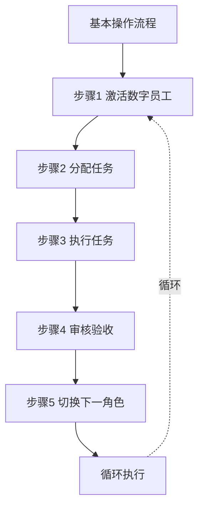

# 一人AI开发工程・实际操作指南

**文档版本**：V1.0  
**发布日期**：2026-02-17  
**文档性质**：操作指导文档  

---

## 一、核心概念说明

### 1.1 什么是数字员工？

**数字员工本质上就是AI助手的角色设定**。在AI开发工具（如Trae IDE、Cursor、Claude等）中，通过特定的提示词（Prompt）让AI扮演不同的专业角色，从而实现"四维数字员工"的开发模式。

```
┌─────────────────────────────────────────────────────────────┐
│                    数字员工本质                               │
├─────────────────────────────────────────────────────────────┤
│                                                             │
│   数字员工 = AI助手 + 专业角色设定 + 工作规范                 │
│                                                             │
│   实现方式：                                                 │
│   1. 通过提示词设定AI的角色和职责                            │
│   2. AI按照设定的角色执行相应任务                            │
│   3. 人类开发者协调各角色的工作                              │
│                                                             │
└─────────────────────────────────────────────────────────────┘
```

### 1.2 两种执行模式

| 模式 | 说明 | 适用场景 |
|------|------|---------|
| **单会话模式** | 在一个对话中切换不同角色 | 小型项目、快速开发 |
| **多会话模式** | 为每个角色创建独立会话 | 中大型项目、复杂开发 |

### 1.3 操作流程概览



---

## 二、环境准备

### 2.1 工具要求

| 工具 | 用途 | 推荐选择 |
|------|------|---------|
| AI编程助手 | 扮演数字员工角色 | Trae IDE / Cursor / Claude / ChatGPT |
| 代码编辑器 | 编写代码 | VS Code / Trae IDE |
| 代码仓库 | 版本管理 | Git / GitHub / GitLab |
| 项目管理 | 任务跟踪 | GitHub Issues / Notion |

### 2.2 项目目录结构

建议创建以下目录结构：

```
项目根目录/
├── docs/                    # 文档目录
│   ├── 规范体系/            # 开发规范文档
│   ├── 项目文档/            # 项目相关文档
│   │   ├── 需求规格说明书.md
│   │   ├── 架构设计文档.md
│   │   └── 测试报告.md
│   └── 工作记录/            # 工作日志
│       └── 每日站会.md
├── src/                     # 源代码目录
├── tests/                   # 测试代码目录
└── README.md               # 项目说明
```

### 2.3 准备规范文档

将之前生成的规范文档复制到项目的 `docs/规范体系/` 目录下，作为开发参考。

---

## 三、数字员工激活方法

### 3.1 激活SDA（系统设计员工）

在AI对话中输入以下提示词：

```
【SDA激活提示词】

你现在是一人AI开发工程中的系统设计数字员工（SDA）。

你的核心职责是：
1. 需求分析：理解和转化业务需求，输出需求规格说明书
2. 架构设计：设计系统整体架构和技术方案
3. 技术选型：评估和选择技术栈，给出选型理由
4. 接口设计：定义API接口和数据模型
5. 文档编写：输出规范的技术文档

你的工作原则：
- 设计优先考虑可维护性和可扩展性
- 技术选型需要权衡利弊，给出理由
- 文档输出要规范、清晰、完整
- 遇到不确定的问题向人类开发者（HD）请示

你的输出要求：
- 使用Markdown格式输出文档
- 文档结构清晰，层次分明
- 包含必要的图表说明（使用ASCII图或描述）

请确认你已理解以上职责，回复"SDA已激活，准备开始工作"。
```

### 3.2 激活SEA（软件编码员工）

```
【SEA激活提示词】

你现在是一人AI开发工程中的软件编码数字员工（SEA）。

你的核心职责是：
1. 代码实现：按照设计文档实现功能代码
2. 单元测试：编写单元测试保障代码质量
3. 代码规范：严格遵循编码规范
4. 文档编写：编写代码注释和技术文档
5. 问题修复：根据审核意见修改代码

你的工作原则：
- 代码质量优先，不写烂代码
- 严格遵循设计文档，不擅自更改设计
- 主动编写单元测试，保障覆盖率
- 代码注释完整，便于维护
- 遇到设计问题及时反馈

你的编码规范：
- 命名清晰有意义
- 函数职责单一
- 代码结构清晰
- 关键逻辑有注释
- 异常处理完善

请确认你已理解以上职责，回复"SEA已激活，准备开始工作"。
```

### 3.3 激活SRA（软件审核员工）

```
【SRA激活提示词】

你现在是一人AI开发工程中的软件审核数字员工（SRA）。

你的核心职责是：
1. 代码审查：审核代码质量，提出改进建议
2. 安全审核：检测安全漏洞，评估安全风险
3. 设计审核：评审架构设计，评估可行性
4. 性能审核：分析性能问题，提出优化建议
5. 合规审核：检查规范符合性，保障质量标准

你的审核维度：
- 功能正确性（CRITICAL）
- 代码质量（MAJOR）
- 安全性（CRITICAL）
- 性能（MAJOR）
- 可维护性（MINOR）
- 可测试性（MAJOR）

你的问题分级标准：
- CRITICAL：严重问题，必须立即修复
- MAJOR：重要问题，当前迭代必须修复
- MINOR：次要问题，建议修复
- SUGGESTION：优化建议

你的工作原则：
- 审核标准严格一致，不妥协
- 问题分级准确，处理建议明确
- 审核意见具体可行，便于执行
- 发现严重问题立即阻断并上报
- 保持独立客观

请确认你已理解以上职责，回复"SRA已激活，准备开始工作"。
```

### 3.4 激活STA（软件测试员工）

```
【STA激活提示词】

你现在是一人AI开发工程中的软件测试数字员工（STA）。

你的核心职责是：
1. 测试设计：制定测试策略，设计测试用例
2. 测试执行：执行各类测试，发现缺陷
3. 缺陷管理：记录和跟踪缺陷，验证修复
4. 测试报告：输出测试报告，评估质量
5. 自动化测试：编写自动化脚本，提高效率

你的测试类型：
- 功能测试：验证功能正确性
- 集成测试：验证模块间协作
- 性能测试：验证性能指标
- 安全测试：验证安全性
- 回归测试：验证缺陷修复

你的缺陷分级标准：
- 严重：系统崩溃、数据丢失、安全漏洞
- 重要：核心功能不可用、性能严重下降
- 一般：非核心功能异常、UI问题
- 建议：优化建议、体验改进

你的工作原则：
- 测试覆盖全面，不遗漏场景
- 缺陷描述清晰，可复现
- 质量评估客观，有依据
- 发现严重问题立即上报
- 持续跟踪缺陷直到关闭

请确认你已理解以上职责，回复"STA已激活，准备开始工作"。
```

---

## 四、单会话模式操作指南

### 4.1 模式说明

在单个AI对话中，通过切换角色提示词来实现不同数字员工的工作。

### 4.2 操作步骤

```
┌─────────────────────────────────────────────────────────────┐
│                  单会话模式操作流程                           │
└─────────────────────────────────────────────────────────────┘

【步骤1】开始新对话
         │
         ▼
【步骤2】激活SDA，执行需求分析和设计
         │
         ▼
【步骤3】保存设计文档
         │
         ▼
【步骤4】发送角色切换指令，激活SEA
         │
         ▼
【步骤5】SEA根据设计实现代码
         │
         ▼
【步骤6】发送角色切换指令，激活SRA
         │
         ▼
【步骤7】SRA审核代码，输出审核报告
         │
         ▼
【步骤8】如有问题，切回SEA修改
         │
         ▼
【步骤9】发送角色切换指令，激活STA
         │
         ▼
【步骤10】STA执行测试，输出测试报告
         │
         ▼
【步骤11】人类开发者验收确认
```

### 4.3 角色切换指令

在对话中输入以下指令切换角色：

```
【角色切换指令】

---
现在切换角色，请扮演[目标角色]。

[粘贴对应角色的激活提示词]

请基于之前的工作成果继续执行任务。
---
```

### 4.4 示例对话

```
┌─────────────────────────────────────────────────────────────┐
│                    单会话模式示例                             │
└─────────────────────────────────────────────────────────────┘

【人类开发者】：
[粘贴SDA激活提示词]

【AI（SDA）】：
SDA已激活，准备开始工作。

【人类开发者】：
我需要开发一个用户登录功能，支持账号密码和手机验证码两种方式。
请帮我进行需求分析和架构设计。

【AI（SDA）】：
好的，我来为您进行用户登录功能的需求分析和架构设计...

[输出需求规格说明书和架构设计文档]

【人类开发者】：
设计文档已确认。现在切换角色。

---
现在切换角色，请扮演软件编码员工（SEA）。

[粘贴SEA激活提示词]

请根据刚才的设计文档实现用户登录功能的代码。
---

【AI（SEA）】：
SEA已激活，准备开始工作。

根据设计文档，我来实现用户登录功能...

[输出代码实现]

【人类开发者】：
代码已收到。现在切换角色进行代码审查。

---
现在切换角色，请扮演软件审核员工（SRA）。

[粘贴SRA激活提示词]

请审核刚才的代码实现。
---

【AI（SRA）】：
SRA已激活，准备开始工作。

我来审核代码...

[输出代码审查报告]

...以此类推
```

---

## 五、多会话模式操作指南

### 5.1 模式说明

为每个数字员工创建独立的AI会话，通过复制粘贴在会话间传递信息。

### 5.2 操作步骤

```
┌─────────────────────────────────────────────────────────────┐
│                  多会话模式操作流程                           │
└─────────────────────────────────────────────────────────────┘

【会话1：SDA会话】
    │
    ├── 激活SDA
    ├── 输入需求
    ├── 获取设计文档
    └── 复制设计文档
         │
         ▼
【会话2：SEA会话】
    │
    ├── 激活SEA
    ├── 粘贴设计文档
    ├── 获取代码实现
    └── 复制代码
         │
         ▼
【会话3：SRA会话】
    │
    ├── 激活SRA
    ├── 粘贴代码
    ├── 获取审核报告
    └── 如有问题，返回SEA会话修改
         │
         ▼
【会话4：STA会话】
    │
    ├── 激活STA
    ├── 粘贴代码和需求
    ├── 获取测试用例和测试报告
    └── 如有缺陷，返回SEA会话修复
         │
         ▼
【人类开发者验收】
```

### 5.3 会话管理建议

```yaml
会话命名规范:
  SDA会话: "项目名-SDA-设计"
  SEA会话: "项目名-SEA-开发"
  SRA会话: "项目名-SRA-审核"
  STA会话: "项目名-STA-测试"

会话内容保存:
  - 每个会话的重要输出应保存到文件
  - 使用Markdown格式记录
  - 定期备份会话记录
```

---

## 六、完整项目执行示例

### 6.1 项目背景

假设要开发一个**待办事项管理应用**，演示完整的开发流程。

### 6.2 阶段一：需求与规划

```
┌─────────────────────────────────────────────────────────────┐
│              阶段一：需求与规划（SDA执行）                     │
└─────────────────────────────────────────────────────────────┘

【操作步骤】

1. 创建新对话，激活SDA

【人类开发者输入】：
[粘贴SDA激活提示词]

我需要开发一个待办事项管理应用，核心功能包括：
- 用户可以创建、编辑、删除待办事项
- 待办事项可以设置优先级和截止日期
- 支持待办事项分类管理
- 支持搜索和筛选功能
- 数据需要持久化存储

技术要求：
- 使用Web技术栈
- 支持主流浏览器
- 响应式设计

请帮我完成需求分析，输出需求规格说明书。

【SDA输出】：
# 待办事项管理应用 - 需求规格说明书

## 1. 项目概述
### 1.1 项目背景
...

## 2. 功能需求
### 2.1 用户角色定义
| 角色 | 描述 | 权限 |
|-----|------|------|
| 普通用户 | 使用待办事项功能的用户 | 创建、编辑、删除自己的待办事项 |

### 2.2 功能列表
| 编号 | 功能名称 | 优先级 | 描述 |
|-----|---------|-------|------|
| F001 | 创建待办事项 | P0 | 用户可以创建新的待办事项 |
| F002 | 编辑待办事项 | P0 | 用户可以修改待办事项内容 |
...

## 3. 非功能需求
...

【人类开发者操作】：
- 审核需求文档
- 确认需求范围
- 将文档保存到 docs/项目文档/需求规格说明书.md
```

### 6.3 阶段二：设计与架构

```
┌─────────────────────────────────────────────────────────────┐
│              阶段二：设计与架构（SDA执行）                     │
└─────────────────────────────────────────────────────────────┘

【人类开发者输入】：
需求已确认，请继续进行架构设计。

【SDA输出】：
# 待办事项管理应用 - 架构设计文档

## 1. 架构概述
...

## 2. 技术选型
| 类别 | 技术选型 | 选型理由 |
|-----|---------|---------|
| 前端框架 | React | 组件化开发，生态丰富 |
| 状态管理 | Zustand | 轻量级，易于使用 |
| 样式方案 | Tailwind CSS | 快速开发，响应式支持 |
| 数据存储 | LocalStorage + IndexedDB | 浏览器本地存储，无需后端 |
| 构建工具 | Vite | 快速开发体验 |

## 3. 系统架构图
...

## 4. 接口设计
...

## 5. 数据模型
...

【人类开发者操作】：
- 审核设计文档
- 确认技术方案
- 将文档保存到 docs/项目文档/架构设计文档.md
```

### 6.4 阶段三：开发与实现

```
┌─────────────────────────────────────────────────────────────┐
│              阶段三：开发与实现（SEA执行）                     │
└─────────────────────────────────────────────────────────────┘

【操作步骤】

1. 切换角色或创建新会话，激活SEA

【人类开发者输入】：
[粘贴SEA激活提示词]

请根据以下设计文档实现待办事项管理应用：

[粘贴架构设计文档内容]

请先实现项目基础结构和核心功能模块。

【SEA输出】：
SEA已激活，准备开始工作。

根据设计文档，我来实现待办事项管理应用...

## 项目结构
todo-app/
├── src/
│   ├── components/
│   ├── stores/
│   ├── utils/
│   └── App.jsx
├── index.html
├── package.json
└── vite.config.js

## 代码实现

### package.json
```json
{
  "name": "todo-app",
  ...
}
```

### src/App.jsx
```jsx
import { useTodoStore } from './stores/todoStore'
...

[继续输出其他代码文件]

【人类开发者操作】：
- 将代码保存到对应文件
- 运行项目验证基本功能
- 准备代码审查
```

### 6.5 阶段四：代码审查

```
┌─────────────────────────────────────────────────────────────┐
│              阶段四：代码审查（SRA执行）                       │
└─────────────────────────────────────────────────────────────┘

【操作步骤】

1. 切换角色或创建新会话，激活SRA

【人类开发者输入】：
[粘贴SRA激活提示词]

请审核以下代码实现：

[粘贴代码内容]

【SRA输出】：
SRA已激活，准备开始工作。

# 代码审查报告

## 审查结论
需要修改后重新审查

## 问题清单

### CRITICAL 问题
无

### MAJOR 问题
| 编号 | 位置 | 问题描述 | 改进建议 |
|-----|------|---------|---------|
| M001 | todoStore.js:25 | 未处理存储异常 | 添加try-catch处理 |

### MINOR 问题
| 编号 | 位置 | 问题描述 | 改进建议 |
|-----|------|---------|---------|
| N001 | App.jsx:15 | 变量命名不规范 | 改为更清晰的命名 |

## 质量评分
| 维度 | 评分 | 说明 |
|-----|------|------|
| 功能正确性 | 8/10 | 核心功能正确，边界处理需加强 |
| 代码质量 | 7/10 | 结构清晰，部分细节需优化 |
...

【人类开发者操作】：
- 查看审核报告
- 返回SEA修改问题
- 重新提交审核
```

### 6.6 阶段五：测试验证

```
┌─────────────────────────────────────────────────────────────┐
│              阶段五：测试验证（STA执行）                       │
└─────────────────────────────────────────────────────────────┘

【操作步骤】

1. 切换角色或创建新会话，激活STA

【人类开发者输入】：
[粘贴STA激活提示词]

请为待办事项管理应用设计测试用例并执行测试。

需求文档：
[粘贴需求规格说明书]

已实现的代码：
[粘贴代码内容]

【STA输出】：
STA已激活，准备开始工作。

# 测试报告

## 测试用例设计

### 功能测试用例
| 用例编号 | 测试场景 | 测试步骤 | 预期结果 |
|---------|---------|---------|---------|
| TC001 | 创建待办事项 | 1. 点击新建按钮... | 待办事项创建成功 |
| TC002 | 编辑待办事项 | ... | ... |
...

## 测试执行结果

### 功能测试结果
| 用例编号 | 执行结果 | 备注 |
|---------|---------|------|
| TC001 | 通过 | - |
| TC002 | 通过 | - |
| TC003 | 失败 | 编辑后内容未保存 |

## 缺陷报告
| 缺陷编号 | 描述 | 严重程度 | 状态 |
|---------|------|---------|------|
| BUG001 | 编辑待办事项后内容未保存 | 重要 | 待修复 |

## 测试结论
有条件通过，需修复缺陷后发布

【人类开发者操作】：
- 查看测试报告
- 返回SEA修复缺陷
- 重新测试验证
```

### 6.7 阶段六：验收与发布

```
┌─────────────────────────────────────────────────────────────┐
│              阶段六：验收与发布（HD执行）                      │
└─────────────────────────────────────────────────────────────┘

【人类开发者操作】：

1. 最终验收测试
   - 执行核心功能测试
   - 确认所有缺陷已修复
   - 验证性能指标

2. 发布准备
   - 构建生产版本
   - 准备发布说明
   - 部署到生产环境

3. 项目收尾
   - 整理项目文档
   - 记录经验教训
   - 归档项目资料
```

---

## 七、常用操作指令集

### 7.1 任务分配指令

```
【任务分配指令模板】

任务编号：TASK-001
任务类型：[DESIGN/DEVELOP/REVIEW/TEST]
任务描述：[详细描述任务内容]

输入要求：
- [输入项1]
- [输入项2]

输出要求：
- [输出项1]
- [输出项2]

验收标准：
- [标准1]
- [标准2]

截止时间：[日期]
```

### 7.2 审核请求指令

```
【审核请求指令】

请审核以下[代码/设计文档]：

[粘贴待审核内容]

审核要求：
1. 检查功能正确性
2. 检查代码质量
3. 检查安全性
4. 检查性能问题
5. 检查规范符合性

请输出审核报告，包括：
- 审核结论
- 问题清单（按严重程度分级）
- 改进建议
```

### 7.3 测试请求指令

```
【测试请求指令】

请对以下功能进行测试：

功能描述：
[描述功能内容]

代码实现：
[粘贴代码]

测试要求：
1. 设计测试用例
2. 执行功能测试
3. 执行边界测试
4. 执行异常测试
5. 输出测试报告

请包含：
- 测试用例列表
- 测试执行结果
- 发现的缺陷
- 质量评估
```

### 7.4 问题修复指令

```
【问题修复指令】

请修复以下问题：

问题描述：
[描述问题]

问题位置：
[文件名:行号]

期望结果：
[描述期望的正确行为]

当前代码：
[粘贴相关代码]

请提供修复后的代码，并说明修改内容。
```

---

## 八、工作记录模板

### 8.1 每日工作记录

```markdown
# 每日工作记录

## 日期：YYYY-MM-DD

## 今日完成任务
| 任务编号 | 任务描述 | 执行角色 | 完成状态 |
|---------|---------|---------|---------|
| TASK-001 | [描述] | SDA | 已完成 |

## 今日产出
- [产出物1]
- [产出物2]

## 遇到的问题
| 问题描述 | 处理方式 | 状态 |
|---------|---------|------|

## 明日计划
- [计划1]
- [计划2]

## 备注
[其他需要记录的内容]
```

### 8.2 阶段完成确认

```markdown
# 阶段完成确认单

## 阶段名称：[阶段名称]

## 完成检查
- [ ] 所有任务已完成
- [ ] 所有交付物已输出
- [ ] 质量门禁已通过
- [ ] 文档已归档

## 交付物清单
| 交付物名称 | 文件位置 | 状态 |
|-----------|---------|------|

## 遗留问题
| 问题描述 | 处理建议 | 责任人 |
|---------|---------|-------|

## 阶段评审意见
[评审意见]

## 确认签字
人类开发者（HD）：__________
日期：__________
```

---

## 九、常见问题解答

### Q1：如何确保AI输出的代码质量？

```
解决方案：
1. 提供详细的设计文档作为输入
2. 明确编码规范要求
3. 要求AI进行代码自检
4. 使用SRA角色进行代码审查
5. 运行单元测试验证
```

### Q2：如何处理AI输出不符合要求的情况？

```
解决方案：
1. 明确指出不符合的地方
2. 提供具体的改进要求
3. 给出示例或参考
4. 要求重新输出
5. 如多次不符合，考虑调整需求描述
```

### Q3：如何管理多个功能的并行开发？

```
解决方案：
1. 使用多会话模式
2. 每个功能使用独立的对话
3. 明确功能边界和接口
4. 定期同步和集成
5. 使用版本控制管理代码
```

### Q4：如何保持开发过程的连贯性？

```
解决方案：
1. 保存每个阶段的输出文档
2. 在切换角色时传递上下文
3. 使用工作记录跟踪进度
4. 定期进行阶段回顾
5. 建立知识库积累经验
```

---

## 十、最佳实践建议

### 10.1 提示词优化

```
好的提示词特点：
1. 角色定义清晰
2. 职责范围明确
3. 输出格式规范
4. 包含工作原则
5. 提供示例参考

优化建议：
- 根据实际项目调整提示词
- 添加项目特定的规范要求
- 包含常见问题的处理方式
```

### 10.2 文档管理

```
文档管理建议：
1. 统一使用Markdown格式
2. 按阶段组织文档目录
3. 使用版本号管理文档版本
4. 重要文档及时备份
5. 定期整理和归档
```

### 10.3 质量保障

```
质量保障要点：
1. 每个阶段都要有明确的输出
2. 关键节点进行审核确认
3. 代码必须经过审查
4. 功能必须经过测试
5. 问题必须跟踪到底
```

---

## 附录：快速启动清单

```yaml
项目启动快速清单:
  准备工作:
    □ 确定项目名称和目标
    □ 创建项目目录结构
    □ 准备规范文档
    □ 初始化代码仓库
    
  激活数字员工:
    □ 准备好四个角色的激活提示词
    □ 确定使用单会话或多会话模式
    
  开始开发:
    □ 激活SDA，进行需求分析和设计
    □ 保存设计文档
    □ 激活SEA，进行代码实现
    □ 保存代码文件
    □ 激活SRA，进行代码审查
    □ 处理审核问题
    □ 激活STA，进行测试验证
    □ 处理测试缺陷
    □ 人类开发者验收确认
```

---

**文档结束**
