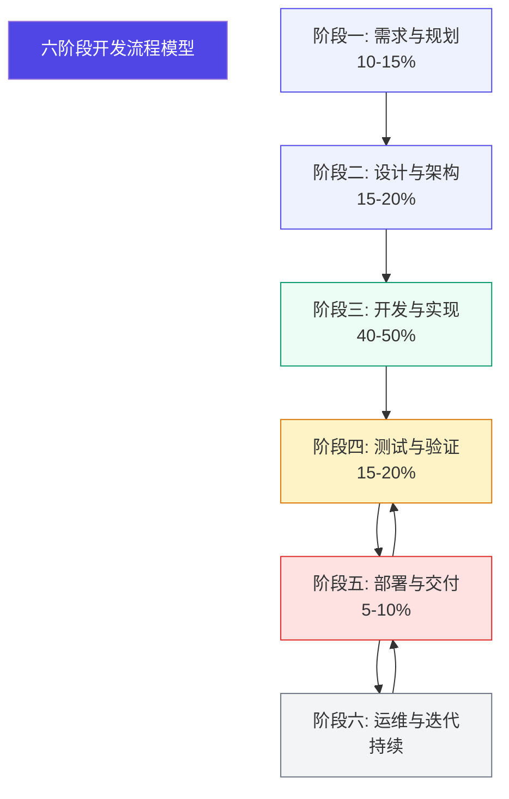

# 开发流程执行指南

**文档版本**：V1.0  
**发布日期**：2026-02-17  
**文档性质**：规范性文档  
**所属体系**：一人AI开发工程规范体系

---

## 一、总则

### 1.1 文档目的

本指南详细定义一人AI开发工程的六阶段开发流程，明确各阶段的活动内容、交付物标准、质量门禁和执行规范，为项目开发提供可操作的流程指导。

### 1.2 流程模型



注：百分比表示各阶段占项目总周期的建议比例

### 1.3 流程原则

| 原则 | 说明 |
|------|------|
| 阶段完整性 | 每个阶段必须完成规定的活动和交付物 |
| 门禁严格性 | 阶段转换必须通过质量门禁检查 |
| 迭代灵活性 | 可根据项目规模适当调整流程细节 |
| 文档规范性 | 所有交付物必须符合模板规范 |

---

## 二、阶段一：需求与规划

### 2.1 阶段概述

| 项目 | 内容 |
|------|------|
| **阶段目标** | 明确项目目标、范围和约束条件，形成可执行的需求规格 |
| **建议时长** | 项目总周期的 10-15% |
| **主导角色** | HD（人类开发者）+ SDA（系统设计员工） |
| **关键活动** | 需求收集、需求分析、可行性评估、项目规划 |

### 2.2 活动流程

```
┌─────────────────────────────────────────────────────────────┐
│                     需求与规划阶段流程                        │
└─────────────────────────────────────────────────────────────┘

HD: 人类开发者    SDA: 系统设计员工

    ┌──────────┐
    │ 项目启动 │
    └────┬─────┘
         │
         ▼
    ┌──────────────────────────────────────────┐
    │  HD: 描述业务愿景和核心需求               │
    │      - 说明业务背景                       │
    │      - 定义项目目标                       │
    │      - 明确核心功能需求                   │
    └────────────────────┬─────────────────────┘
                         │
                         ▼
    ┌──────────────────────────────────────────┐
    │  SDA: 需求分析与结构化整理                │
    │      - 识别功能需求                       │
    │      - 定义非功能需求                     │
    │      - 梳理需求依赖关系                   │
    │      - 分析需求优先级                     │
    └────────────────────┬─────────────────────┘
                         │
                         ▼
    ┌──────────────────────────────────────────┐
    │  SDA: 可行性评估                          │
    │      - 技术可行性分析                     │
    │      - 资源可行性分析                     │
    │      - 时间可行性分析                     │
    │      - 风险识别与评估                     │
    └────────────────────┬─────────────────────┘
                         │
                         ▼
    ┌──────────────────────────────────────────┐
    │  SDA: 编写需求规格文档                    │
    │      - 需求规格说明书                     │
    │      - 用户故事列表                       │
    │      - 验收标准定义                       │
    └────────────────────┬─────────────────────┘
                         │
                         ▼
    ┌──────────────────────────────────────────┐
    │  HD: 需求确认与审批                       │
    │      - 审核需求文档                       │
    │      - 确认需求范围                       │
    │      - 批准进入下一阶段                   │
    └────────────────────┬─────────────────────┘
                         │
                         ▼
              ┌──────────────────┐
              │ 阶段完成，进入设计阶段 │
              └──────────────────┘
```

### 2.3 输入输出

#### 2.3.1 输入要求

| 输入项 | 提供者 | 内容要求 |
|-------|-------|---------|
| 业务需求 | HD | 业务背景、目标、核心功能描述 |
| 技术约束 | HD | 技术栈要求、平台限制、集成要求 |
| 时间约束 | HD | 项目截止时间、里程碑节点 |
| 资源约束 | HD | 可用资源、预算限制 |

#### 2.3.2 输出交付物

| 交付物 | 负责角色 | 内容要求 | 审核角色 |
|-------|---------|---------|---------|
| 需求规格说明书 | SDA | 完整的需求描述，包含功能和非功能需求 | HD |
| 用户故事列表 | SDA | 按优先级排序的用户故事 | HD |
| 验收标准 | SDA | 明确可测试的验收条件 | HD |
| 项目计划 | SDA | 时间计划、里程碑、资源安排 | HD |
| 风险清单 | SDA | 已识别风险及应对措施 | HD |

### 2.4 质量门禁

**阶段转换检查清单**：

```yaml
需求阶段完成检查:
  需求完整性:
    □ 所有业务需求已识别
    □ 功能需求列表完整
    □ 非功能需求已定义
    □ 需求边界已明确
    
  可行性评估:
    □ 技术可行性已评估
    □ 资源可行性已评估
    □ 时间可行性已评估
    □ 主要风险已识别
    
  文档输出:
    □ 需求规格说明书已完成
    □ 用户故事已编写
    □ 验收标准已明确
    □ 项目计划已制定
    
  审批确认:
    □ SDA 完成需求分析
    □ HD 完成需求确认
    □ 需求基线已建立
```

### 2.5 执行规范

#### 2.5.1 需求分析方法

```
需求分析步骤:
1. 需求收集
   - 与HD沟通获取业务需求
   - 记录所有需求点
   - 识别需求来源

2. 需求分类
   - 功能需求：系统必须实现的功能
   - 非功能需求：性能、安全、可用性等
   - 约束条件：技术、时间、资源限制

3. 需求优先级
   - P0：必须有，否则系统无法使用
   - P1：重要功能，影响核心体验
   - P2：增强功能，提升用户体验
   - P3：可选功能，锦上添花

4. 需求验证
   - 与HD确认需求理解正确
   - 检查需求是否完整
   - 评估需求是否可实现
```

#### 2.5.2 用户故事格式

```
标准格式：
作为 [用户角色]
我希望 [完成某个功能]
以便 [获得某种价值]

示例：
作为 注册用户
我希望 能够通过手机验证码登录
以便 在忘记密码时也能访问账户

验收标准：
- 场景1：正常登录
  Given 用户已注册手机号
  When 用户输入手机号并获取验证码
  Then 系统发送验证码
  And 用户输入正确验证码后登录成功

- 场景2：验证码错误
  Given 用户已获取验证码
  When 用户输入错误验证码
  Then 系统提示"验证码错误"
  And 允许重新输入
```

---

## 三、阶段二：设计与架构

### 3.1 阶段概述

| 项目 | 内容 |
|------|------|
| **阶段目标** | 建立系统架构蓝图，明确技术方案和实现路径 |
| **建议时长** | 项目总周期的 15-20% |
| **主导角色** | SDA（系统设计员工）+ SRA（软件审核员工） |
| **关键活动** | 架构设计、技术选型、接口设计、设计审核 |

### 3.2 活动流程

```
┌─────────────────────────────────────────────────────────────┐
│                     设计与架构阶段流程                        │
└─────────────────────────────────────────────────────────────┘

SDA: 系统设计员工    SRA: 软件审核员工    HD: 人类开发者

    ┌──────────────────┐
    │ 接收需求文档     │
    └────────┬─────────┘
             │
             ▼
    ┌──────────────────────────────────────────┐
    │  SDA: 系统架构设计                        │
    │      - 确定架构风格                       │
    │      - 划分系统模块                       │
    │      - 定义模块接口                       │
    │      - 设计部署架构                       │
    └────────────────────┬─────────────────────┘
                         │
                         ▼
    ┌──────────────────────────────────────────┐
    │  SDA: 技术选型                            │
    │      - 评估技术栈选项                     │
    │      - 选择开发框架                       │
    │      - 确定第三方组件                     │
    │      - 记录选型理由                       │
    └────────────────────┬─────────────────────┘
                         │
                         ▼
    ┌──────────────────────────────────────────┐
    │  SDA: 详细设计                            │
    │      - API接口设计                        │
    │      - 数据模型设计                       │
    │      - 业务流程设计                       │
    │      - 安全方案设计                       │
    └────────────────────┬─────────────────────┘
                         │
                         ▼
    ┌──────────────────────────────────────────┐
    │  SRA: 设计审核                            │
    │      - 架构合理性审核                     │
    │      - 安全性审核                         │
    │      - 可行性审核                         │
    │      - 输出审核报告                       │
    └────────────────────┬─────────────────────┘
                         │
            ┌────────────┴────────────┐
            │                         │
            ▼                         ▼
     ┌─────────────┐          ┌─────────────┐
     │ 审核通过    │          │ 审核不通过  │
     └──────┬──────┘          └──────┬──────┘
            │                        │
            │                        ▼
            │                 ┌─────────────┐
            │                 │ SDA修改设计 │
            │                 └──────┬──────┘
            │                        │
            │                        ▼
            │                 ┌─────────────┐
            │                 │ 重新审核    │
            │                 └─────────────┘
            │
            ▼
    ┌──────────────────────────────────────────┐
    │  HD: 设计审批                             │
    │      - 审核设计文档                       │
    │      - 确认技术方案                       │
    │      - 批准进入开发阶段                   │
    └────────────────────┬─────────────────────┘
                         │
                         ▼
              ┌──────────────────┐
              │ 阶段完成，进入开发阶段 │
              └──────────────────┘
```

### 3.3 输入输出

#### 3.3.1 输入要求

| 输入项 | 提供者 | 内容要求 |
|-------|-------|---------|
| 需求规格说明书 | 阶段一输出 | 完整的需求定义 |
| 技术约束 | HD | 技术栈要求、平台限制 |
| 项目计划 | 阶段一输出 | 时间安排、里程碑 |

#### 3.3.2 输出交付物

| 交付物 | 负责角色 | 内容要求 | 审核角色 |
|-------|---------|---------|---------|
| 架构设计文档 | SDA | 系统架构图、模块划分、技术选型 | SRA/HD |
| 接口定义文档 | SDA | API列表、请求响应格式、错误码 | SRA |
| 数据库设计文档 | SDA | 数据模型、表结构、索引设计 | SRA |
| 安全方案文档 | SDA | 安全策略、认证授权、数据保护 | SRA |
| 设计审核报告 | SRA | 审核结论、问题清单、改进建议 | HD |

### 3.4 质量门禁

**阶段转换检查清单**：

```yaml
设计阶段完成检查:
  架构设计:
    □ 架构图完整清晰
    □ 模块划分合理
    □ 接口定义完整
    □ 部署方案明确
    
  技术选型:
    □ 技术栈已确定
    □ 选型理由充分
    □ 第三方组件已评估
    □ 许可证合规检查
    
  详细设计:
    □ API接口设计完成
    □ 数据模型设计完成
    □ 业务流程梳理完成
    □ 安全方案设计完成
    
  设计审核:
    □ SRA 完成架构审核
    □ 安全性审核通过
    □ 可行性审核通过
    □ HD 审批通过
```

### 3.5 执行规范

#### 3.5.1 架构设计原则

```
架构设计原则:
1. 单一职责原则
   - 每个模块只负责一个功能领域
   - 降低模块间的耦合度

2. 开闭原则
   - 对扩展开放，对修改关闭
   - 通过接口和抽象实现扩展

3. 依赖倒置原则
   - 高层模块不依赖低层模块
   - 都依赖抽象接口

4. 接口隔离原则
   - 接口要小而专一
   - 不强迫实现不需要的方法

5. 最小知识原则
   - 模块间通信最小化
   - 减少不必要的依赖
```

#### 3.5.2 技术选型评估维度

```yaml
技术选型评估:
  功能匹配度:
    - 是否满足功能需求
    - 是否支持扩展需求
    
  技术成熟度:
    - 社区活跃度
    - 版本稳定性
    - 文档完善度
    
  学习成本:
    - 团队熟悉程度
    - 学习曲线
    
  生态支持:
    - 第三方库丰富度
    - 工具链完善度
    
  长期维护:
    - 版本更新频率
    - 向后兼容性
    - 商业支持情况
```

---

## 四、阶段三：开发与实现

### 4.1 阶段概述

| 项目 | 内容 |
|------|------|
| **阶段目标** | 按照设计规范实现功能代码，确保代码质量 |
| **建议时长** | 项目总周期的 40-50% |
| **主导角色** | SEA（软件编码员工）+ SRA（软件审核员工） |
| **关键活动** | 环境搭建、代码编写、单元测试、代码审查 |

### 4.2 活动流程

```
┌─────────────────────────────────────────────────────────────┐
│                     开发与实现阶段流程                        │
└─────────────────────────────────────────────────────────────┘

SEA: 软件编码员工    SRA: 软件审核员工    STA: 软件测试员工

    ┌──────────────────┐
    │ 接收设计文档     │
    └────────┬─────────┘
             │
             ▼
    ┌──────────────────────────────────────────┐
    │  SEA: 开发环境搭建                        │
    │      - 配置开发环境                       │
    │      - 创建项目骨架                       │
    │      - 初始化代码仓库                     │
    │      - 配置构建工具                       │
    └────────────────────┬─────────────────────┘
                         │
                         ▼
    ┌──────────────────────────────────────────┐
    │  SEA: 模块开发（迭代循环）                │
    │                                          │
    │   ┌────────────────────────────────┐    │
    │   │ 1. 实现功能代码                │    │
    │   │ 2. 编写单元测试                │    │
    │   │ 3. 代码自检                    │    │
    │   │ 4. 提交代码审查                │    │
    │   └────────────────────────────────┘    │
    │                                          │
    └────────────────────┬─────────────────────┘
                         │
                         ▼
    ┌──────────────────────────────────────────┐
    │  SRA: 代码审查                            │
    │      - 代码质量检查                       │
    │      - 安全漏洞检查                       │
    │      - 性能问题检查                       │
    │      - 规范合规检查                       │
    └────────────────────┬─────────────────────┘
                         │
            ┌────────────┴────────────┐
            │                         │
            ▼                         ▼
     ┌─────────────┐          ┌─────────────┐
     │ 审核通过    │          │ 审核不通过  │
     └──────┬──────┘          └──────┬──────┘
            │                        │
            │                        ▼
            │                 ┌─────────────┐
            │                 │ SEA修改代码 │
            │                 └──────┬──────┘
            │                        │
            │                        ▼
            │                 ┌─────────────┐
            │                 │ 重新审查    │
            │                 └─────────────┘
            │
            ▼
    ┌──────────────────────────────────────────┐
    │  SEA: 继续下一模块开发                    │
    │      （重复上述循环直到所有模块完成）      │
    └────────────────────┬─────────────────────┘
                         │
                         ▼
    ┌──────────────────────────────────────────┐
    │  STA: 单元测试验收                        │
    │      - 验证单元测试覆盖率                 │
    │      - 确认测试通过                       │
    └────────────────────┬─────────────────────┘
                         │
                         ▼
              ┌──────────────────┐
              │ 阶段完成，进入测试阶段 │
              └──────────────────┘
```

### 4.3 输入输出

#### 4.3.1 输入要求

| 输入项 | 提供者 | 内容要求 |
|-------|-------|---------|
| 架构设计文档 | 阶段二输出 | 系统架构和模块划分 |
| 接口定义文档 | 阶段二输出 | API接口定义 |
| 数据库设计文档 | 阶段二输出 | 数据模型定义 |
| 编码规范 | SDA/HD | 代码风格和规范要求 |

#### 4.3.2 输出交付物

| 交付物 | 负责角色 | 内容要求 | 审核角色 |
|-------|---------|---------|---------|
| 源代码 | SEA | 功能实现代码，符合编码规范 | SRA |
| 单元测试代码 | SEA | 测试用例代码，覆盖率≥80% | STA |
| 代码注释 | SEA | 关键逻辑注释，API文档 | SRA |
| 技术实现文档 | SEA | 实现说明、配置说明 | SRA |
| 代码审查报告 | SRA | 审查结论、问题清单 | HD |

### 4.4 质量门禁

**阶段转换检查清单**：

```yaml
开发阶段完成检查:
  功能实现:
    □ 所有功能模块已实现
    □ 功能符合设计文档
    □ 无阻塞性问题
    
  代码质量:
    □ 代码编译无错误
    □ 编码规范检查通过
    □ 无严重静态分析问题
    □ 代码注释完整
    
  测试覆盖:
    □ 单元测试全部通过
    □ 测试覆盖率 ≥ 80%
    □ 边界场景已覆盖
    
  代码审查:
    □ 所有代码已审查
    □ 审查问题已修复
    □ 审查报告已归档
```

### 4.5 执行规范

#### 4.5.1 代码提交规范

```
代码提交前检查:
1. 代码质量
   - 编译无错误无警告
   - 遵循编码规范
   - 无明显性能问题

2. 测试验证
   - 单元测试全部通过
   - 新增代码有测试覆盖
   - 边界场景已测试

3. 文档更新
   - 代码注释完整
   - API文档已更新
   - 变更日志已记录

4. 提交信息
   - 提交信息清晰
   - 关联任务编号
   - 说明修改内容
```

#### 4.5.2 单元测试规范

```yaml
单元测试要求:
  覆盖率:
    行覆盖率: ≥ 80%
    分支覆盖率: ≥ 70%
    
  测试用例:
    - 正常场景测试
    - 边界条件测试
    - 异常情况测试
    
  命名规范:
    格式: test_<功能>_<场景>_<预期结果>
    示例: test_login_validUser_success
    
  断言规范:
    - 每个测试至少一个断言
    - 断言信息清晰明确
    - 避免冗余断言
```

---

## 五、阶段四：测试与验证

### 5.1 阶段概述

| 项目 | 内容 |
|------|------|
| **阶段目标** | 全面验证系统质量，确保满足验收标准 |
| **建议时长** | 项目总周期的 15-20% |
| **主导角色** | STA（软件测试员工）+ SRA（软件审核员工） |
| **关键活动** | 测试设计、测试执行、缺陷管理、质量评估 |

### 5.2 活动流程

```
┌─────────────────────────────────────────────────────────────┐
│                     测试与验证阶段流程                        │
└─────────────────────────────────────────────────────────────┘

STA: 软件测试员工    SRA: 软件审核员工    SEA: 软件编码员工
HD: 人类开发者

    ┌──────────────────┐
    │ 接收可运行系统   │
    └────────┬─────────┘
             │
             ▼
    ┌──────────────────────────────────────────┐
    │  STA: 测试准备                            │
    │      - 制定测试计划                       │
    │      - 设计测试用例                       │
    │      - 搭建测试环境                       │
    │      - 准备测试数据                       │
    └────────────────────┬─────────────────────┘
                         │
                         ▼
    ┌──────────────────────────────────────────┐
    │  STA: 功能测试                            │
    │      - 执行功能测试用例                   │
    │      - 记录测试结果                       │
    │      - 提交缺陷报告                       │
    └────────────────────┬─────────────────────┘
                         │
                         ▼
    ┌──────────────────────────────────────────┐
    │  STA: 集成测试                            │
    │      - 模块间接口测试                     │
    │      - 业务流程测试                       │
    │      - 数据一致性测试                     │
    └────────────────────┬─────────────────────┘
                         │
                         ▼
    ┌──────────────────────────────────────────┐
    │  SRA: 安全测试                            │
    │      - 安全漏洞扫描                       │
    │      - 权限控制测试                       │
    │      - 数据安全测试                       │
    └────────────────────┬─────────────────────┘
                         │
                         ▼
    ┌──────────────────────────────────────────┐
    │  STA: 性能测试                            │
    │      - 响应时间测试                       │
    │      - 并发性能测试                       │
    │      - 资源使用测试                       │
    └────────────────────┬─────────────────────┘
                         │
                         ▼
    ┌──────────────────────────────────────────┐
    │  缺陷修复循环                             │
    │                                          │
    │   STA: 提交缺陷 ──────────────────┐      │
    │                                   │      │
    │   SEA: 修复缺陷 ◀────────────────┘      │
    │        │                                │
    │   STA: 回归测试 ──────────────────┘      │
    │                                          │
    └────────────────────┬─────────────────────┘
                         │
                         ▼
    ┌──────────────────────────────────────────┐
    │  STA: 编写测试报告                        │
    │      - 测试结果统计                       │
    │      - 缺陷分析报告                       │
    │      - 质量评估结论                       │
    └────────────────────┬─────────────────────┘
                         │
                         ▼
    ┌──────────────────────────────────────────┐
    │  HD: 验收决策                             │
    │      - 审核测试报告                       │
    │      - 执行验收测试                       │
    │      - 决定是否发布                       │
    └────────────────────┬─────────────────────┘
                         │
                         ▼
              ┌──────────────────┐
              │ 阶段完成，进入部署阶段 │
              └──────────────────┘
```

### 5.3 输入输出

#### 5.3.1 输入要求

| 输入项 | 提供者 | 内容要求 |
|-------|-------|---------|
| 可运行系统 | 阶段三输出 | 功能完整的可运行系统 |
| 需求规格说明书 | 阶段一输出 | 验收标准定义 |
| 测试环境 | HD/SEA | 与生产环境一致的测试环境 |

#### 5.3.2 输出交付物

| 交付物 | 负责角色 | 内容要求 | 审核角色 |
|-------|---------|---------|---------|
| 测试计划 | STA | 测试范围、策略、资源安排 | HD |
| 测试用例 | STA | 覆盖所有功能点的测试用例 | HD |
| 缺陷报告 | STA | 缺陷描述、复现步骤、严重程度 | SEA |
| 测试报告 | STA | 测试结果、质量评估、发布建议 | HD |
| 质量评估报告 | STA | 质量指标、风险评估 | HD |

### 5.4 质量门禁

**阶段转换检查清单**：

```yaml
测试阶段完成检查:
  测试执行:
    □ 所有测试用例已执行
    □ 功能测试已完成
    □ 集成测试已完成
    □ 性能测试已完成
    □ 安全测试已完成
    
  缺陷管理:
    □ 所有缺陷已记录
    □ 严重缺陷已修复
    □ 重要缺陷已修复
    □ 回归测试已通过
    
  质量指标:
    □ 测试通过率 ≥ 95%
    □ 无未修复的严重缺陷
    □ 性能指标达标
    □ 安全测试通过
    
  文档输出:
    □ 测试报告已完成
    □ 质量评估已完成
    □ 发布建议已提出
```

### 5.5 执行规范

#### 5.5.1 测试用例设计方法

```
测试用例设计方法:
1. 等价类划分
   - 有效等价类
   - 无效等价类

2. 边界值分析
   - 边界值
   - 边界附近值

3. 场景法
   - 基本流程
   - 替代流程
   - 异常流程

4. 错误推测
   - 常见错误场景
   - 历史缺陷场景
```

#### 5.5.2 缺陷报告规范

```yaml
缺陷报告格式:
  基本信息:
    缺陷编号: "[自动生成]"
    发现时间: "[时间戳]"
    发现者: "[STA]"
    
  缺陷描述:
    标题: "[简明描述]"
    严重程度: "[严重/重要/一般/建议]"
    优先级: "[P0/P1/P2/P3]"
    
  详细信息:
    前置条件: "[执行前需要满足的条件]"
    复现步骤: "[详细的操作步骤]"
    预期结果: "[应该出现的结果]"
    实际结果: "[实际出现的结果]"
    
  附加信息:
    截图/日志: "[相关附件]"
    影响范围: "[受影响的功能模块]"
```

---

## 六、阶段五：部署与交付

### 6.1 阶段概述

| 项目 | 内容 |
|------|------|
| **阶段目标** | 安全可靠地将系统部署到生产环境，完成交付 |
| **建议时长** | 项目总周期的 5-10% |
| **主导角色** | SEA（软件编码员工）+ SRA（软件审核员工） |
| **关键活动** | 部署准备、部署执行、部署验证、发布审批 |

### 6.2 活动流程

```
┌─────────────────────────────────────────────────────────────┐
│                     部署与交付阶段流程                        │
└─────────────────────────────────────────────────────────────┘

SEA: 软件编码员工    SRA: 软件审核员工    STA: 软件测试员工
HD: 人类开发者

    ┌──────────────────┐
    │ 测试验收通过     │
    └────────┬─────────┘
             │
             ▼
    ┌──────────────────────────────────────────┐
    │  SEA: 部署准备                            │
    │      - 构建部署包                         │
    │      - 编写部署脚本                       │
    │      - 准备配置文件                       │
    │      - 制定回滚方案                       │
    └────────────────────┬─────────────────────┘
                         │
                         ▼
    ┌──────────────────────────────────────────┐
    │  SRA: 部署审核                            │
    │      - 审核部署方案                       │
    │      - 检查安全配置                       │
    │      - 验证回滚方案                       │
    └────────────────────┬─────────────────────┘
                         │
                         ▼
    ┌──────────────────────────────────────────┐
    │  SEA: 部署执行                            │
    │      - 执行部署脚本                       │
    │      - 配置生产环境                       │
    │      - 启动系统服务                       │
    └────────────────────┬─────────────────────┘
                         │
                         ▼
    ┌──────────────────────────────────────────┐
    │  STA: 冒烟测试                            │
    │      - 核心功能验证                       │
    │      - 系统可用性检查                     │
    │      - 性能基准验证                       │
    └────────────────────┬─────────────────────┘
                         │
                         ▼
    ┌──────────────────────────────────────────┐
    │  SRA: 部署验证                            │
    │      - 部署完整性检查                     │
    │      - 安全配置验证                       │
    │      - 监控告警配置                       │
    └────────────────────┬─────────────────────┘
                         │
                         ▼
    ┌──────────────────────────────────────────┐
    │  HD: 发布审批                             │
    │      - 审核部署结果                       │
    │      - 确认系统可用                       │
    │      - 签署发布批准                       │
    └────────────────────┬─────────────────────┘
                         │
                         ▼
    ┌──────────────────────────────────────────┐
    │  SEA: 发布完成                            │
    │      - 编写发布说明                       │
    │      - 更新用户文档                       │
    │      - 通知相关方                         │
    └────────────────────┬─────────────────────┘
                         │
                         ▼
              ┌──────────────────┐
              │ 阶段完成，进入运维阶段 │
              └──────────────────┘
```

### 6.3 输入输出

#### 6.3.1 输入要求

| 输入项 | 提供者 | 内容要求 |
|-------|-------|---------|
| 测试通过的系统 | 阶段四输出 | 通过所有测试的系统 |
| 生产环境 | HD | 已配置好的生产环境 |
| 部署计划 | SEA | 部署步骤和回滚方案 |

#### 6.3.2 输出交付物

| 交付物 | 负责角色 | 内容要求 | 审核角色 |
|-------|---------|---------|---------|
| 部署包 | SEA | 可部署的系统包 | SRA |
| 部署文档 | SEA | 部署步骤、配置说明 | SRA |
| 发布说明 | SEA | 版本信息、变更内容 | HD |
| 用户手册 | SEA | 用户操作指南 | HD |
| 运维手册 | SEA | 运维操作指南 | HD |

### 6.4 质量门禁

**阶段转换检查清单**：

```yaml
部署阶段完成检查:
  部署准备:
    □ 部署包已构建
    □ 部署脚本已准备
    □ 配置文件已准备
    □ 回滚方案已制定
    
  部署审核:
    □ SRA 完成部署审核
    □ 安全配置已检查
    □ 回滚方案已验证
    
  部署执行:
    □ 部署步骤已执行
    □ 系统已启动
    □ 冒烟测试通过
    
  发布确认:
    □ SRA 完成部署验证
    □ HD 完成发布审批
    □ 发布说明已完成
```

### 6.5 执行规范

#### 6.5.1 部署检查清单

```yaml
部署前检查:
  环境检查:
    □ 目标环境已准备
    □ 依赖服务已启动
    □ 网络连通性已验证
    □ 存储空间已确认
    
  配置检查:
    □ 配置文件已更新
    □ 敏感信息已配置
    □ 环境变量已设置
    
  备份检查:
    □ 数据已备份
    □ 配置已备份
    □ 回滚脚本已准备

部署后检查:
  服务检查:
    □ 服务已启动
    □ 端口已监听
    □ 日志无错误
    
  功能检查:
    □ 核心功能可用
    □ 接口响应正常
    □ 数据读写正常
    
  监控检查:
    □ 监控已配置
    □ 告警已配置
    □ 日志已收集
```

---

## 七、阶段六：运维与迭代

### 7.1 阶段概述

| 项目 | 内容 |
|------|------|
| **阶段目标** | 保障系统稳定运行，持续优化和迭代 |
| **建议时长** | 持续进行 |
| **主导角色** | STA（软件测试员工）+ HD（人类开发者） |
| **关键活动** | 系统监控、问题处理、需求收集、迭代规划 |

### 7.2 活动流程

```
┌─────────────────────────────────────────────────────────────┐
│                     运维与迭代阶段流程                        │
└─────────────────────────────────────────────────────────────┘

STA: 软件测试员工    SRA: 软件审核员工    HD: 人类开发者
SDA: 系统设计员工

    ┌──────────────────┐
    │ 系统上线运行     │
    └────────┬─────────┘
             │
             ▼
    ┌──────────────────────────────────────────┐
    │  STA: 系统监控                            │
    │      - 性能指标监控                       │
    │      - 错误日志监控                       │
    │      - 资源使用监控                       │
    │      - 用户行为分析                       │
    └────────────────────┬─────────────────────┘
                         │
                         ▼
    ┌──────────────────────────────────────────┐
    │  SRA: 问题诊断                            │
    │      - 性能问题分析                       │
    │      - 安全问题分析                       │
    │      - 稳定性问题分析                     │
    └────────────────────┬─────────────────────┘
                         │
                         ▼
    ┌──────────────────────────────────────────┐
    │  HD: 需求收集                             │
    │      - 用户反馈收集                       │
    │      - 业务需求变更                       │
    │      - 技术改进需求                       │
    └────────────────────┬─────────────────────┘
                         │
                         ▼
    ┌──────────────────────────────────────────┐
    │  SDA: 迭代规划                            │
    │      - 需求优先级排序                     │
    │      - 迭代计划制定                       │
    │      - 资源评估                           │
    └────────────────────┬─────────────────────┘
                         │
                         ▼
    ┌──────────────────────────────────────────┐
    │  HD: 迭代决策                             │
    │      - 审批迭代计划                       │
    │      - 确定迭代范围                       │
    │      - 启动新迭代                         │
    └────────────────────┬─────────────────────┘
                         │
                         ▼
              ┌──────────────────┐
              │ 进入新一轮开发周期 │
              └──────────────────┘
```

### 7.3 输入输出

#### 7.3.1 输入要求

| 输入项 | 提供者 | 内容要求 |
|-------|-------|---------|
| 运行系统 | 阶段五输出 | 已上线的系统 |
| 监控数据 | 系统自动 | 性能指标、错误日志 |
| 用户反馈 | HD/用户 | 问题反馈、需求建议 |

#### 7.3.2 输出交付物

| 交付物 | 负责角色 | 内容要求 | 审核角色 |
|-------|---------|---------|---------|
| 运维报告 | STA | 系统运行状态、问题统计 | HD |
| 问题分析报告 | SRA | 问题根因、解决方案 | HD |
| 迭代计划 | SDA | 迭代目标、任务分解 | HD |
| 优化建议 | SRA/STA | 性能优化、安全加固建议 | HD |

### 7.4 执行规范

#### 7.4.1 监控指标

```yaml
系统监控指标:
  性能指标:
    - 响应时间
    - 吞吐量
    - 并发数
    
  资源指标:
    - CPU使用率
    - 内存使用率
    - 磁盘使用率
    - 网络流量
    
  可用性指标:
    - 系统可用率
    - 错误率
    - 平均恢复时间
    
  业务指标:
    - 用户活跃度
    - 功能使用率
    - 转化率
```

#### 7.4.2 问题处理流程

```
问题处理流程:
1. 问题发现
   - 监控告警
   - 用户反馈
   - 主动巡检

2. 问题记录
   - 记录问题详情
   - 评估影响范围
   - 确定优先级

3. 问题分析
   - 收集相关信息
   - 分析根本原因
   - 制定解决方案

4. 问题解决
   - 实施解决方案
   - 验证解决效果
   - 更新相关文档

5. 问题复盘
   - 总结经验教训
   - 优化预防措施
   - 更新知识库
```

---

## 八、流程适配指南

### 8.1 项目规模适配

| 项目规模 | 流程适配建议 |
|---------|-------------|
| **小型项目**（1-2周） | 需求和设计阶段可合并，简化文档输出，关键节点审核 |
| **中型项目**（2-8周） | 标准六阶段流程，完整文档输出，持续审核 |
| **大型项目**（8周以上） | 强化设计和审核阶段，多层审核机制，分模块迭代 |

### 8.2 迭代模式适配

```
迭代模式选择:
1. 单次交付
   - 适用：小型项目、需求明确
   - 特点：一次性完成所有功能

2. 迭代交付
   - 适用：中型项目、需求渐进明确
   - 特点：分迭代交付，每迭代2-4周

3. 持续交付
   - 适用：大型项目、长期维护
   - 特点：持续集成、持续部署
```

---

## 九、附录

### 9.1 流程执行检查表

```yaml
项目启动检查:
  □ 项目目标已明确
  □ 项目范围已定义
  □ 项目计划已制定
  □ 数字员工已激活

阶段转换检查:
  □ 当前阶段活动已完成
  □ 交付物已输出
  □ 质量门禁已通过
  □ 下一阶段准备就绪

项目收尾检查:
  □ 所有功能已交付
  □ 所有文档已完成
  □ 系统已上线运行
  □ 项目复盘已完成
```

### 9.2 常见问题处理

| 问题 | 处理方式 |
|------|---------|
| 需求变更频繁 | 建立变更控制流程，评估影响后决策 |
| 设计方案分歧 | SRA评估，HD最终决策 |
| 开发进度延迟 | 分析原因，调整计划或增加资源 |
| 测试缺陷过多 | 加强代码审查，优化开发流程 |
| 部署失败 | 执行回滚，分析原因后重新部署 |

---

**文档结束**
