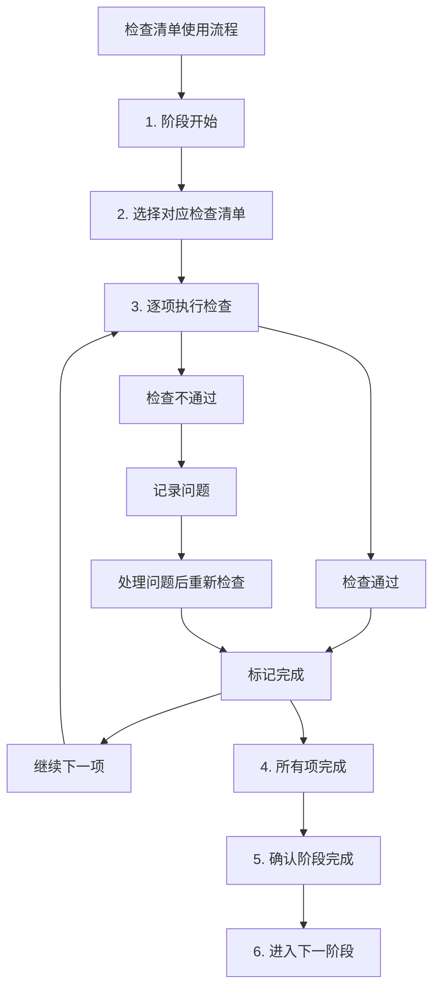

# 检查清单与模板库

**文档版本**：V1.0  
**发布日期**：2026-02-17  
**文档性质**：规范性文档  
**所属体系**：一人AI开发工程规范体系

---

## 一、总则

### 1.1 文档目的

本手册汇集一人AI开发工程中各阶段、各角色的检查清单和标准模板，为项目开发提供即用型工具，确保工作规范、完整、高效。

### 1.2 使用说明

```
┌─────────────────────────────────────────────────────────────┐
│                    检查清单使用说明                           │
├─────────────────────────────────────────────────────────────┤
│                                                             │
│  1. 在相应阶段开始前，查阅对应的检查清单                      │
│  2. 按照检查清单逐项执行和确认                                │
│  3. 使用模板生成标准化的交付物                                │
│  4. 所有检查项完成后才能进入下一阶段                          │
│                                                             │
└─────────────────────────────────────────────────────────────┘
```

---

## 二、项目级检查清单

### 2.1 项目启动检查清单

```yaml
项目启动检查清单:
  项目信息确认:
    □ 项目名称和编号已确定
    □ 项目目标和范围已明确
    □ 项目时间线已规划
    □ 技术栈已初步确定
    □ 项目约束条件已记录
    
  需求准备:
    □ 业务需求文档已完成
    □ 用户故事列表已整理
    □ 验收标准已定义
    □ 需求优先级已排序
    □ 风险评估已完成
    
  环境准备:
    □ 开发环境已配置
    □ 代码仓库已创建
    □ 分支策略已确定
    □ CI/CD流程已规划
    □ 工具链已就绪
    
  角色激活:
    □ SDA 已激活并理解项目背景
    □ SEA 已激活并了解技术要求
    □ SRA 已激活并明确审核标准
    □ STA 已激活并了解测试策略
    
  规范导入:
    □ 开发规范已确认
    □ 质量标准已明确
    □ 协作机制已建立
```

### 2.2 项目收尾检查清单

```yaml
项目收尾检查清单:
  交付物确认:
    □ 所有功能已交付
    □ 所有文档已完成
    □ 系统已上线运行
    □ 用户已验收确认
    
  质量确认:
    □ 所有测试已通过
    □ 所有缺陷已关闭
    □ 性能指标达标
    □ 安全审计通过
    
  文档归档:
    □ 需求文档已归档
    □ 设计文档已归档
    □ 测试文档已归档
    □ 部署文档已归档
    □ 运维文档已归档
    
  项目复盘:
    □ 项目复盘会已完成
    □ 经验教训已总结
    □ 改进建议已记录
    □ 最佳实践已沉淀
```

---

## 三、阶段检查清单

### 3.1 需求阶段检查清单

```yaml
需求阶段检查清单:
  需求分析:
    □ 所有业务需求已识别
    □ 功能需求列表完整
    □ 非功能需求已定义
    □ 需求依赖关系已梳理
    □ 需求优先级已确定
    
  可行性评估:
    □ 技术可行性已评估
    □ 资源可行性已评估
    □ 时间可行性已评估
    □ 风险已识别和评估
    
  文档输出:
    □ 需求规格说明书已完成
    □ 用户故事已编写
    □ 验收标准已明确
    □ 项目计划已制定
    
  评审确认:
    □ SDA 完成需求分析
    □ HD 完成需求确认
    □ 需求基线已建立
```

### 3.2 设计阶段检查清单

```yaml
设计阶段检查清单:
  架构设计:
    □ 架构图完整清晰
    □ 模块划分合理
    □ 接口定义完整
    □ 部署方案明确
    
  技术选型:
    □ 技术栈已确定
    □ 选型理由充分
    □ 第三方组件已评估
    □ 许可证合规检查
    
  详细设计:
    □ API接口设计完成
    □ 数据模型设计完成
    □ 业务流程梳理完成
    □ 安全方案设计完成
    
  设计评审:
    □ SRA 完成架构审核
    □ 安全性审核通过
    □ 可行性审核通过
    □ HD 审批通过
```

### 3.3 开发阶段检查清单

```yaml
开发阶段检查清单:
  开发准备:
    □ 开发环境已搭建
    □ 项目骨架已创建
    □ 编码规范已明确
    □ 开发任务已分解
    
  编码实现:
    □ 功能代码已实现
    □ 代码注释已添加
    □ 单元测试已编写
    □ 代码已提交
    
  代码质量:
    □ 代码编译无错误
    □ 单元测试全部通过
    □ 代码覆盖率达标
    □ 静态分析无严重问题
    
  代码审查:
    □ SRA 完成代码审查
    □ 审查问题已修复
    □ 审查报告已归档
```

### 3.4 测试阶段检查清单

```yaml
测试阶段检查清单:
  测试准备:
    □ 测试计划已制定
    □ 测试用例已设计
    □ 测试环境已搭建
    □ 测试数据已准备
    
  测试执行:
    □ 功能测试已完成
    □ 集成测试已完成
    □ 性能测试已完成
    □ 安全测试已完成
    
  缺陷管理:
    □ 缺陷已记录和分类
    □ 严重缺陷已修复
    □ 回归测试已完成
    □ 缺陷关闭率达标
    
  测试报告:
    □ 测试报告已完成
    □ 质量评估已完成
    □ 发布建议已提出
```

### 3.5 部署阶段检查清单

```yaml
部署阶段检查清单:
  部署准备:
    □ 部署包已构建
    □ 部署脚本已准备
    □ 部署环境已就绪
    □ 回滚方案已制定
    
  部署执行:
    □ 部署步骤已执行
    □ 部署验证已完成
    □ 冒烟测试已通过
    □ 监控告警已配置
    
  发布确认:
    □ SRA 完成发布审核
    □ HD 完成发布审批
    □ 发布说明已完成
    □ 用户通知已发送
```

---

## 四、角色检查清单

### 4.1 SDA（系统设计员工）检查清单

```yaml
SDA工作检查清单:
  需求分析阶段:
    □ 业务需求已理解
    □ 功能需求已识别
    □ 非功能需求已定义
    □ 需求优先级已排序
    □ 需求文档已输出
    
  设计阶段:
    □ 架构设计已完成
    □ 技术选型已完成
    □ 接口设计已完成
    □ 数据模型设计已完成
    □ 设计文档已输出
    
  交付前检查:
    □ 设计文档完整
    □ 接口定义清晰
    □ 技术方案可行
    □ 安全因素已考虑
    □ 性能因素已考虑
```

### 4.2 SEA（软件编码员工）检查清单

```yaml
SEA工作检查清单:
  编码前:
    □ 设计文档已理解
    □ 编码规范已明确
    □ 开发环境已准备
    □ 任务要求已确认
    
  编码中:
    □ 代码逻辑正确
    □ 编码规范遵循
    □ 代码注释完整
    □ 异常处理完善
    
  编码后:
    □ 代码编译通过
    □ 单元测试编写
    □ 单元测试通过
    □ 代码覆盖率达标
    
  提交前:
    □ 自检清单完成
    □ 代码已提交
    □ 审查请求已发送
```

### 4.3 SRA（软件审核员工）检查清单

```yaml
SRA工作检查清单:
  设计审核:
    □ 架构合理性审核
    □ 技术可行性审核
    □ 安全性审核
    □ 审核报告输出
    
  代码审核:
    □ 功能正确性检查
    □ 代码质量检查
    □ 安全性检查
    □ 性能检查
    □ 规范合规检查
    □ 审核报告输出
    
  发布审核:
    □ 部署方案审核
    □ 安全配置检查
    □ 回滚方案验证
    □ 审核结论输出
```

### 4.4 STA（软件测试员工）检查清单

```yaml
STA工作检查清单:
  测试准备:
    □ 测试计划已制定
    □ 测试用例已设计
    □ 测试环境已搭建
    □ 测试数据已准备
    
  测试执行:
    □ 功能测试执行
    □ 集成测试执行
    □ 性能测试执行
    □ 安全测试执行
    
  缺陷管理:
    □ 缺陷已记录
    □ 缺陷已分类
    □ 缺陷已跟踪
    □ 回归测试执行
    
  测试报告:
    □ 测试结果统计
    □ 缺陷分析完成
    □ 质量评估完成
    □ 测试报告输出
```

---

## 五、质量门禁检查清单

### 5.1 代码提交门禁

```yaml
代码提交门禁检查:
  必须项:
    □ 代码编译无错误
    □ 单元测试全部通过
    □ 代码覆盖率 ≥ 80%
    □ 无严重静态分析问题
    □ 代码注释完整
    
  推荐项:
    □ 无重要静态分析问题
    □ 代码复杂度合理
    □ 无重复代码警告
    □ 依赖检查无漏洞
```

### 5.2 设计评审门禁

```yaml
设计评审门禁检查:
  必须项:
    □ 架构图完整清晰
    □ 接口定义完整
    □ 数据模型设计合理
    □ 安全方案明确
    □ 性能方案可行
    
  推荐项:
    □ 有备选方案对比
    □ 扩展性考虑充分
    □ 技术债务评估
```

### 5.3 测试通过门禁

```yaml
测试通过门禁检查:
  必须项:
    □ 所有测试用例执行完成
    □ 严重缺陷全部修复
    □ 性能指标达标
    □ 安全审计通过
    □ 测试通过率 ≥ 95%
    
  推荐项:
    □ 重要缺陷全部修复
    □ 自动化测试覆盖核心功能
```

### 5.4 发布门禁

```yaml
发布门禁检查:
  必须项:
    □ 部署包已构建并验证
    □ 部署环境已准备
    □ 回滚方案已验证
    □ 监控告警已配置
    □ 部署文档完整
    
  推荐项:
    □ 用户手册已更新
    □ API文档已同步
    □ 变更日志已完整
```

---

## 六、标准文档模板

### 6.1 需求规格说明书模板

```markdown
# 需求规格说明书

## 文档信息
| 项目 | 内容 |
|------|------|
| 项目名称 | [项目名称] |
| 文档版本 | V1.0 |
| 编写日期 | [日期] |
| 编写人 | [角色] |
| 审核人 | [角色] |

## 1. 项目概述
### 1.1 项目背景
[描述项目背景和业务价值]

### 1.2 项目目标
[明确项目的核心目标]

### 1.3 项目范围
[定义项目的边界和范围]

## 2. 功能需求
### 2.1 用户角色定义
| 角色名称 | 角色描述 | 权限范围 |
|---------|---------|---------|
| [角色1] | [描述] | [权限] |

### 2.2 功能列表
| 编号 | 功能名称 | 优先级 | 描述 | 验收标准 |
|-----|---------|-------|------|---------|
| F001 | [功能名] | P0 | [描述] | [标准] |

### 2.3 用户故事
**US-001: [用户故事标题]**
- 作为 [角色]
- 我希望 [功能]
- 以便 [价值]

**验收标准：**
- 场景1：[场景描述]
  - Given [前置条件]
  - When [操作]
  - Then [预期结果]

## 3. 非功能需求
### 3.1 性能需求
| 指标 | 要求 |
|------|------|
| 响应时间 | [要求] |
| 并发用户 | [要求] |
| 吞吐量 | [要求] |

### 3.2 安全需求
| 类别 | 要求 |
|------|------|
| 认证授权 | [要求] |
| 数据安全 | [要求] |
| 审计日志 | [要求] |

### 3.3 可用性需求
| 指标 | 要求 |
|------|------|
| 可用性目标 | [要求] |
| 恢复时间 | [要求] |

## 4. 约束条件
### 4.1 技术约束
[描述技术约束]

### 4.2 时间约束
[描述时间约束]

### 4.3 资源约束
[描述资源约束]

## 5. 验收标准
| 需求编号 | 验收标准 | 验收方法 |
|---------|---------|---------|
| F001 | [标准] | [方法] |

## 6. 附录
### 6.1 术语定义
| 术语 | 定义 |
|------|------|

### 6.2 参考文档
- [文档1]
- [文档2]
```

### 6.2 架构设计文档模板

```markdown
# 架构设计文档

## 文档信息
| 项目 | 内容 |
|------|------|
| 项目名称 | [项目名称] |
| 文档版本 | V1.0 |
| 编写日期 | [日期] |
| 编写人 | SDA |
| 审核人 | SRA |

## 1. 架构概述
### 1.1 设计目标
[描述架构设计的目标]

### 1.2 设计原则
[描述架构设计遵循的原则]

### 1.3 架构约束
[描述架构设计的约束条件]

## 2. 系统架构
### 2.1 整体架构图
```
[架构图]
```

### 2.2 架构层次说明
| 层次 | 职责 | 技术选型 |
|-----|------|---------|
| 表现层 | [职责] | [技术] |
| 业务层 | [职责] | [技术] |
| 数据层 | [职责] | [技术] |

### 2.3 模块划分
| 模块名称 | 职责 | 依赖关系 |
|---------|------|---------|
| [模块1] | [职责] | [依赖] |

## 3. 技术选型
### 3.1 技术栈
| 类别 | 技术选型 | 版本 | 选型理由 |
|-----|---------|------|---------|
| 后端框架 | [技术] | [版本] | [理由] |
| 数据库 | [技术] | [版本] | [理由] |

### 3.2 第三方组件
| 组件名称 | 版本 | 用途 | 许可证 |
|---------|------|------|-------|

## 4. 接口设计
### 4.1 API设计规范
[描述API设计规范]

### 4.2 接口列表
| 接口名称 | 请求方式 | 路径 | 描述 |
|---------|---------|------|------|
| [接口1] | POST | /api/xxx | [描述] |

## 5. 数据设计
### 5.1 数据模型
[数据模型图或ER图]

### 5.2 数据库选型
| 数据库类型 | 选型 | 理由 |
|-----------|------|------|

### 5.3 数据字典
| 表名 | 字段名 | 类型 | 说明 |
|-----|-------|------|------|

## 6. 安全设计
### 6.1 认证授权方案
[描述认证授权方案]

### 6.2 数据安全方案
[描述数据安全方案]

### 6.3 安全防护措施
[描述安全防护措施]

## 7. 性能设计
### 7.1 性能目标
| 指标 | 目标值 |
|------|-------|

### 7.2 性能优化策略
[描述性能优化策略]

### 7.3 缓存策略
[描述缓存策略]

## 8. 部署架构
### 8.1 部署拓扑
[部署架构图]

### 8.2 环境规划
| 环境 | 用途 | 配置 |
|-----|------|------|

## 9. 附录
### 9.1 架构决策记录
| 决策编号 | 决策内容 | 原因 | 日期 |
|---------|---------|------|------|

### 9.2 参考资料
- [资料1]
- [资料2]
```

### 6.3 代码审查报告模板

```markdown
# 代码审查报告

## 审查信息
| 项目 | 内容 |
|------|------|
| 审查编号 | [编号] |
| 审查日期 | [日期] |
| 审查人 | SRA |
| 被审查人 | SEA |
| 代码范围 | [模块/文件列表] |

## 审查统计
| 指标 | 数值 |
|-----|------|
| 审查代码行数 | [行数] |
| 发现问题总数 | [数量] |
| CRITICAL | [数量] |
| MAJOR | [数量] |
| MINOR | [数量] |
| SUGGESTION | [数量] |

## 问题详情

### CRITICAL 问题
| 编号 | 位置 | 问题描述 | 改进建议 | 状态 |
|-----|------|---------|---------|------|
| C001 | [位置] | [描述] | [建议] | OPEN |

### MAJOR 问题
| 编号 | 位置 | 问题描述 | 改进建议 | 状态 |
|-----|------|---------|---------|------|
| M001 | [位置] | [描述] | [建议] | OPEN |

### MINOR 问题
| 编号 | 位置 | 问题描述 | 改进建议 | 状态 |
|-----|------|---------|---------|------|
| N001 | [位置] | [描述] | [建议] | OPEN |

### SUGGESTION
| 编号 | 位置 | 建议内容 | 状态 |
|-----|------|---------|------|
| S001 | [位置] | [建议] | OPEN |

## 质量评估
| 维度 | 评分(1-10) | 说明 |
|-----|-----------|------|
| 功能正确性 | [分数] | [说明] |
| 代码质量 | [分数] | [说明] |
| 安全性 | [分数] | [说明] |
| 性能 | [分数] | [说明] |
| 可维护性 | [分数] | [说明] |
| **综合评分** | [分数] | [说明] |

## 审查结论
- [ ] 通过
- [ ] 通过（有改进建议）
- [ ] 需要修改后重新审查
- [ ] 不通过

## 后续行动
| 行动项 | 责任人 | 截止日期 | 状态 |
|-------|-------|---------|------|
| [行动1] | SEA | [日期] | 待处理 |

## 审查人签字
审查人：SRA
日期：[日期]
```

### 6.4 测试报告模板

```markdown
# 测试报告

## 测试信息
| 项目 | 内容 |
|------|------|
| 项目名称 | [项目名称] |
| 测试版本 | [版本号] |
| 测试日期 | [日期范围] |
| 测试人 | STA |

## 测试概述
### 测试范围
[描述测试覆盖的功能范围]

### 测试环境
| 环境类型 | 配置信息 |
|---------|---------|
| 测试服务器 | [配置] |
| 数据库 | [配置] |
| 浏览器/客户端 | [配置] |

## 测试执行情况

### 测试用例统计
| 测试类型 | 用例总数 | 执行数 | 通过数 | 失败数 | 阻塞数 | 通过率 |
|---------|---------|-------|-------|-------|-------|-------|
| 功能测试 | [数量] | [数量] | [数量] | [数量] | [数量] | [百分比] |
| 集成测试 | [数量] | [数量] | [数量] | [数量] | [数量] | [百分比] |
| 性能测试 | [数量] | [数量] | [数量] | [数量] | [数量] | [百分比] |
| 安全测试 | [数量] | [数量] | [数量] | [数量] | [数量] | [百分比] |
| **合计** | [数量] | [数量] | [数量] | [数量] | [数量] | [百分比] |

### 缺陷统计
| 严重程度 | 新增 | 已修复 | 待修复 | 无法复现 | 关闭率 |
|---------|------|-------|-------|---------|-------|
| 严重 | [数量] | [数量] | [数量] | [数量] | [百分比] |
| 重要 | [数量] | [数量] | [数量] | [数量] | [百分比] |
| 一般 | [数量] | [数量] | [数量] | [数量] | [百分比] |
| 建议 | [数量] | [数量] | [数量] | [数量] | [百分比] |
| **合计** | [数量] | [数量] | [数量] | [数量] | [百分比] |

## 测试结果详情

### 功能测试结果
| 功能模块 | 测试结果 | 通过率 | 备注 |
|---------|---------|-------|------|
| [模块1] | 通过/失败 | [百分比] | [备注] |

### 性能测试结果
| 测试场景 | 目标值 | 实际值 | 结果 |
|---------|-------|-------|------|
| 响应时间 | [目标] | [实际] | 通过/失败 |
| 并发用户 | [目标] | [实际] | 通过/失败 |
| 吞吐量 | [目标] | [实际] | 通过/失败 |

### 安全测试结果
| 测试项 | 结果 | 风险等级 | 说明 |
|-------|------|---------|------|
| SQL注入 | 通过/失败 | 高/中/低 | [说明] |
| XSS攻击 | 通过/失败 | 高/中/低 | [说明] |
| 权限控制 | 通过/失败 | 高/中/低 | [说明] |

## 质量评估
| 评估维度 | 评估结果 | 说明 |
|---------|---------|------|
| 功能完整性 | [结果] | [说明] |
| 系统稳定性 | [结果] | [说明] |
| 性能表现 | [结果] | [说明] |
| 安全性 | [结果] | [说明] |
| 用户体验 | [结果] | [说明] |

## 遗留问题
| 问题编号 | 问题描述 | 严重程度 | 处理建议 |
|---------|---------|---------|---------|
| [编号] | [描述] | [程度] | [建议] |

## 测试结论
- [ ] 通过，建议发布
- [ ] 有条件通过，需关注以下问题
- [ ] 不通过，需修复后重新测试

## 发布建议
[具体的发布建议和注意事项]

## 测试人签字
测试人：STA
日期：[日期]
```

### 6.5 部署文档模板

```markdown
# 部署文档

## 文档信息
| 项目 | 内容 |
|------|------|
| 项目名称 | [项目名称] |
| 文档版本 | V1.0 |
| 编写日期 | [日期] |
| 编写人 | SEA |

## 1. 部署概述
### 1.1 部署目标
[描述部署的目标]

### 1.2 部署范围
[描述部署的范围]

## 2. 环境要求
### 2.1 硬件要求
| 组件 | 最低配置 | 推荐配置 |
|-----|---------|---------|
| CPU | [配置] | [配置] |
| 内存 | [配置] | [配置] |
| 存储 | [配置] | [配置] |

### 2.2 软件要求
| 软件 | 版本要求 | 说明 |
|-----|---------|------|
| 操作系统 | [版本] | [说明] |
| 运行环境 | [版本] | [说明] |
| 数据库 | [版本] | [说明] |

### 2.3 网络要求
| 项目 | 要求 |
|-----|------|
| 端口 | [端口列表] |
| 域名 | [域名列表] |

## 3. 部署步骤
### 3.1 部署前准备
1. [步骤1]
2. [步骤2]

### 3.2 部署执行
1. [步骤1]
   ```bash
   [命令]
   ```
2. [步骤2]
   ```bash
   [命令]
   ```

### 3.3 部署验证
1. [验证步骤1]
2. [验证步骤2]

## 4. 配置说明
### 4.1 配置文件
| 文件名 | 位置 | 说明 |
|-------|------|------|
| [文件1] | [位置] | [说明] |

### 4.2 环境变量
| 变量名 | 说明 | 示例值 |
|-------|------|-------|
| [变量1] | [说明] | [示例] |

### 4.3 数据库配置
[数据库配置说明]

## 5. 回滚方案
### 5.1 回滚条件
[描述触发回滚的条件]

### 5.2 回滚步骤
1. [步骤1]
2. [步骤2]

## 6. 监控配置
### 6.1 监控指标
| 指标 | 阈值 | 告警级别 |
|-----|------|---------|
| [指标1] | [阈值] | [级别] |

### 6.2 日志配置
[日志配置说明]

## 7. 常见问题
### 7.1 问题1
**现象**：[描述]
**原因**：[分析]
**解决**：[方案]

## 8. 附录
### 8.1 部署检查清单
- [ ] 环境准备完成
- [ ] 配置文件正确
- [ ] 数据库初始化完成
- [ ] 服务启动正常
- [ ] 功能验证通过
```

---

## 七、日常操作模板

### 7.1 任务分配单模板

```yaml
任务分配单:
  任务编号: "[自动生成]"
  创建时间: "[时间戳]"
  
  任务信息:
    任务名称: ""
    任务类型: "DESIGN | DEVELOP | REVIEW | TEST | DEPLOY"
    优先级: "P0 | P1 | P2 | P3"
    预估工时: ""
    
  分配信息:
    分配给: "SDA | SEA | SRA | STA"
    截止时间: ""
    
  任务描述: |
    [详细描述任务内容]
    
  输入要求:
    - ""
    - ""
    
  输出要求:
    - ""
    - ""
    
  验收标准:
    - ""
    - ""
    
  依赖任务:
    - 任务编号: ""
      依赖类型: "完成依赖 | 输出依赖"
```

### 7.2 每日站会报告模板

```markdown
# 每日站会报告

## 日期：[YYYY-MM-DD]

## 各角色状态汇报

### SDA（系统设计员工）
- 昨日完成：
- 今日计划：
- 阻塞问题：

### SEA（软件编码员工）
- 昨日完成：
- 今日计划：
- 阻塞问题：

### SRA（软件审核员工）
- 昨日完成：
- 今日计划：
- 阻塞问题：

### STA（软件测试员工）
- 昨日完成：
- 今日计划：
- 阻塞问题：

## 项目整体状态
- 当前阶段：
- 整体进度：
- 健康度评估：

## 风险与问题
| 风险/问题 | 等级 | 责任人 | 解决方案 |
|---------|------|-------|---------|
| [问题] | 高/中/低 | [角色] | [方案] |

## 今日关键决策
- [决策内容]

## 备注
[其他需要说明的内容]
```

### 7.3 问题升级单模板

```yaml
问题升级单:
  升级编号: "[自动生成]"
  升级时间: "[时间戳]"
  
  问题信息:
    问题类型: "TECHNICAL | DESIGN | RESOURCE | SCHEDULE | QUALITY"
    严重程度: "CRITICAL | HIGH | MEDIUM | LOW"
    问题标题: ""
    问题描述: |
      [详细描述问题]
    影响范围: ""
    
  升级信息:
    升级发起者: ""
    升级目标: "HD"
    
  已尝试方案:
    - 方案: ""
      结果: ""
      
  请求支持:
    - 类型: "DECISION | RESOURCE | SUPPORT | INFORMATION"
      描述: ""
      期望响应: ""
      
  附件:
    - 类型: ""
      位置: ""
```

### 7.4 变更请求单模板

```yaml
变更请求单:
  变更编号: "[自动生成]"
  提交时间: "[时间戳]"
  提交人: ""
  
  变更信息:
    变更类型: "需求变更 | 设计变更 | 技术变更 | 其他"
    变更范围: ""
    变更原因: ""
    变更描述: |
      [详细描述变更内容]
      
  影响分析:
    影响范围: ""
    影响模块: ""
    影响进度: ""
    影响资源: ""
    
  评估信息:
    工作量评估: ""
    风险评估: ""
    建议方案: ""
    
  审批信息:
    审批人: "HD"
    审批状态: "待审批 | 已批准 | 已拒绝"
    审批意见: ""
    审批时间: ""
```

---

## 八、附录

### 8.1 检查清单使用流程



### 8.2 模板定制指南

```yaml
模板定制原则:
  保持核心结构:
    - 不删除核心章节
    - 不改变核心流程
    
  允许适当扩展:
    - 可增加项目特定章节
    - 可增加特定字段
    
  格式统一:
    - 保持格式一致性
    - 便于阅读和理解
    
  版本管理:
    - 定制版本需标注
    - 记录定制原因
```

### 8.3 文档命名规范

```
文档命名规范:
  格式: [项目编号]_[文档类型]_[版本号]_[日期].md
  
  示例:
  - PROJ001_需求规格说明书_V1.0_20260217.md
  - PROJ001_架构设计文档_V1.0_20260217.md
  - PROJ001_代码审查报告_V1.0_20260217.md
  - PROJ001_测试报告_V1.0_20260217.md
```

---

**文档结束**
