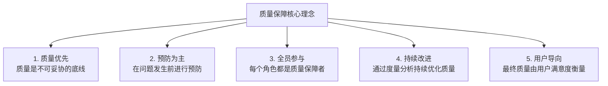
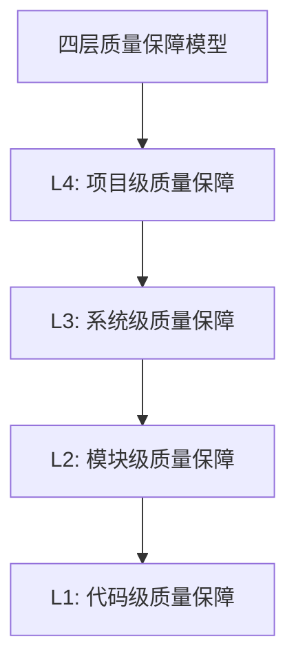

# 质量保障体系手册

**文档版本**：V1.0  
**发布日期**�?026-02-17  
**文档性质**：规范性文�? 
**所属体�?*：一人AI开发工程规范体�?

---

## 一、总则

### 1.1 文档目的

本手册详细定义一人AI开发工程的质量保障体系，包括四层质量模型、质量门禁体系、质量度量指标和质量改进机制，为项目开发提供全方位的质量保障指导�?

### 1.2 质量理念



### 1.3 质量目标

| 质量维度 | 目标 | 度量方式 |
|---------|------|---------|
| 功能正确�?| 100%功能符合需�?| 功能测试通过�?|
| 代码质量 | 高质量代码标�?| 代码审查评分 |
| 安全�?| 无严重安全漏�?| 安全测试结果 |
| 性能 | 满足性能要求 | 性能测试结果 |
| 可维护�?| 易于维护和扩�?| 代码复杂度分�?|

---

## 二、四层质量保障模�?

### 2.1 模型架构



### 2.2 L1：代码级质量保障

#### 2.2.1 职责定义

| 项目 | 内容 |
|------|------|
| **负责角色** | SEA（软件编码员工） |
| **质量活动** | 编码规范遵循、静态分析、自测验�?|
| **执行时机** | 代码编写过程中、提交前 |
| **输出结果** | 符合规范的代码、自检报告 |

#### 2.2.2 检查内�?

```yaml
L1质量检查清�?
  编码规范:
    �?命名规范：变量、函数、类命名清晰有意�?
    �?代码格式：缩进、空格、换行符合规�?
    �?注释规范：关键逻辑有注释说�?
    �?代码结构：逻辑清晰，层次分�?
    
  静态分�?
    �?无编译错�?
    �?无编译警�?
    �?无静态分析工具报告的问题
    �?无代码坏味道
    
  自测验证:
    �?功能逻辑正确
    �?边界条件处理
    �?异常情况处理
    �?基本功能可用
    
  文档完整:
    �?代码注释完整
    �?API文档更新
    �?变更说明记录
```

#### 2.2.3 执行规范

```
SEA代码提交前自检流程:

1. 编码完成
   └──�?2. 编码规范检�?
        └──�?3. 静态分�?
             └──�?4. 自测验证
                  └──�?5. 文档更新
                       └──�?6. 提交代码审查

任何一步不通过，返回修改后重新检�?
```

### 2.3 L2：模块级质量保障

#### 2.3.1 职责定义

| 项目 | 内容 |
|------|------|
| **负责角色** | SRA（软件审核员工）+ SEA（软件编码员工） |
| **质量活动** | 代码审查、单元测试、接口测试、规范检�?|
| **执行时机** | 代码提交后、模块开发完成后 |
| **输出结果** | 代码审查报告、测试报�?|

#### 2.3.2 检查内�?

```yaml
L2质量检查清�?
  代码审查:
    �?功能正确性：逻辑正确，功能完�?
    �?代码质量：可读性、可维护性、可扩展�?
    �?安全性：无安全漏洞风�?
    �?性能：无明显性能问题
    �?规范性：符合编码规范和最佳实�?
    
  单元测试:
    �?测试覆盖�?�?80%
    �?测试用例有效
    �?所有测试通过
    �?边界场景覆盖
    
  接口测试:
    �?接口定义符合设计
    �?请求响应格式正确
    �?错误处理完善
    �?接口文档一�?
    
  规范检�?
    �?设计文档符合
    �?编码规范符合
    �?安全规范符合
    �?文档规范符合
```

#### 2.3.3 代码审查维度

```
┌─────────────────────────────────────────────────────────────�?
�?                   代码审查维度矩阵                           �?
├─────────────────────────────────────────────────────────────�?
�?                                                            �?
�? ┌─────────────────�?   ┌─────────────────�?               �?
�? �? 功能正确�?    �?   �?  代码质量      �?               �?
�? �? CRITICAL       �?   �?  MAJOR         �?               �?
�? �? �?逻辑正确     �?   �? �?可读�?      �?               �?
�? �? �?边界处理     �?   �? �?可维护�?    �?               �?
�? �? �?异常处理     �?   �? �?复杂�?      �?               �?
�? └─────────────────�?   └─────────────────�?               �?
�?                                                            �?
�? ┌─────────────────�?   ┌─────────────────�?               �?
�? �?  安全�?       �?   �?  性能          �?               �?
�? �? CRITICAL       �?   �?  MAJOR         �?               �?
�? �? �?输入验证     �?   �? �?算法效率     �?               �?
�? �? �?权限控制     �?   �? �?资源使用     �?               �?
�? �? �?数据安全     �?   �? �?数据库优�?  �?               �?
�? └─────────────────�?   └─────────────────�?               �?
�?                                                            �?
�? ┌─────────────────�?   ┌─────────────────�?               �?
�? �? 可维护�?      �?   �? 可测试�?      �?               �?
�? �? MINOR          �?   �?  MAJOR         �?               �?
�? �? �?代码注释     �?   �? �?测试覆盖     �?               �?
�? �? �?模块�?      �?   �? �?测试质量     �?               �?
�? �? �?依赖管理     �?   �? �?可测试设�?  �?               �?
�? └─────────────────�?   └─────────────────�?               �?
�?                                                            �?
└─────────────────────────────────────────────────────────────�?
```

### 2.4 L3：系统级质量保障

#### 2.4.1 职责定义

| 项目 | 内容 |
|------|------|
| **负责角色** | STA（软件测试员工）+ SRA（软件审核员工） |
| **质量活动** | 安全审计、性能测试、集成测试、系统测�?|
| **执行时机** | 功能开发完成后、发布前 |
| **输出结果** | 测试报告、安全报告、性能报告 |

#### 2.4.2 检查内�?

```yaml
L3质量检查清�?
  安全审计:
    �?安全漏洞扫描
    �?权限控制验证
    �?敏感数据保护
    �?安全配置检�?
    
  性能测试:
    �?响应时间测试
    �?并发性能测试
    �?资源使用测试
    �?稳定性测�?
    
  集成测试:
    �?模块间接口测�?
    �?业务流程测试
    �?数据一致性测�?
    �?异常处理测试
    
  系统测试:
    �?功能测试
    �?兼容性测�?
    �?可用性测�?
    �?恢复性测�?
```

#### 2.4.3 测试类型矩阵

| 测试类型 | 目的 | 执行�?| 执行时机 |
|---------|------|-------|---------|
| 功能测试 | 验证功能正确�?| STA | 每个功能完成�?|
| 集成测试 | 验证模块间协�?| STA | 模块集成�?|
| 系统测试 | 验证系统整体质量 | STA | 系统完成�?|
| 性能测试 | 验证性能指标 | STA | 系统测试通过�?|
| 安全测试 | 验证安全�?| SRA | 发布�?|
| 验收测试 | 验证业务需�?| HD | 发布�?|

### 2.5 L4：项目级质量保障

#### 2.5.1 职责定义

| 项目 | 内容 |
|------|------|
| **负责角色** | HD（人类开发者） |
| **质量活动** | 项目监控、里程碑验收、最终决策、风险管�?|
| **执行时机** | 项目全过�?|
| **输出结果** | 验收报告、决策记�?|

#### 2.5.2 检查内�?

```yaml
L4质量检查清�?
  项目监控:
    �?进度监控
    �?质量指标跟踪
    �?风险监控
    �?问题跟踪
    
  里程碑验�?
    �?阶段交付物完�?
    �?质量门禁通过
    �?验收标准达成
    �?文档齐全
    
  最终决�?
    �?发布就绪评估
    �?风险评估
    �?发布批准
    �?回滚准备
    
  风险管控:
    �?风险识别
    �?风险评估
    �?风险应对
    �?风险监控
```

---

## 三、质量门禁体�?

### 3.1 门禁架构

```
┌─────────────────────────────────────────────────────────────�?
�?                   质量门禁体系架构                           �?
└─────────────────────────────────────────────────────────────�?

    需求阶�?                   设计阶段                    开发阶�?
        �?                         �?                         �?
        �?                         �?                         �?
┌───────────────�?         ┌───────────────�?         ┌───────────────�?
�?需求完整性门�?�?         �?设计评审门禁   �?         �?代码质量门禁   �?
�?              �?         �?              �?         �?              �?
�?�?需求覆�?   �?         �?�?架构合理    �?         �?�?代码审查    �?
�?�?可行性确�? �?         �?�?接口完整    �?         �?�?单元测试    �?
�?�?验收标准    �?         �?�?技术可�?   �?         �?�?静态分�?   �?
�?              �?         �?              �?         �?              �?
�?把关�? HD    �?         �?把关�? SRA   �?         �?把关�? SRA   �?
└───────┬───────�?         └───────┬───────�?         └───────┬───────�?
        �?                         �?                         �?
        �?                         �?                         �?
        └──────────────────────────┼──────────────────────────�?
                                   �?
                                   �?
                            ┌───────────────�?
                            �?测试通过门禁   �?
                            �?              �?
                            �?�?功能测试    �?
                            �?�?性能测试    �?
                            �?�?安全测试    �?
                            �?              �?
                            �?把关�? STA/SRA�?
                            └───────┬───────�?
                                    �?
                                    �?
                            ┌───────────────�?
                            �?发布就绪门禁   �?
                            �?              �?
                            �?�?部署验证    �?
                            �?�?回滚测试    �?
                            �?�?文档完整    �?
                            �?              �?
                            �?把关�? HD    �?
                            └───────────────�?
```

### 3.2 门禁详细定义

#### 3.2.1 需求完整性门�?

```yaml
门禁名称: 需求完整性门�?
触发时机: 需求阶段结束，进入设计阶段�?
把关角色: HD（人类开发者）

通过条件:
  必须�?
    - 所有业务需求已识别并记�?
    - 功能需求列表完�?
    - 非功能需求已定义
    - 需求优先级已确�?
    - 验收标准已明�?
    
  推荐�?
    - 用户故事已编�?
    - 需求依赖关系已梳理
    - 风险已识�?

检查方�?
  - 文档审核
  - 需求评审会�?
  - HD签字确认

不通过处理:
  - 返回SDA补充需求分�?
  - 明确缺失项和完成期限
```

#### 3.2.2 设计评审门禁

```yaml
门禁名称: 设计评审门禁
触发时机: 设计阶段结束，进入开发阶段前
把关角色: SRA（软件审核员工）

通过条件:
  必须�?
    - 架构设计文档完整
    - 技术选型有理有据
    - 接口定义完整清晰
    - 数据模型设计合理
    - 安全方案已设�?
    
  推荐�?
    - 性能方案已设�?
    - 部署方案已规�?
    - 技术风险已评估

检查方�?
  - 文档审核
  - 架构评审
  - SRA审核报告

不通过处理:
  - 返回SDA修改设计
  - 记录问题和修改建�?
  - 重新审核
```

#### 3.2.3 代码质量门禁

```yaml
门禁名称: 代码质量门禁
触发时机: 代码提交时、模块开发完成时
把关角色: SRA（软件审核员工）

通过条件:
  必须�?
    - 代码编译无错�?
    - 单元测试全部通过
    - 代码覆盖�?�?80%
    - 无严重静态分析问�?
    - 代码审查通过
    
  推荐�?
    - 无重要静态分析问�?
    - 代码复杂度合�?
    - 无重复代码警�?

检查方�?
  - 自动化构�?
  - 自动化测�?
  - 静态代码分�?
  - 代码审查

不通过处理:
  - 返回SEA修改代码
  - 记录问题和修改建�?
  - 重新提交审核
```

#### 3.2.4 测试通过门禁

```yaml
门禁名称: 测试通过门禁
触发时机: 测试阶段结束，进入部署阶段前
把关角色: STA（软件测试员工）+ SRA（软件审核员工）

通过条件:
  必须�?
    - 功能测试全部通过
    - 测试通过�?�?95%
    - 无未修复的严重缺�?
    - 性能指标达标
    - 安全测试通过
    
  推荐�?
    - 无未修复的重要缺�?
    - 自动化测试覆盖核心功�?

检查方�?
  - 测试报告审核
  - 缺陷统计检�?
  - HD验收测试

不通过处理:
  - 返回SEA修复缺陷
  - 执行回归测试
  - 重新评估发布
```

#### 3.2.5 发布就绪门禁

```yaml
门禁名称: 发布就绪门禁
触发时机: 部署阶段结束，正式发布前
把关角色: HD（人类开发者）

通过条件:
  必须�?
    - 部署包已构建并验�?
    - 部署环境已准�?
    - 回滚方案已制定并验证
    - 监控告警已配�?
    - 发布文档已完�?
    
  推荐�?
    - 用户手册已更�?
    - 运维手册已更�?
    - 相关方已通知

检查方�?
  - 部署检查清�?
  - 冒烟测试
  - HD审批

不通过处理:
  - 返回SEA完善部署准备
  - 明确缺失项和完成期限
```

### 3.3 门禁执行流程

```
┌─────────────────────────────────────────────────────────────�?
�?                   门禁执行流程                               �?
└─────────────────────────────────────────────────────────────�?

    ┌─────────────�?
    �?阶段完成    �?
    └──────┬──────�?
           �?
           �?
    ┌─────────────�?    ┌─────────────�?
    �?门禁检�?   │────▶│ 检查结�?   �?
    └─────────────�?    └──────┬──────�?
                               �?
              ┌────────────────┼────────────────�?
              �?               �?               �?
              �?               �?               �?
       ┌───────────�?  ┌───────────�?  ┌───────────�?
       �?  通过    �?  �?条件通过  �?  �? 不通过   �?
       └─────┬─────�?  └─────┬─────�?  └─────┬─────�?
             �?              �?              �?
             �?              �?              �?
      ┌─────────────�?┌─────────────�?┌─────────────�?
      �?进入下一阶段 �?│记录问题后   �?�?返回修改    �?
      └─────────────�?│进入下一阶段 �?└──────┬──────�?
                      └─────────────�?       �?
                                             �?
                                      ┌─────────────�?
                                      �?重新检�?   �?
                                      └─────────────�?
```

---

## 四、质量度量指�?

### 4.1 指标体系

```
┌─────────────────────────────────────────────────────────────�?
�?                   质量度量指标体系                           �?
└─────────────────────────────────────────────────────────────�?

┌─────────────────────────────────────────────────────────────�?
�?                                                            �?
�? 过程质量指标                                                �?
�? ─────────────────────────────────────────────────────────  �?
�? �?需求变更率        �?代码审查覆盖�?                       �?
�? �?缺陷修复及时�?   �?返工�?                               �?
�?                                                            �?
├─────────────────────────────────────────────────────────────�?
�?                                                            �?
�? 产品质量指标                                                �?
�? ─────────────────────────────────────────────────────────  �?
�? �?缺陷密度          �?测试通过�?                           �?
�? �?代码覆盖�?       �?性能达标�?                           �?
�?                                                            �?
├─────────────────────────────────────────────────────────────�?
�?                                                            �?
�? 效率指标                                                    �?
�? ─────────────────────────────────────────────────────────  �?
�? �?开发效�?         �?迭代周期                              �?
�? �?缺陷发现效率      �?问题解决效率                          �?
�?                                                            �?
└─────────────────────────────────────────────────────────────�?
```

### 4.2 过程质量指标

#### 4.2.1 需求变更率

```yaml
指标名称: 需求变更率
计算公式: 变更需求数 / 总需求数 × 100%
目标�? �?20%
度量周期: 项目全程
数据来源: 需求管理记�?

说明:
  - 统计项目过程中发生变更的需�?
  - 变更包括新增、修改、删除需�?
  - 变更率过高说明需求分析不充分

改进措施:
  - 加强需求分析阶段工�?
  - 提高需求确认质�?
  - 建立变更控制流程
```

#### 4.2.2 代码审查覆盖�?

```yaml
指标名称: 代码审查覆盖�?
计算公式: 已审查代码行�?/ 总代码行�?× 100%
目标�? 100%
度量周期: 开发阶�?
数据来源: 代码审查记录

说明:
  - 所有代码必须经过审�?
  - 审查包括人工审查和自动化检�?
  - 覆盖率不足会增加质量风险

改进措施:
  - 强制代码审查流程
  - 集成自动化审查工�?
  - 建立审查质量标准
```

#### 4.2.3 缺陷修复及时�?

```yaml
指标名称: 缺陷修复及时�?
计算公式: 按时修复缺陷�?/ 总缺陷数 × 100%
目标�? �?95%
度量周期: 测试阶段
数据来源: 缺陷管理系统

说明:
  - 按时指在规定时限内修�?
  - 不同级别缺陷有不同时限要�?
  - 及时率低会影响项目进�?

改进措施:
  - 优化缺陷处理流程
  - 合理安排修复优先�?
  - 提高代码质量减少缺陷
```

#### 4.2.4 返工�?

```yaml
指标名称: 返工�?
计算公式: 返工时间 / 总开发时�?× 100%
目标�? �?15%
度量周期: 项目全程
数据来源: 工时记录

说明:
  - 返工包括需求变更、设计修改、代码重构等
  - 返工率高说明前期工作质量不足
  - 影响项目效率和成�?

改进措施:
  - 加强前期分析和设�?
  - 提高代码质量
  - 减少需求变�?
```

### 4.3 产品质量指标

#### 4.3.1 缺陷密度

```yaml
指标名称: 缺陷密度
计算公式: 缺陷总数 / 代码规模(千行)
目标�? �?0.5 �?千行
度量周期: 测试阶段、运维阶�?
数据来源: 缺陷管理系统

说明:
  - 统计所有级别缺�?
  - 可按严重程度分类统计
  - 反映代码质量水平

改进措施:
  - 加强代码审查
  - 提高单元测试覆盖�?
  - 引入静态分析工�?
```

#### 4.3.2 测试通过�?

```yaml
指标名称: 测试通过�?
计算公式: 通过测试用例�?/ 总测试用例数 × 100%
目标�? �?95%
度量周期: 测试阶段
数据来源: 测试管理系统

说明:
  - 统计所有测试类�?
  - 可按测试类型分类统计
  - 反映功能质量水平

改进措施:
  - 提高代码质量
  - 加强自测
  - 优化测试用例设计
```

#### 4.3.3 代码覆盖�?

```yaml
指标名称: 代码覆盖�?
计算公式: 已覆盖代码行�?/ 总代码行�?× 100%
目标�? �?80%
度量周期: 开发阶�?
数据来源: 测试覆盖率工�?

说明:
  - 主要指单元测试覆盖率
  - 可细分行覆盖、分支覆盖等
  - 反映测试充分�?

改进措施:
  - 补充单元测试用例
  - 覆盖边界场景
  - 提高测试意识
```

#### 4.3.4 性能达标�?

```yaml
指标名称: 性能达标�?
计算公式: 达标性能指标�?/ 总性能指标�?× 100%
目标�? 100%
度量周期: 测试阶段
数据来源: 性能测试报告

说明:
  - 统计所有性能指标
  - 包括响应时间、吞吐量�?
  - 反映系统性能水平

改进措施:
  - 性能优化
  - 架构调整
  - 资源扩容
```

### 4.4 效率指标

#### 4.4.1 开发效�?

```yaml
指标名称: 开发效�?
计算公式: 功能点数 / 开发天�?
度量周期: 项目全程
数据来源: 项目管理记录

说明:
  - 可按迭代统计
  - 用于趋势分析和对�?
  - 受项目复杂度影响

改进措施:
  - 提高开发技�?
  - 优化开发流�?
  - 复用已有成果
```

#### 4.4.2 迭代周期

```yaml
指标名称: 迭代周期
计算公式: 单次迭代完成时间
目标�? 按计划完成率 �?90%
度量周期: 每个迭代
数据来源: 项目管理记录

说明:
  - 统计迭代实际完成时间
  - 与计划时间对�?
  - 反映项目管理水平

改进措施:
  - 合理制定计划
  - 及时识别风险
  - 优化协作效率
```

### 4.5 指标监控仪表�?

```
┌─────────────────────────────────────────────────────────────�?
�?                   质量指标监控仪表�?                        �?
├─────────────────────────────────────────────────────────────�?
�?                                                            �?
�? 过程质量                      产品质量                      �?
�? ┌─────────────────────�?     ┌─────────────────────�?     �?
�? �?需求变更率: 15%  �? �?     �?缺陷密度: 0.3   �? �?     �?
�? �?审查覆盖�? 100% �? �?     �?测试通过�? 97% �? �?     �?
�? �?修复及时�? 96%  �? �?     �?代码覆盖�? 85% �? �?     �?
�? �?返工�?    12%  �? �?     �?性能达标�? 100%�? �?     �?
�? └─────────────────────�?     └─────────────────────�?     �?
�?                                                            �?
�? 效率指标                                                    �?
�? ┌─────────────────────────────────────────────────�?      �?
�? �?开发效�? 5 功能�?�?                           �?      �?
�? �?迭代周期: 按计划完成率 92%                       �?      �?
�? └─────────────────────────────────────────────────�?      �?
�?                                                            �?
�? 趋势�? [质量指标趋势图表]                                  �?
�?                                                            �?
└─────────────────────────────────────────────────────────────�?
```

---

## 五、质量改进机�?

### 5.1 持续改进模型

```
┌─────────────────────────────────────────────────────────────�?
�?                   PDCA持续改进循环                          �?
└─────────────────────────────────────────────────────────────�?

          ┌─────────────────────────────────────�?
          �?                                    �?
          �?                                    �?
    ┌───────────�?                       ┌───────────�?
    �? Plan     �?                       �?  Act     �?
    �? 计划     �?                       �?  改进    �?
    �?          �?                       �?          �?
    �?�?分析问题�?                       �?�?标准�? �?
    �?�?制定目标�?                       �?�?推广    �?
    �?�?制定计划�?                       �?�?固化    �?
    └─────┬─────�?                       └─────┬─────�?
          �?                                   �?
          �?                                   �?
          �?                                   �?
    ┌───────────�?   ┌───────────�?           �?
    �?  Do      │───▶│  Check    │────────────�?
    �?  执行    �?   �?  检�?   �?
    �?          �?   �?          �?
    �?�?实施计划�?   �?�?评估结果�?
    �?�?执行改进�?   �?�?分析差距�?
    �?�?收集数据�?   �?�?总结经验�?
    └───────────�?   └───────────�?
```

### 5.2 改进活动

#### 5.2.1 项目复盘

```yaml
活动名称: 项目复盘�?
触发时机: 每个项目结束�?
参与角色: HD, SDA, SEA, SRA, STA
活动时长: 1-2小时

活动内容:
  1. 项目回顾
     - 项目目标达成情况
     - 关键里程碑回�?
     
  2. 成功经验
     - 做得好的方面
     - 可复用的经验
     
  3. 问题分析
     - 遇到的问�?
     - 根本原因分析
     
  4. 改进建议
     - 具体改进措施
     - 责任人和时间
     
  5. 行动计划
     - 改进项优先级
     - 实施计划

输出成果:
  - 项目复盘报告
  - 改进行动计划
```

#### 5.2.2 迭代回顾

```yaml
活动名称: 迭代回顾�?
触发时机: 每个迭代结束�?
参与角色: HD, SEA, SRA, STA
活动时长: 30分钟-1小时

活动内容:
  1. 迭代回顾
     - 迭代目标达成情况
     - 完成的功能点
     
  2. 问题回顾
     - 本迭代遇到的问题
     - 问题处理情况
     
  3. 改进讨论
     - 下迭代改进措�?
     - 需要的支持
     
  4. 行动确认
     - 改进项确�?
     - 责任人确�?

输出成果:
  - 迭代回顾记录
  - 改进行动�?
```

#### 5.2.3 问题根因分析

```yaml
活动名称: 问题根因分析
触发时机: 重大问题发生�?
参与角色: HD, 相关数字员工
活动时长: 视问题复杂度而定

分析方法:
  1. 5Why分析�?
     - 连续�?次为什�?
     - 找到根本原因
     
  2. 鱼骨图分�?
     - 人、机、料、法、环
     - 全面分析原因
     
  3. 故障树分�?
     - 自顶向下分析
     - 找出所有可能原�?

输出成果:
  - 问题分析报告
  - 根本原因
  - 改进措施
```

### 5.3 质量改进流程

```
┌─────────────────────────────────────────────────────────────�?
�?                   质量改进流程                               �?
└─────────────────────────────────────────────────────────────�?

    ┌─────────────�?
    �?问题识别    �?
    �?(度量/反馈) �?
    └──────┬──────�?
           �?
           �?
    ┌─────────────�?
    �?问题分析    �?
    �?(根因分析)  �?
    └──────┬──────�?
           �?
           �?
    ┌─────────────�?    ┌─────────────�?
    �?制定方案    │────▶│ 方案评审    �?
    └─────────────�?    └──────┬──────�?
                               �?
              ┌────────────────┴────────────────�?
              �?                                �?
              �?                                �?
       ┌───────────�?                   ┌───────────�?
       �?方案通过  �?                   �?方案调整  �?
       └─────┬─────�?                   └─────┬─────�?
             �?                               �?
             �?                               �?
       ┌───────────�?                         �?
       �?实施改进  │◀─────────────────────────�?
       └─────┬─────�?
             �?
             �?
       ┌───────────�?
       �?效果评估  �?
       └─────┬─────�?
             �?
             �?
       ┌───────────�?
       �?标准�?   �?
       �?(固化流程)�?
       └───────────�?
```

---

## 六、质量保障工�?

### 6.1 工具清单

| 工具类别 | 工具名称 | 用�?| 使用角色 |
|---------|---------|------|---------|
| 静态分�?| ESLint, SonarQube | 代码质量检�?| SEA, SRA |
| 单元测试 | Jest, JUnit, pytest | 单元测试执行 | SEA |
| 代码覆盖�?| Istanbul, JaCoCo | 覆盖率统�?| SEA, STA |
| 安全扫描 | OWASP ZAP, SonarQube | 安全漏洞检�?| SRA |
| 性能测试 | JMeter, Gatling | 性能测试执行 | STA |
| 缺陷管理 | Jira, GitHub Issues | 缺陷跟踪 | STA, SEA |
| 文档管理 | Markdown, Confluence | 文档编写 | SDA, SEA |

### 6.2 工具集成

```
┌─────────────────────────────────────────────────────────────�?
�?                   质量工具集成架构                           �?
└─────────────────────────────────────────────────────────────�?

                    ┌─────────────────�?
                    �?  代码仓库      �?
                    �? (Git/GitHub)   �?
                    └────────┬────────�?
                             �?
                             �?
                    ┌─────────────────�?
                    �?  CI/CD流水�?  �?
                    └────────┬────────�?
                             �?
         ┌───────────────────┼───────────────────�?
         �?                  �?                  �?
         �?                  �?                  �?
┌─────────────────�?┌─────────────────�?┌─────────────────�?
�?  静态分�?     �?�?  单元测试      �?�?  安全扫描      �?
�? (SonarQube)   �?�?  (Jest)        �?�? (OWASP ZAP)   �?
└────────┬────────�?└────────┬────────�?└────────┬────────�?
         �?                  �?                  �?
         └───────────────────┼───────────────────�?
                             �?
                             �?
                    ┌─────────────────�?
                    �?  质量报告      �?
                    �?  (汇总展�?    �?
                    └─────────────────�?
```

---

## 七、附�?

### 7.1 质量检查清单汇�?

```yaml
代码提交检查清�?
  �?代码编译无错�?
  �?单元测试全部通过
  �?代码覆盖�?�?80%
  �?静态分析无严重问题
  �?代码注释完整
  �?遵循编码规范

代码审查检查清�?
  �?功能正确性检�?
  �?代码质量检�?
  �?安全性检�?
  �?性能检�?
  �?可维护性检�?
  �?可测试性检�?

测试完成检查清�?
  �?功能测试完成
  �?集成测试完成
  �?性能测试完成
  �?安全测试完成
  �?测试通过�?�?95%
  �?严重缺陷已修�?

发布就绪检查清�?
  �?部署包已构建
  �?部署环境已准�?
  �?回滚方案已验�?
  �?监控告警已配�?
  �?发布文档已完�?
  �?HD已审�?
```

### 7.2 质量问题升级流程

```
质量问题升级流程:

发现问题
    �?
    �?
评估严重程度
    �?
    ├──�?严重问题 ──�?立即升级HD ──�?紧急处�?
    �?
    ├──�?重要问题 ──�?记录并安排处�?──�?24小时内处�?
    �?
    └──�?一般问�?──�?记录并安排处�?──�?72小时内处�?
```

---

**文档结束**
